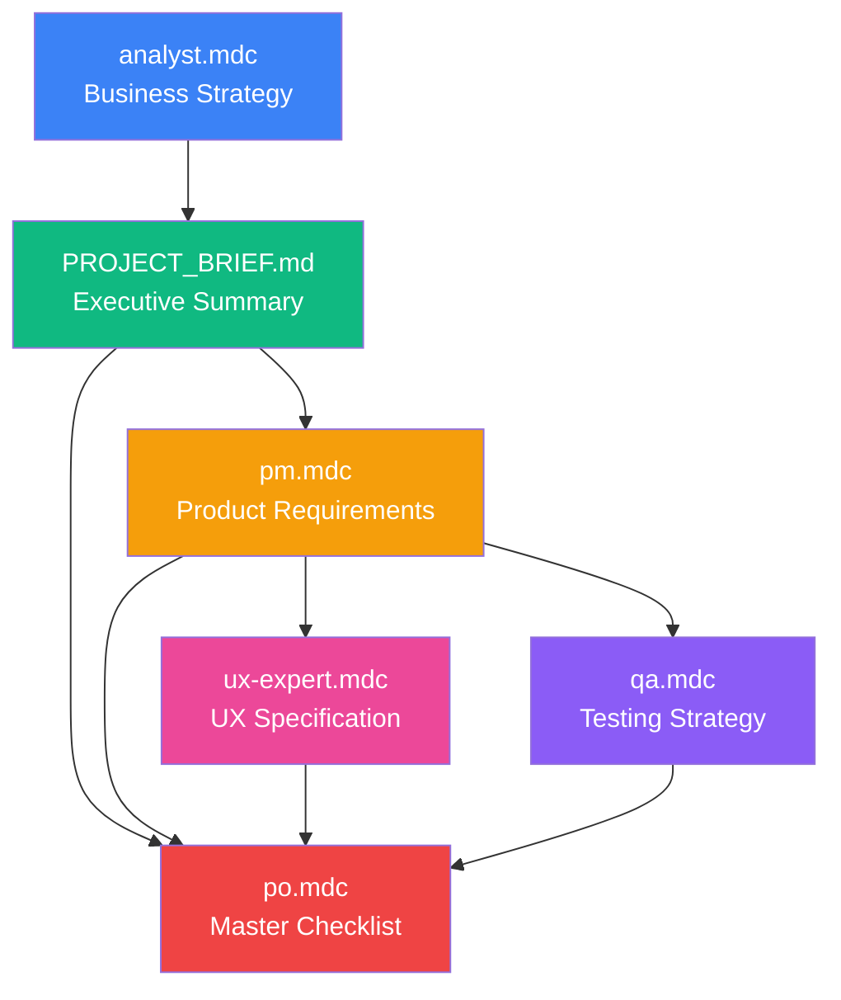

# Supplex - Documentation Index

**Project:** Supplex - Supplier Lifecycle Management Platform  
**Status:** Pre-Development / Planning Phase  
**Last Updated:** October 12, 2025

---

## 📚 Documentation Overview

This repository contains **6 comprehensive planning documents** totaling over **500 pages** of business analysis, product requirements, design specifications, testing strategy, and execution checklists.

**Total Documentation:**

- **500+ pages** of detailed specifications
- **250+ checklist items** for execution
- **100+ user stories** with acceptance criteria
- **40+ test suites** with code examples
- **15+ screen wireframes** with specifications

---

## 🗺️ Document Map

```
Supplex Documentation
│
├── 📊 STRATEGIC PLANNING
│   ├── analyst.mdc (40 pages)
│   └── PROJECT_BRIEF.md (11 pages)
│
├── 🎯 PRODUCT SPECIFICATION
│   ├── pm.mdc (85 pages)
│   └── po.mdc (124 pages)
│
├── 🎨 DESIGN & USER EXPERIENCE
│   └── ux-expert.mdc (120 pages)
│
├── 🧪 QUALITY ASSURANCE
│   └── qa.mdc (120 pages)
│
└── 📖 PROJECT INDEX
    └── README.md (this file)
```

---

## 📄 Document Directory

### 1. analyst.mdc - Business & Technical Analysis

**Length:** 40 pages | **Audience:** Investors, Technical Team, Business Stakeholders

**Purpose:** Comprehensive market analysis, competitive landscape, technical architecture, and business strategy

**Key Sections:**

- ✅ **Executive Summary** - Core value proposition
- ✅ **Business Requirements** - Target market, core modules, features
- ✅ **Technical Architecture** - Supabase + Vercel stack, multi-tenancy (RLS), system design
- ✅ **Data Model** - Database schemas with RLS policies
- ✅ **Competitive Analysis** - 12 competitors analyzed, pricing comparison, positioning strategy
- ✅ **Pricing & Revenue** - 3 tiers ($299-$799/mo), Year 1-3 projections
- ✅ **Risks & Mitigations** - Technical and business risks
- ✅ **Roadmap** - 4 phases over 18 months

**When to Read:**

- Understanding the business opportunity and market
- Technical architecture decisions
- Competitive positioning
- Investor presentations
- Strategic planning

**File Location:** `docs/business/analyst.mdc`

**Links to:**

- docs/product/PROJECT_BRIEF.md (summary version)
- docs/product/pm.mdc (product details)

---

### 2. PROJECT_BRIEF.md - Executive Project Brief

**Length:** 11 pages | **Audience:** Executives, Stakeholders, Decision Makers

**Purpose:** Concise executive summary for approvals and alignment

**Key Sections:**

- ✅ **Executive Summary** - Market opportunity, value proposition
- ✅ **Project Objectives** - MVP in 4 months, success criteria
- ✅ **Project Scope** - In-scope (7 modules), out-of-scope (Phase 2+)
- ✅ **Timeline & Milestones** - Month-by-month breakdown
- ✅ **Budget & Resources** - $235K-$475K, 5-7 person team
- ✅ **Technology Stack** - NestJS, React, Supabase, Vercel
- ✅ **Risks** - Technical, business, schedule risks
- ✅ **Success Metrics** - KPIs, adoption targets

**When to Read:**

- Getting executive buy-in
- Budget approval meetings
- Quick project overview
- Stakeholder onboarding

**File Location:** `docs/product/PROJECT_BRIEF.md`

**Links to:**

- docs/business/analyst.mdc (detailed analysis)
- docs/product/pm.mdc (product specifications)

---

### 3. pm.mdc - Product Requirements Document (PRD)

**Length:** 85 pages | **Audience:** Development Team, QA, Design, Product Managers

**Purpose:** Detailed product specifications for building the MVP

**Key Sections:**

- ✅ **Product Overview** - Vision, objectives, target users
- ✅ **User Personas** - 5 detailed personas (Sarah, Michael, David, Jennifer, Tom)
- ✅ **Feature Requirements** - 7 modules with detailed feature lists
- ✅ **User Stories** - 22 stories with acceptance criteria and story points
- ✅ **User Flows** - 3 complete flows (qualification, complaint, evaluation)
- ✅ **Functional Requirements** - Auth, RBAC, notifications, search, file management
- ✅ **Non-Functional Requirements** - Performance, security, availability, usability
- ✅ **API Specifications** - Complete endpoints with request/response examples
- ✅ **Data Model** - SQL schemas with RLS policies
- ✅ **UI/UX Requirements** - Design system, layouts, component specs

**When to Read:**

- Before starting development
- Writing user stories
- API implementation
- Database design
- Understanding acceptance criteria

**File Location:** `docs/product/pm.mdc`

**Links to:**

- docs/design/ux-expert.mdc (UI specifications)
- docs/quality/qa.mdc (testing requirements)
- docs/execution/po.mdc (execution checklist)

---

### 4. ux-expert.mdc - UX Design Specification

**Length:** 120 pages | **Audience:** Designers, Frontend Developers, Product Team

**Purpose:** Complete UX design system and screen specifications

**Key Sections:**

- ✅ **Design Principles** - "Enterprise power, consumer simplicity"
- ✅ **Design System** - Colors, typography, spacing, shadows, animations
- ✅ **Component Library** - 15+ components with code (Button, Input, Card, Badge, Modal, etc.)
- ✅ **Screen Specifications** - 15+ wireframes with ASCII art
  - Authentication, Dashboard, Supplier List/Detail, Qualification, Evaluation, Complaint
- ✅ **Interaction Patterns** - Loading, empty states, errors, confirmations, keyboard shortcuts
- ✅ **User Flows** - Visual flows with mermaid diagrams
- ✅ **Responsive Design** - Breakpoints, component adaptations, touch targets
- ✅ **Accessibility** - WCAG 2.1 Level AA, keyboard nav, screen readers
- ✅ **Usability Testing** - 3 test scenarios with success metrics
- ✅ **9 Appendices** - Component mapping, Tailwind config, icons, animations, patterns

**When to Read:**

- Before creating Figma designs
- Implementing frontend components
- Setting up Tailwind CSS
- Accessibility implementation
- Component development

**File Location:** `docs/design/ux-expert.mdc`

**Links to:**

- docs/product/pm.mdc (functional requirements)
- Appendix A (shadcn/ui component mapping)
- Appendix C (Tailwind configuration)

---

### 5. qa.mdc - QA & Testing Strategy

**Length:** 120 pages | **Audience:** QA Engineers, Developers, Security Team

**Purpose:** Comprehensive testing strategy with focus on high-risk areas

**Key Sections:**

- ✅ **Executive Summary** - Testing philosophy, quality objectives
- ✅ **High-Risk Areas** - 5 critical areas with detailed test strategies
  1. 🔴 Multi-Tenancy Data Isolation (CRITICAL)
  2. 🔴 Authentication & Authorization
  3. 🔴 Data Integrity & Consistency
  4. 🟠 File Upload Security
  5. 🟠 Performance & Scalability
- ✅ **Test Architecture** - Test pyramid, tech stack, environments
- ✅ **Testing Strategies** - Unit, integration, E2E testing with code examples
- ✅ **Multi-Tenancy Testing** - 30+ test cases, RLS policy testing
- ✅ **Security Testing** - OWASP Top 10, penetration testing
- ✅ **Performance Testing** - k6 load testing scripts, benchmarks
- ✅ **Test Data Management** - Test factories, database management
- ✅ **CI/CD Pipeline** - Complete GitHub Actions workflow
- ✅ **Quality Gates** - 4 gates from commit to production

**When to Read:**

- Setting up test infrastructure
- Writing test cases
- Security testing
- Performance testing
- CI/CD configuration
- Understanding high-risk areas

**File Location:** `docs/quality/qa.mdc`

**Links to:**

- docs/product/pm.mdc (requirements to test)
- GitHub Actions (CI/CD implementation)

---

### 6. po.mdc - Product Owner Master Checklist

**Length:** 124 pages | **Audience:** Product Owner, Project Manager, Team Leads

**Purpose:** Single source of truth for MVP execution with 250+ actionable items

**Key Sections:**

- ✅ **Executive Dashboard** - Project health at-a-glance
- ✅ **Phase 0: Pre-Development** - Market validation, team assembly, infrastructure (45 items)
- ✅ **Phase 1: Foundation (Month 1)** - Kickoff, database, UX, Sprint 1-2 (55 items)
- ✅ **Phase 2: Core Modules (Month 2)** - Qualification, evaluation, complaint (48 items)
- ✅ **Phase 3: Integration (Month 3)** - Dashboard, API docs, optimization (42 items)
- ✅ **Phase 4: Launch Prep (Month 4)** - Testing, docs, deployment (38 items)
- ✅ **Phase 5: Pilot Program (Months 5-6)** - Customer onboarding, feedback (22 items)
- ✅ **Ongoing Activities** - Stakeholder management, QA, risk management
- ✅ **Success Criteria Tracking** - MVP launch, pilot program metrics
- ✅ **Weekly Status Template** - Pre-formatted status updates

**When to Read:**

- Daily (track progress, update checklist)
- Weekly (status updates, team meetings)
- Monthly (milestone reviews)
- Sprint planning
- Risk management

**File Location:** `docs/execution/po.mdc`

**Links to:**

- All other documents (references specific sections)
- External tools (Linear/Jira, Figma, GitHub)

---

## 🎯 Quick Navigation Guide

### **"I need to..."**

| Task                                    | Document                                   | Section                                 |
| --------------------------------------- | ------------------------------------------ | --------------------------------------- |
| **Understand the business opportunity** | docs/business/analyst.mdc                  | Executive Summary, Competitive Analysis |
| **Get executive approval**              | docs/product/PROJECT_BRIEF.md              | Entire document                         |
| **Understand tech stack decisions**     | docs/business/analyst.mdc                  | Section 2.2 Technical Architecture      |
| **See database schema**                 | docs/product/pm.mdc                        | Section 9 Data Model Requirements       |
| **Build a UI component**                | docs/design/ux-expert.mdc                  | Section 3 Component Library             |
| **Design a screen**                     | docs/design/ux-expert.mdc                  | Section 4 Screen Specifications         |
| **Write a test**                        | docs/quality/qa.mdc                        | Sections 4-7 Testing Strategies         |
| **Set up CI/CD**                        | docs/quality/qa.mdc                        | Section 9.1 CI/CD Pipeline              |
| **Track project progress**              | docs/execution/po.mdc                      | Entire document (update weekly)         |
| **Plan next sprint**                    | docs/execution/po.mdc                      | Phase-specific sections                 |
| **Understand user needs**               | docs/product/pm.mdc                        | Section 2 User Personas                 |
| **Write user stories**                  | docs/product/pm.mdc                        | Section 4 User Stories                  |
| **Implement API endpoint**              | docs/product/pm.mdc                        | Section 8 API Specifications            |
| **Configure Tailwind CSS**              | docs/design/ux-expert.mdc                  | Appendix C Tailwind Configuration       |
| **Test multi-tenancy**                  | docs/quality/qa.mdc                        | Section 5 Multi-Tenancy Testing         |
| **Understand risks**                    | docs/business/analyst.mdc or PROJECT_BRIEF | Risks & Mitigations                     |
| **See competitive analysis**            | docs/business/analyst.mdc                  | Section 7 Competitive Analysis          |
| **Track success metrics**               | docs/execution/po.mdc                      | Success Criteria Tracking               |

---

## 📊 Document Relationships



**Document Flow:**

1. **analyst.mdc** → Strategic foundation
2. **PROJECT_BRIEF.md** → Executive summary for approvals
3. **pm.mdc** → Detailed product specifications
4. **ux-expert.mdc** → Design implementation guide
5. **qa.mdc** → Testing implementation guide
6. **po.mdc** → Execution checklist (references all above)

---

## 🏗️ Current Document Structure ✅

**Implementation:** Organized by Type (recommended approach for scalability)

```
/supplex
├── README.md (index - you are here)
│
├── /docs
│   ├── /business
│   │   └── analyst.mdc (Business & Technical Analysis)
│   │
│   ├── /product
│   │   ├── PROJECT_BRIEF.md (Executive Brief)
│   │   └── pm.mdc (PRD - Product Requirements)
│   │
│   ├── /design
│   │   └── ux-expert.mdc (UX Specification)
│   │
│   ├── /quality
│   │   └── qa.mdc (QA & Testing Strategy)
│   │
│   └── /execution
│       └── po.mdc (Product Owner Master Checklist)
│
├── /database
│   ├── migrations/ (to be created in Week 1)
│   └── seeders/ (to be created in Week 1)
│
├── /tests
│   ├── /unit (to be created in Week 1)
│   ├── /integration (to be created in Week 2)
│   ├── /e2e (to be created in Week 3)
│   └── /performance (to be created in Month 3)
│
└── /assets
    ├── /images (to be created as needed)
    └── /templates (to be created in Month 2)
```

**Benefits of This Structure:**

- ✅ Clear separation of concerns
- ✅ Easy to find relevant documents
- ✅ Scales well as project grows
- ✅ Supports future additions (tests, database, assets)
- ✅ Maintains context (related docs together)

---

## 📖 Reading Paths by Role

### **Executive Sponsor**

1. **Start:** `docs/product/PROJECT_BRIEF.md` (11 pages)
2. **Deep Dive:** `docs/business/analyst.mdc` - Executive Summary, Competitive Analysis, Risks (15 pages)
3. **Track Progress:** `docs/execution/po.mdc` - Executive Dashboard, Success Criteria (5 pages)

**Total Reading:** ~30 pages

---

### **Product Owner / Project Manager**

1. **Start:** `docs/product/PROJECT_BRIEF.md` (11 pages)
2. **Requirements:** `docs/product/pm.mdc` - All sections (85 pages)
3. **Execution:** `docs/execution/po.mdc` - All sections (124 pages)
4. **Reference:** `docs/business/analyst.mdc` - Business requirements (10 pages)

**Total Reading:** ~230 pages (over 2-3 days)

---

### **Technical Lead / Backend Developer**

1. **Start:** `docs/product/PROJECT_BRIEF.md` - Technology Stack (2 pages)
2. **Architecture:** `docs/business/analyst.mdc` - Section 2 Technical Architecture (20 pages)
3. **Requirements:** `docs/product/pm.mdc` - Sections 6-9 (Functional, NFRs, API, Data Model) (40 pages)
4. **Testing:** `docs/quality/qa.mdc` - Sections 2-5 (High-risk areas, Test architecture) (50 pages)
5. **Track:** `docs/execution/po.mdc` - Sprint checklists (relevant sections)

**Total Reading:** ~110 pages

---

### **Frontend Developer**

1. **Start:** `docs/product/PROJECT_BRIEF.md` - Technology Stack (2 pages)
2. **Requirements:** `docs/product/pm.mdc` - User Stories, UI Requirements (30 pages)
3. **Design:** `docs/design/ux-expert.mdc` - All sections (120 pages)
4. **Testing:** `docs/quality/qa.mdc` - Section 4.3 E2E Testing (10 pages)
5. **Track:** `docs/execution/po.mdc` - Frontend development checklists (relevant sections)

**Total Reading:** ~160 pages

---

### **UX/UI Designer**

1. **Start:** `docs/product/pm.mdc` - Section 2 User Personas (10 pages)
2. **Design:** `docs/design/ux-expert.mdc` - All sections (120 pages)
3. **Flows:** `docs/product/pm.mdc` - Section 5 User Flows (5 pages)
4. **Reference:** `docs/execution/po.mdc` - UX design checklist (5 pages)

**Total Reading:** ~140 pages

---

### **QA Engineer**

1. **Start:** `docs/product/PROJECT_BRIEF.md` - Project scope (5 pages)
2. **Requirements:** `docs/product/pm.mdc` - User Stories, Acceptance Criteria (30 pages)
3. **Testing:** `docs/quality/qa.mdc` - All sections (120 pages)
4. **Track:** `docs/execution/po.mdc` - Testing checklists (10 pages)

**Total Reading:** ~165 pages

---

### **First-Time Contributor**

1. **Start:** `README.md` (this file)
2. **Quick Overview:** `docs/product/PROJECT_BRIEF.md` (11 pages)
3. **Your Role:** Find your role above, follow reading path
4. **Reference:** Bookmark relevant documents

**Total Reading:** ~15 pages to get started

---

## 🔍 Key Information Quick Reference

### Technology Stack

- **Backend:** Node.js + NestJS + TypeScript
- **Frontend:** React + Tailwind CSS + shadcn/ui + Zustand
- **Database:** PostgreSQL (Supabase) with Row-Level Security (RLS)
- **Hosting:** Vercel (frontend + API routes)
- **Storage:** Supabase Storage
- **Cache:** Upstash Redis
- **Auth:** Supabase Auth (email/password, OAuth, MFA)
- **Monitoring:** Sentry + Vercel Analytics

**Source:** `docs/business/analyst.mdc` Section 2.2, `docs/product/PROJECT_BRIEF.md`

---

### Timeline

- **MVP Development:** 4 months (Weeks 1-16)
- **Pilot Program:** 2 months (Weeks 17-24)
- **Total to Product-Market Fit:** 6 months

**Milestones:**

- Month 1: Development environment ready
- Month 2: Core modules functional
- Month 3: Feature-complete beta
- Month 4: Production launch
- Month 6: Pilot validation, 2+ paid customers

**Source:** `docs/product/PROJECT_BRIEF.md`, `docs/execution/po.mdc`

---

### Budget

- **MVP Development (4 months):** $235K-$475K

  - Personnel: $200K-$400K
  - Infrastructure: $4K-$9K
  - Software/Tools: $1.5K-$3K
  - Contingency: $30K-$60K

- **Monthly Infrastructure:** $100-$500/month (Supabase + Vercel)

**Source:** `docs/product/PROJECT_BRIEF.md` Section: Budget & Resources

---

### Team

- **Product Owner / PM:** 1 FT
- **Backend Engineers:** 2 FT
- **Frontend Engineers:** 2 FT
- **DevOps Engineer:** 0.5 PT
- **UX/UI Designer:** 0.5 PT
- **QA Engineer:** 1 FT (joins Month 3)

**Total:** 5-7 people

**Source:** `docs/product/PROJECT_BRIEF.md`, `docs/execution/po.mdc` Phase 0.2

---

### Target Market

- **Primary:** Mid-sized manufacturing (50-500 employees)
- **Geography:** US (Midwest, Southeast manufacturing hubs)
- **Industries:** Automotive, aerospace, electronics, industrial equipment
- **Current Solutions:** Spreadsheets, email (our competitors)
- **Budget:** $5K-$50K annually for supplier management

**Source:** `docs/business/analyst.mdc` Section 1.1

---

### Competitive Positioning

- **80-90% cheaper** than SAP Ariba ($299-$799 vs. $150K+)
- **10x faster** implementation (2-4 weeks vs. 6-12 months)
- **Supplier-focused** vs. general procurement/ERP
- **Quality + Procurement** combined (unique positioning)

**Source:** `docs/business/analyst.mdc` Section 7 Competitive Analysis

---

### Success Metrics (Month 6)

- **Customers:** 5 pilot customers → 2+ paid
- **Suppliers:** 250+ managed in system
- **Users:** 20+ active users
- **NPS:** > 40
- **ARR:** $20K committed
- **Uptime:** 99.5%+

**Source:** `docs/product/PROJECT_BRIEF.md`, `docs/execution/po.mdc` Success Criteria

---

## 🚀 Getting Started (New Team Members)

### Day 1: Onboarding

1. Read this `README.md` (10 min)
2. Read `docs/product/PROJECT_BRIEF.md` (30 min)
3. Skim your role-specific reading path above (identify key docs)
4. Set up development environment (follow `docs/execution/po.mdc` Phase 1.1)

### Week 1: Deep Dive

1. Read your role-specific documents in detail
2. Review design system (`docs/design/ux-expert.mdc` if frontend/design)
3. Review test strategy (`docs/quality/qa.mdc` if backend/QA)
4. Attend team kickoff meeting

### Week 2: Contributing

1. Pick first user story from backlog
2. Reference `docs/product/pm.mdc` for requirements
3. Reference `docs/design/ux-expert.mdc` for UI specs (if frontend)
4. Write tests (reference `docs/quality/qa.mdc`)
5. Submit first PR

---

## 📋 Document Maintenance

### Update Frequency

| Document                          | Update Frequency           | Owner         | Last Updated |
| --------------------------------- | -------------------------- | ------------- | ------------ |
| **README.md**                     | As needed                  | Product Owner | Oct 12, 2025 |
| **docs/business/analyst.mdc**     | Quarterly                  | Product Owner | Oct 12, 2025 |
| **docs/product/PROJECT_BRIEF.md** | When scope changes         | Product Owner | Oct 12, 2025 |
| **docs/product/pm.mdc**           | When requirements change   | Product Owner | Oct 12, 2025 |
| **docs/design/ux-expert.mdc**     | When design system changes | UX Lead       | Oct 12, 2025 |
| **docs/quality/qa.mdc**           | When test strategy changes | QA Lead       | Oct 12, 2025 |
| **docs/execution/po.mdc**         | **Weekly**                 | Product Owner | Oct 12, 2025 |

### Version Control

All documents use semantic versioning:

- **Major (1.0 → 2.0):** Significant scope/strategy change
- **Minor (1.0 → 1.1):** New sections added
- **Patch (1.0.0 → 1.0.1):** Small updates, clarifications

Each document has a **Document Version History** table at the end.

---

## 🔗 External Links (To Be Created)

### Development Tools

- **GitHub Repository:** [URL - TBD]
- **Linear/Jira Project:** [URL - TBD]
- **Figma Designs:** [URL - TBD]
- **Storybook (Component Library):** [URL - TBD]

### Environments

- **Development:** [https://dev.supplex.com - TBD]
- **Staging:** [https://staging.supplex.com - TBD]
- **Production:** [https://app.supplex.com - TBD]
- **Marketing Site:** [https://supplex.com - TBD]
- **API Documentation:** [https://docs.supplex.com - TBD]
- **Demo:** [https://demo.supplex.com - TBD]

### Monitoring

- **Vercel Dashboard:** [URL - TBD]
- **Supabase Dashboard:** [URL - TBD]
- **Sentry:** [URL - TBD]
- **Uptime Monitor:** [URL - TBD]

---

## 📦 Deliverables Checklist

### Documentation Deliverables ✅ COMPLETE

- [x] Business & Technical Analysis
- [x] Executive Project Brief
- [x] Product Requirements Document (PRD)
- [x] UX Design Specification
- [x] QA & Testing Strategy
- [x] Product Owner Master Checklist
- [x] Documentation Index (this file)

### Design Deliverables (Month 1) ⬜ TODO

- [ ] Figma wireframes (15+ screens)
- [ ] Figma design system
- [ ] Interactive prototypes (3 key flows)
- [ ] Component library in Storybook

### Development Deliverables (Months 1-4) ⬜ TODO

- [ ] Backend API (NestJS)
- [ ] Frontend App (React)
- [ ] Database schema (PostgreSQL)
- [ ] Authentication system
- [ ] 7 core modules
- [ ] API documentation (Swagger)
- [ ] Test suite (80%+ coverage)

### Launch Deliverables (Month 4) ⬜ TODO

- [ ] Production deployment
- [ ] User guide
- [ ] API documentation site
- [ ] Marketing website
- [ ] Support infrastructure
- [ ] Legal documents (ToS, Privacy Policy)

---

## 📞 Key Contacts

### Project Team

- **Executive Sponsor:** [Name, email, phone - TBD]
- **Product Owner:** [Name, email, phone - TBD]
- **Technical Lead:** [Name, email, phone - TBD]
- **UX Lead:** [Name, email, phone - TBD]
- **QA Lead:** [Name, email, phone - TBD]

### External Partners

- **Legal Counsel:** [Firm, contact - TBD]
- **Security Consultant:** [Firm, contact - TBD]
- **Pilot Customer #1:** [Company, contact - TBD]
- **Pilot Customer #2:** [Company, contact - TBD]
- **Pilot Customer #3:** [Company, contact - TBD]
- **Pilot Customer #4:** [Company, contact - TBD]
- **Pilot Customer #5:** [Company, contact - TBD]

---

## 🎓 Glossary of Key Terms

**CAPA:** Corrective and Preventive Actions  
**ERP:** Enterprise Resource Planning  
**KPI:** Key Performance Indicator  
**MVP:** Minimum Viable Product  
**NPS:** Net Promoter Score  
**PRD:** Product Requirements Document  
**RBAC:** Role-Based Access Control  
**RLS:** Row-Level Security (Supabase)  
**SLA:** Service Level Agreement  
**SOC 2:** Security compliance certification  
**WCAG:** Web Content Accessibility Guidelines

---

## ⚡ Quick Start Commands

### For Product Owner

```bash
# Open master checklist
open docs/execution/po.mdc

# Update progress weekly
# Mark items as complete: ⬜ → ✅
# Track metrics in tables
# Share weekly status using template
```

### For Developers (Week 1+)

```bash
# Read requirements for a feature
grep -n "US-2.1" docs/product/pm.mdc  # Find user story US-2.1

# Check design specs
grep -n "Supplier List" docs/design/ux-expert.mdc

# Find test examples
grep -n "Multi-Tenancy" docs/quality/qa.mdc

# Check checklist for sprint
grep -n "Sprint 1" docs/execution/po.mdc
```

### For Designers

```bash
# Review design system
open docs/design/ux-expert.mdc
# Jump to Section 2: Design System
# Jump to Section 3: Component Library
# Jump to Section 4: Screen Specifications
```

### For QA

```bash
# Review testing strategy
open docs/quality/qa.mdc
# Jump to Section 2: High-Risk Areas
# Jump to Section 5: Multi-Tenancy Testing
# Copy test code examples
```

---

## 📊 Documentation Statistics

| Metric              | Value                     |
| ------------------- | ------------------------- |
| **Total Documents** | 6 comprehensive + 1 index |
| **Total Pages**     | ~500 pages                |
| **Total Lines**     | ~15,000 lines             |
| **User Stories**    | 22 detailed stories       |
| **Test Scenarios**  | 100+ test cases           |
| **Checklist Items** | 250+ actionable items     |
| **API Endpoints**   | 30+ fully specified       |
| **Database Tables** | 10+ with RLS policies     |
| **UI Components**   | 20+ fully specified       |
| **Wireframes**      | 15+ screens described     |
| **Code Examples**   | 90+ snippets              |

---

## ✅ Pre-Development Checklist

**Before starting development, ensure:**

- [ ] All 6 documents reviewed by relevant stakeholders
- [ ] Executive Sponsor signed off on PROJECT_BRIEF.md
- [ ] Technical Lead approved analyst.mdc architecture
- [ ] Product Owner approved pm.mdc requirements
- [ ] UX Lead approved ux-expert.mdc design system
- [ ] QA Lead approved qa.mdc testing strategy
- [ ] Budget approved ($235K-$475K)
- [ ] 5 pilot customers committed (LOIs signed)
- [ ] Core team assembled (5-7 people)
- [ ] Infrastructure accounts created (Supabase, Vercel, GitHub)
- [ ] Project management tool set up (Linear/Jira)
- [ ] Communication tools set up (Slack, Zoom)

**When all checked → Ready for Week 1 kickoff! 🚀**

---

## 🆘 Support & Questions

### For Questions About:

**Business Strategy, Market, Competition:**

- Review: `docs/business/analyst.mdc`
- Contact: Product Owner, Executive Sponsor

**Project Timeline, Budget, Resources:**

- Review: `docs/product/PROJECT_BRIEF.md`
- Contact: Product Owner, Project Manager

**Features, Requirements, User Stories:**

- Review: `docs/product/pm.mdc`
- Contact: Product Owner

**Design, UI/UX, Components:**

- Review: `docs/design/ux-expert.mdc`
- Contact: UX Lead

**Testing, Quality, Security:**

- Review: `docs/quality/qa.mdc`
- Contact: QA Lead

**Execution, Progress, Checklists:**

- Review: `docs/execution/po.mdc`
- Contact: Product Owner, Project Manager

---

## 📝 Contributing to Documentation

### How to Update Documents

1. **Find the right document** (use Quick Navigation Guide above)
2. **Make changes** (keep formatting consistent)
3. **Update version history** (at end of document)
4. **Get review** (relevant stakeholder)
5. **Commit to Git** (with descriptive message)

### Documentation Standards

**Format:** Markdown (.md or .mdc)  
**Line Width:** No strict limit (use soft wrap)  
**Headings:** Use `#` hierarchy (# ## ### ####)  
**Code Blocks:** Use triple backticks with language  
**Tables:** Use markdown tables, keep aligned  
**Lists:** Use `-` for unordered, `1.` for ordered  
**Checkboxes:** Use `- [ ]` for unchecked, `- [x]` for checked

---

## 📅 Important Dates

| Milestone                         | Target Date   | Status         |
| --------------------------------- | ------------- | -------------- |
| **Documentation Complete**        | Oct 12, 2025  | ✅ Complete    |
| **Team Assembled**                | Week 1        | ⬜ Not Started |
| **Pilot Customers Committed**     | Week 0        | ⬜ Not Started |
| **Development Kickoff**           | Week 1, Day 1 | ⬜ Not Started |
| **Milestone 1: Dev Environment**  | Week 4        | ⬜ Not Started |
| **Milestone 2: Core Modules**     | Week 8        | ⬜ Not Started |
| **Milestone 3: Feature Complete** | Week 12       | ⬜ Not Started |
| **Milestone 4: MVP Launch**       | Week 16       | ⬜ Not Started |
| **Milestone 5: Pilot Complete**   | Week 24       | ⬜ Not Started |

---

## 🎯 Success Metrics Snapshot

### MVP Launch (Month 4)

✅ 7 modules complete  
✅ 80%+ test coverage  
✅ 0 P0 bugs  
✅ < 500ms API response time  
✅ 99.5%+ uptime

### Pilot Program (Month 6)

✅ 5 customers onboarded  
✅ 250+ suppliers managed  
✅ 50+ evaluations completed  
✅ NPS > 40  
✅ 2+ paid customers  
✅ $20K ARR

**Full metrics:** po.mdc Success Criteria Tracking

---

## 🔐 Security & Confidentiality

**⚠️ CONFIDENTIAL:** All documents contain proprietary business strategy, technical architecture, and competitive intelligence. Do not share externally without authorization.

**Access Control:**

- Documents stored in private GitHub repository
- Access granted to core team members only
- NDA required for external contractors
- Pilot customers receive only user-facing documentation

---

## 📚 Additional Resources

### Learning Resources

- **NestJS Documentation:** https://docs.nestjs.com
- **React Documentation:** https://react.dev
- **Supabase Documentation:** https://supabase.com/docs
- **Tailwind CSS:** https://tailwindcss.com
- **shadcn/ui:** https://ui.shadcn.com
- **Playwright Testing:** https://playwright.dev

### Industry References

- **IATF 16949:** Automotive quality standard
- **ISO 9001:** Quality management standard
- **GDPR Compliance:** https://gdpr.eu
- **WCAG 2.1:** https://www.w3.org/WAI/WCAG21/quickref/

---

## 🏆 Project Vision

**Mission:** Make supplier lifecycle management affordable and accessible for mid-sized manufacturers.

**Vision:** Become the leading supplier management platform for the mid-market by 2027, serving 250+ customers and managing 50,000+ suppliers.

**Core Values:**

- **Customer Success:** Build what solves real problems
- **Quality:** No shortcuts on security, reliability, or UX
- **Speed:** Move fast, ship often, iterate based on feedback
- **Transparency:** Open communication with customers and team
- **Innovation:** Leverage modern tech to deliver superior experience

---

## 📖 Version History

| Version | Date         | Author       | Changes                             |
| ------- | ------------ | ------------ | ----------------------------------- |
| 1.0     | Oct 12, 2025 | Product Team | Initial documentation index created |

---

## 📧 Contact

**For questions about this documentation:**

- **Product Owner:** [email@supplex.com]
- **Project Manager:** [email@supplex.com]

**For general inquiries:**

- **Website:** https://supplex.com (coming soon)
- **Email:** info@supplex.com

---

**© 2025 Supplex. All rights reserved. Confidential and proprietary.**

---

**You're all set! 🎉**

This comprehensive documentation package provides everything needed to build Supplex from concept to product-market fit. Start with the README (this file), follow your role-specific reading path, and reference the master checklist (po.mdc) for execution.

**Next step:** Complete Phase 0 checklist items → Week 1 kickoff → Build! 🚀
