# Entity Relationship Diagram (ERD)

> **⚠️ Stale References (Story 2.2.23):** This document references `form_template_version`, `multi_approver`, and `step_approver`. Template versioning was removed in Story 2.2.14. Multi-approver was removed in Story 2.2.18. The actual schema in `packages/db/src/schema/` is the source of truth.

## Overview

This document describes the database schema for the Supplex Supplier Management Platform. The schema is designed with multi-tenant isolation as the primary architectural pattern, using PostgreSQL Row Level Security (RLS) for enforcement.

## Mermaid ERD

```mermaid
erDiagram
    TENANTS ||--o{ USERS : "contains"
    TENANTS ||--o{ SUPPLIERS : "contains"
    TENANTS ||--o{ CONTACTS : "contains"
    TENANTS ||--o{ DOCUMENTS : "contains"
    TENANTS ||--o{ PROCESS_INSTANCE : "contains"
    TENANTS ||--o{ FORM_TEMPLATE : "contains"
    TENANTS ||--o{ TASK_INSTANCE : "contains"
    TENANTS ||--o{ WORKFLOW_TEMPLATE : "contains"
    TENANTS ||--o{ WORKFLOW_TEMPLATE_VERSION : "contains"
    TENANTS ||--o{ WORKFLOW_STEP_TEMPLATE : "contains"
    TENANTS ||--o{ STEP_APPROVER : "contains"
    
    SUPPLIERS ||--o{ CONTACTS : "has"
    SUPPLIERS ||--o{ DOCUMENTS : "has"
    SUPPLIERS }o--|| USERS : "created by"
    
    DOCUMENTS }o--|| USERS : "uploaded by"
    
    USERS ||--o{ PROCESS_INSTANCE : "initiates"
    USERS ||--o{ WORKFLOW_TEMPLATE : "creates"
    PROCESS_INSTANCE ||--o{ STEP_INSTANCE : "has_steps"
    PROCESS_INSTANCE ||--o{ TASK_INSTANCE : "has_tasks"
    TENANTS ||--o{ STEP_INSTANCE : "contains"
    USERS ||--o{ STEP_INSTANCE : "assigned_to"
    USERS ||--o{ STEP_INSTANCE : "completed_by"
    
    WORKFLOW_TEMPLATE ||--o{ WORKFLOW_TEMPLATE_VERSION : "has_versions"
    WORKFLOW_TEMPLATE_VERSION ||--o{ WORKFLOW_STEP_TEMPLATE : "has_steps"
    WORKFLOW_STEP_TEMPLATE ||--o{ STEP_APPROVER : "has_approvers"
    WORKFLOW_STEP_TEMPLATE }o--o| FORM_TEMPLATE_VERSION : "uses_form"
    WORKFLOW_STEP_TEMPLATE }o--o| USERS : "assignee"
    STEP_APPROVER }o--o| USERS : "approver"
    
    FORM_TEMPLATE ||--o{ FORM_TEMPLATE_VERSION : "has_versions"
    FORM_TEMPLATE_VERSION ||--o{ FORM_SECTION : "has_sections"
    FORM_SECTION ||--o{ FORM_FIELD : "has_fields"
    TENANTS ||--o{ FORM_TEMPLATE_VERSION : "contains"
    TENANTS ||--o{ FORM_SECTION : "contains"
    TENANTS ||--o{ FORM_FIELD : "contains"
    
    TASK_INSTANCE }o--|| PROCESS_INSTANCE : "part_of"
    TASK_INSTANCE }o--|| STEP_INSTANCE : "part_of_required"
    TASK_INSTANCE }o--o| USERS : "assignee_user_id"
    TASK_INSTANCE }o--o| USERS : "completed_by"

    TENANTS {
        uuid id PK
        varchar name
        varchar slug UK
        varchar status
        varchar plan
        jsonb settings
        timestamp subscription_ends_at
        timestamp created_at
        timestamp updated_at
    }

    USERS {
        uuid id PK "FK to auth.users"
        uuid tenant_id FK
        varchar email
        varchar full_name
        varchar role
        varchar avatar_url
        boolean is_active
        timestamp last_login_at
        timestamp created_at
        timestamp updated_at
    }

    SUPPLIERS {
        uuid id PK
        uuid tenant_id FK
        varchar name
        varchar tax_id
        varchar category
        varchar status
        numeric performance_score "1-5 scale"
        varchar contact_name
        varchar contact_email
        varchar contact_phone
        jsonb address
        jsonb certifications
        jsonb metadata
        numeric risk_score "1-10 scale"
        uuid created_by FK
        timestamp created_at
        timestamp updated_at
        timestamp deleted_at "Soft delete"
    }

    CONTACTS {
        uuid id PK
        uuid tenant_id FK
        uuid supplier_id FK
        varchar name
        varchar title
        varchar email
        varchar phone
        boolean is_primary
        timestamp created_at
        timestamp updated_at
    }

    DOCUMENTS {
        uuid id PK
        uuid tenant_id FK
        uuid supplier_id FK
        varchar filename
        varchar document_type
        varchar storage_path
        bigint file_size
        varchar mime_type
        text description
        date expiry_date
        uuid uploaded_by FK
        timestamp created_at
        timestamp updated_at
        timestamp deleted_at "Soft delete"
    }

    PROCESS_INSTANCE {
        uuid id PK
        uuid tenant_id FK "CASCADE"
        varchar process_type
        varchar entity_type
        uuid entity_id
        varchar status
        uuid initiated_by FK "RESTRICT"
        timestamp initiated_date
        timestamp completed_date
        jsonb metadata
        timestamp created_at
        timestamp updated_at
        timestamp deleted_at
    }

    STEP_INSTANCE {
        uuid id PK
        uuid tenant_id FK "CASCADE"
        uuid process_instance_id FK "CASCADE"
        integer step_order
        varchar step_name
        varchar step_type
        varchar status
        uuid assigned_to FK "RESTRICT"
        uuid completed_by FK "RESTRICT"
        timestamp completed_date
        jsonb metadata
        timestamp created_at
        timestamp updated_at
        timestamp deleted_at
    }

    FORM_TEMPLATE {
        uuid id PK
        uuid tenant_id FK "CASCADE"
        varchar name
        varchar status
        timestamp created_at
        timestamp updated_at
        timestamp deleted_at
    }

    FORM_TEMPLATE_VERSION {
        uuid id PK
        uuid form_template_id FK "CASCADE"
        uuid tenant_id FK "CASCADE"
        integer version
        varchar status
        boolean is_published
        timestamp created_at
        timestamp updated_at
        timestamp deleted_at
    }

    FORM_SECTION {
        uuid id PK
        uuid form_template_version_id FK "CASCADE"
        uuid tenant_id FK "CASCADE"
        integer section_order
        varchar title
        text description
        jsonb metadata
        timestamp created_at
        timestamp updated_at
        timestamp deleted_at
    }

    FORM_FIELD {
        uuid id PK
        uuid form_section_id FK "CASCADE"
        uuid tenant_id FK "CASCADE"
        integer field_order
        varchar field_type
        varchar label
        text placeholder
        boolean required
        jsonb validation_rules
        jsonb options
        timestamp created_at
        timestamp updated_at
        timestamp deleted_at
    }

    TASK_INSTANCE {
        uuid id PK
        uuid tenant_id FK "CASCADE"
        uuid process_instance_id FK "CASCADE"
        uuid step_instance_id FK "CASCADE REQUIRED"
        varchar title
        text description
        varchar assignee_type "role or user"
        varchar assignee_role "nullable"
        uuid assignee_user_id FK "RESTRICT nullable"
        integer completion_time_days "nullable"
        timestamp due_at
        varchar status "open or completed"
        uuid completed_by FK "RESTRICT"
        timestamp completed_at
        jsonb metadata
        timestamp created_at
        timestamp updated_at
        timestamp deleted_at
    }

    WORKFLOW_TEMPLATE {
        uuid id PK
        uuid tenant_id FK "CASCADE"
        varchar process_type "supplier_qualification, sourcing, etc"
        varchar name
        text description "nullable"
        enum status "draft, published, archived"
        uuid created_by FK "RESTRICT"
        timestamp created_at
        timestamp updated_at
        timestamp deleted_at
    }

    WORKFLOW_TEMPLATE_VERSION {
        uuid id PK
        uuid workflow_template_id FK "CASCADE"
        uuid tenant_id FK "CASCADE"
        integer version "1, 2, 3..."
        enum status "draft, published, archived"
        boolean is_published
        timestamp created_at
        timestamp updated_at
        timestamp deleted_at
    }

    WORKFLOW_STEP_TEMPLATE {
        uuid id PK
        uuid workflow_template_version_id FK "CASCADE"
        uuid tenant_id FK "CASCADE"
        integer step_order
        varchar name
        enum step_type "form, approval, document, task"
        varchar task_title "nullable"
        text task_description "nullable"
        integer due_days "nullable"
        enum assignee_type "role, user - nullable"
        varchar assignee_role "nullable"
        uuid assignee_user_id FK "RESTRICT nullable"
        uuid form_template_version_id FK "RESTRICT nullable"
        enum form_action_mode "fill_out, validate - nullable"
        uuid document_template_id "nullable - not yet implemented"
        enum document_action_mode "upload, validate - nullable"
        boolean multi_approver "default false"
        integer approver_count "nullable"
        integer decline_returns_to_step_offset "default 1"
        jsonb metadata
        timestamp created_at
        timestamp updated_at
        timestamp deleted_at
    }

    STEP_APPROVER {
        uuid id PK
        uuid workflow_step_template_id FK "CASCADE"
        uuid tenant_id FK "CASCADE"
        integer approver_order
        enum approver_type "role, user"
        varchar approver_role "nullable"
        uuid approver_user_id FK "RESTRICT nullable"
        timestamp created_at
        timestamp updated_at
        timestamp deleted_at
    }
```



## Multi-Tenancy Strategy

### Tenant Isolation

All tables (except `tenants`) include a `tenant_id` foreign key that enforces data isolation:

- **Database Level**: PostgreSQL Row Level Security (RLS) policies automatically filter queries by `tenant_id` from the JWT token
- **Application Level**: Helper functions (`withTenantId`) enforce tenant filtering in Drizzle queries
- **Defense in Depth**: Both layers work together to prevent accidental cross-tenant data access

### Tenant ID Flow

```
User Authentication → JWT with app_metadata.tenant_id → 
RLS Policy Enforcement + Application Filters → 
Tenant-Isolated Data Access
```

## Table Details

### 1. Tenants Table

**Purpose**: Root entity for multi-tenant isolation

**Key Characteristics**:
- UUID primary key (prevents ID guessing)
- Unique slug for URL-friendly tenant identification
- JSONB settings for flexible tenant configuration
- Subscription tracking for billing

**Indexes**:
- Primary Key: `id`
- Unique: `slug`

---

### 2. Users Table

**Purpose**: Authenticated users with role-based access control (RBAC)

**Key Characteristics**:
- `id` matches Supabase `auth.users.id` (1:1 relationship)
- Cascade delete when tenant is deleted
- Unique constraint on `(tenant_id, email)` prevents duplicate emails per tenant

**Indexes**:
- Primary Key: `id`
- Index: `tenant_id` (for fast tenant-based lookups)
- Unique: `(tenant_id, email)`

**Roles**:
- `admin`: Full access to tenant data
- `procurement_manager`: Manage suppliers and contacts
- `quality_manager`: Manage evaluations and audits
- `viewer`: Read-only access

---

### 3. Suppliers Table

**Purpose**: Core supplier/vendor master data

**Key Characteristics**:
- Soft delete with `deleted_at` timestamp (audit trail)
- JSONB fields for flexible data: `address`, `certifications`, `metadata`
- Performance and risk scoring (nullable for prospects)
- Unique constraint on `(tenant_id, tax_id)` prevents duplicate suppliers

**Indexes**:
- Primary Key: `id`
- Composite: `(tenant_id, status)` WHERE `deleted_at IS NULL` (status filtering)
- Composite: `(tenant_id, name)` WHERE `deleted_at IS NULL` (search queries)
- Unique: `(tenant_id, tax_id)`

**Status Values**:
- `prospect`: Initial contact, not yet qualified
- `qualified`: Passed initial qualification checks
- `approved`: Fully approved for business
- `conditional`: Approved with conditions/restrictions
- `blocked`: Suspended/blocked from business

**Categories**:
- `raw_materials`: Raw material suppliers
- `components`: Component/parts suppliers
- `services`: Service providers
- `packaging`: Packaging suppliers
- `logistics`: Logistics/transportation providers

---

### 4. Contacts Table

**Purpose**: Additional contacts for suppliers beyond the primary contact

**Key Characteristics**:
- Multiple contacts per supplier (1:N relationship)
- `is_primary` flag identifies the main contact
- Cascade delete when supplier or tenant is deleted

**Indexes**:
- Primary Key: `id`
- Index: `supplier_id` (for fast supplier-based lookups)
- Index: `tenant_id` (for tenant-based lookups)

---

### 5. Documents Table

**Purpose**: Metadata for files stored in Supabase Storage

**Key Characteristics**:
- Soft delete with `deleted_at` (files may be deleted from storage later)
- `storage_path` references actual file in Supabase Storage buckets
- `expiry_date` for certificates and time-sensitive documents
- Cascade delete when supplier or tenant is deleted

**Indexes**:
- Primary Key: `id`
- Index: `tenant_id` (for tenant-based lookups)
- Index: `supplier_id` (for supplier-based lookups)

**Document Types**:
- `certificate`: ISO certifications, quality certificates
- `contract`: Contracts and agreements
- `insurance`: Insurance documents
- `audit_report`: Audit and compliance reports
- `other`: Miscellaneous documents

---

## Foreign Key Relationships

### Cascade Rules

| Parent Table | Child Table | On Delete Rule | Rationale |
|--------------|-------------|----------------|-----------|
| `tenants` → `users` | CASCADE | When tenant is deleted, all users are deleted | Users belong to tenant |
| `tenants` → `suppliers` | CASCADE | When tenant is deleted, all suppliers are deleted | Suppliers belong to tenant |
| `tenants` → `contacts` | CASCADE | When tenant is deleted, all contacts are deleted | Contacts belong to tenant |
| `tenants` → `documents` | CASCADE | When tenant is deleted, all documents are deleted | Documents belong to tenant |
| `tenants` → `process_instance` | CASCADE | When tenant is deleted, all processes are deleted | Processes belong to tenant |
| `tenants` → `step_instance` | CASCADE | When tenant is deleted, all steps are deleted | Steps belong to tenant |
| `suppliers` → `contacts` | CASCADE | When supplier is deleted, contacts are deleted | Contacts belong to supplier |
| `suppliers` → `documents` | CASCADE | When supplier is deleted, documents are deleted | Documents belong to supplier |
| `process_instance` → `step_instance` | CASCADE | When process is deleted, steps are deleted | Steps belong to process |
| `users` → `suppliers` | RESTRICT | Cannot delete user who created suppliers | Preserve audit trail |
| `users` → `documents` | RESTRICT | Cannot delete user who uploaded documents | Preserve audit trail |
| `users` → `process_instance` | RESTRICT | Cannot delete user who initiated process | Preserve audit trail |
| `users` → `step_instance` (assigned_to) | RESTRICT | Cannot delete user assigned to step | Preserve audit trail |
| `users` → `step_instance` (completed_by) | RESTRICT | Cannot delete user who completed step | Preserve audit trail |
| `tenants` → `task_instance` | CASCADE | When tenant is deleted, all task instances are deleted | Tasks belong to tenant |
| `process_instance` → `task_instance` | CASCADE | When process is deleted, all tasks are deleted | Tasks belong to process |
| `step_instance` → `task_instance` | CASCADE | When step is deleted, tasks are deleted | Tasks always belong to step (REQUIRED) |
| `users` → `task_instance` (assignee_user_id) | RESTRICT | Cannot delete user assigned to task | Preserve audit trail (when assignee_type = 'user') |
| `users` → `task_instance` (completed_by) | RESTRICT | Cannot delete user who completed task | Preserve audit trail |
| `tenants` → `workflow_template` | CASCADE | When tenant is deleted, all workflow templates are deleted | Templates belong to tenant |
| `tenants` → `workflow_template_version` | CASCADE | When tenant is deleted, all versions are deleted | Versions belong to tenant |
| `tenants` → `workflow_step_template` | CASCADE | When tenant is deleted, all steps are deleted | Steps belong to tenant |
| `tenants` → `step_approver` | CASCADE | When tenant is deleted, all approvers are deleted | Approvers belong to tenant |
| `workflow_template` → `workflow_template_version` | CASCADE | When template is deleted, all versions are deleted | Versions belong to template |
| `workflow_template_version` → `workflow_step_template` | CASCADE | When version is deleted, all steps are deleted | Steps belong to version |
| `workflow_step_template` → `step_approver` | CASCADE | When step is deleted, all approvers are deleted | Approvers belong to step |
| `users` → `workflow_template` (created_by) | RESTRICT | Cannot delete user who created template | Preserve audit trail |
| `users` → `workflow_step_template` (assignee_user_id) | RESTRICT | Cannot delete user assigned to step | Preserve audit trail |
| `users` → `step_approver` (approver_user_id) | RESTRICT | Cannot delete user defined as approver | Preserve audit trail |
| `form_template_version` → `workflow_step_template` | RESTRICT | Cannot delete form version used by workflow | Preserve data integrity |

---

## Row Level Security (RLS) Policies

All tables have RLS enabled with policies that enforce:

1. **SELECT**: Users can only see rows where `tenant_id` matches their JWT token
2. **INSERT**: Users can only insert rows with their own `tenant_id`
3. **UPDATE**: Users can only update rows in their tenant
4. **DELETE**: Users can only delete (soft-delete) rows in their tenant

See `packages/db/rls-policies.sql` for complete policy definitions.

---

## Data Types

### UUID vs Integer

**All primary keys use UUID** for security reasons:
- Prevents ID enumeration attacks
- Globally unique across tenants
- No sequential guessing of IDs

### JSONB Usage

JSONB fields provide flexibility without sacrificing query performance:

1. **`suppliers.address`**: Full address structure
   ```json
   {
     "street": "123 Main St",
     "city": "Frankfurt",
     "state": "Hessen",
     "postalCode": "60311",
     "country": "Germany"
   }
   ```

2. **`suppliers.certifications`**: Array of certifications
   ```json
   [
     {
       "type": "ISO 9001:2015",
       "issueDate": "2023-01-15",
       "expiryDate": "2026-01-15",
       "documentId": "uuid-here"
     }
   ]
   ```

3. **`suppliers.metadata`**: Tenant-specific custom fields
   ```json
   {
     "specialization": "High-grade steel alloys",
     "customField1": "value1",
     "customField2": "value2"
   }
   ```

4. **`tenants.settings`**: Tenant configuration
   ```json
   {
     "evaluationFrequency": "quarterly",
     "notificationEmail": "admin@tenant.com",
     "customFields": {},
     "qualificationRequirements": ["ISO 9001", "Insurance"]
   }
   ```

---

## Performance Considerations

### Indexing Strategy

1. **Tenant-based queries**: All queries filter by `tenant_id` first, so composite indexes start with `tenant_id`
2. **Soft deletes**: Indexes include `WHERE deleted_at IS NULL` to exclude deleted records
3. **Search queries**: `(tenant_id, name)` index supports supplier name searches

### Query Patterns

Most common query patterns are optimized:

```sql
-- Supplier listing (uses idx_suppliers_tenant_status)
SELECT * FROM suppliers 
WHERE tenant_id = ? AND status = 'approved' AND deleted_at IS NULL;

-- Supplier search (uses idx_suppliers_tenant_name)
SELECT * FROM suppliers 
WHERE tenant_id = ? AND name ILIKE '%search%' AND deleted_at IS NULL;

-- Supplier contacts (uses idx_contacts_supplier_id)
SELECT * FROM contacts WHERE supplier_id = ?;

-- Supplier documents (uses idx_documents_supplier_id)
SELECT * FROM documents WHERE supplier_id = ? AND deleted_at IS NULL;
```

---

## Migration Strategy

Drizzle Kit manages migrations in `packages/db/migrations/`:

1. **Generate migration**: `pnpm db:generate` creates SQL migration files
2. **Review migration**: Always review generated SQL before applying
3. **Apply migration**: `pnpm db:migrate` applies to Supabase database
4. **Rollback**: Manual process (see migration files for reverse SQL)

---

## Testing Strategy

1. **Unit Tests**: Schema definitions and helper functions (`packages/db/src/schema/__tests__/`)
2. **Integration Tests**: Actual database queries with test data (requires Supabase connection)
3. **RLS Tests**: Manual verification of RLS policies in Supabase SQL Editor

---

## Workflow Engine Tables (Story 2.2.1)

### 6. Process Instance Table

**Purpose**: Domain-agnostic workflow execution tracking

**Key Characteristics**:
- Supports any process type (supplier_qualification, sourcing, product_lifecycle_management)
- Entity-agnostic: Can track workflows for any entity type (supplier, product, etc.)
- JSONB metadata for process-specific configuration
- Soft delete with `deleted_at` timestamp
- Cascade delete when tenant is removed

**Indexes**:
- Primary Key: `id`
- Composite: `(tenant_id, process_type, status)` WHERE `deleted_at IS NULL` (process filtering)
- Composite: `(tenant_id, entity_type, entity_id)` WHERE `deleted_at IS NULL` (entity-based lookups)

**Process Types**:
- `supplier_qualification`: Supplier qualification workflows
- `sourcing`: Sourcing and RFQ processes
- `product_lifecycle_management`: Product lifecycle workflows

**Status Values**:
- `active`: Process is currently running
- `completed`: Process finished successfully
- `cancelled`: Process was cancelled
- `blocked`: Process is blocked/on hold

---

### 7. Step Instance Table

**Purpose**: Individual steps within a process execution

**Key Characteristics**:
- Tracks discrete actions/approvals in a workflow
- Sequential ordering via `step_order`
- Flexible step types (form, approval, task, document_upload)
- Can be assigned to specific users or remain unassigned
- Cascade delete when process or tenant is removed
- RESTRICT delete on user references (preserve audit trail)

**Indexes**:
- Primary Key: `id`
- Composite: `(process_instance_id, step_order)` WHERE `deleted_at IS NULL` (sequential steps)
- Composite: `(tenant_id, assigned_to, status)` WHERE `status IN ('pending', 'active') AND deleted_at IS NULL` (task lists)

**Step Types**:
- `form`: Data entry form
- `approval`: Approval decision step
- `task`: Generic task/action
- `document_upload`: Document upload requirement

**Status Values**:
- `pending`: Step not yet started
- `active`: Step currently in progress
- `completed`: Step finished successfully
- `blocked`: Step is blocked/on hold
- `skipped`: Step was skipped

> **Note:** See [Workflow Engine Schema Documentation](./workflow-engine-schema.md) for detailed design rationale and migration strategy from legacy qualification tables.

---

## Form Template Tables (Story 2.2.2)

### 8. Form Template Table

**Purpose**: Container for versioned form templates

**Key Characteristics**:
- Each template can have multiple versions
- Supports draft, published, and archived statuses
- Tenant-isolated with CASCADE delete
- Soft delete with `deleted_at` timestamp

**Indexes**:
- Primary Key: `id`
- Composite: `(tenant_id, status)` WHERE `deleted_at IS NULL` (status filtering)

**Status Values**:
- `draft`: Work in progress, can be edited
- `published`: Immutable published version
- `archived`: Deprecated version, no longer selectable

---

### 9. Form Template Version Table

**Purpose**: Immutable versions of form templates

**Key Characteristics**:
- Version numbers are sequential integers (1, 2, 3, ...)
- `UNIQUE(form_template_id, version)` constraint prevents duplicates
- `is_published` boolean flag for quick identification
- CHECK constraint ensures `is_published = true` only when `status = 'published'`
- Published versions are immutable (enforced at application level)

**Indexes**:
- Primary Key: `id`
- Composite: `(tenant_id, form_template_id, version)` WHERE `deleted_at IS NULL` (version lookups)
- Composite: `(tenant_id, status)` WHERE `deleted_at IS NULL` (status filtering)

---

### 10. Form Section Table

**Purpose**: Sections within a form template version for logical grouping

**Key Characteristics**:
- `section_order` determines display order (1, 2, 3, ...)
- JSONB metadata for extensibility (icons, conditional display)
- CASCADE delete when version or tenant is removed

**Indexes**:
- Primary Key: `id`
- Composite: `(tenant_id, form_template_version_id, section_order)` WHERE `deleted_at IS NULL` (ordered retrieval)

---

### 11. Form Field Table

**Purpose**: Individual fields within a form section

**Key Characteristics**:
- `field_order` determines display order within section
- Seven field types: text, textarea, number, date, dropdown, checkbox, multi_select
- JSONB `validation_rules` for flexible validation (minLength, maxLength, pattern, min, max)
- JSONB `options` for dropdown/multi_select choices
- CASCADE delete when section or tenant is removed

**Indexes**:
- Primary Key: `id`
- Composite: `(tenant_id, form_section_id, field_order)` WHERE `deleted_at IS NULL` (ordered retrieval)

**Field Types**:
- `text`: Single-line text input
- `textarea`: Multi-line text input
- `number`: Numeric input with optional min/max validation
- `date`: Date picker
- `dropdown`: Single-select dropdown (requires options JSONB)
- `checkbox`: Boolean checkbox
- `multi_select`: Multi-select checkboxes (requires options JSONB)

> **Note:** See [Form Template Schema Documentation](./form-template-schema.md) for detailed design documentation, validation examples, and usage patterns.

---

## Task Instance Table (Story 2.2.5.1)

### 12. Task Instance Table

**Purpose**: Runtime execution of tasks within workflow steps

**Key Characteristics**:
- Tasks are created dynamically when step_instance becomes active
- No templates - task configuration comes from workflow_step_template (Story 2.2.6)
- `step_instance_id` is REQUIRED (not nullable) - all tasks belong to a step
- Flexible assignment: role-based (`assignee_type = 'role'`) or user-specific (`assignee_type = 'user'`)
- Simplified status: only 'open' and 'completed' (no intermediate states)
- Soft delete with `deleted_at` timestamp
- CASCADE delete when tenant, process, or step is removed
- RESTRICT delete on user FKs to preserve audit trail

**Indexes**:
- Primary Key: `id`
- Composite: `(tenant_id, assignee_type, assignee_role, status)` WHERE `status = 'open' AND deleted_at IS NULL` (role-based task lists)
- Composite: `(tenant_id, assignee_user_id, status)` WHERE `assignee_type = 'user' AND status = 'open' AND deleted_at IS NULL` (user-specific task lists)
- Composite: `(process_instance_id, step_instance_id)` WHERE `deleted_at IS NULL` (workflow tasks)
- Composite: `(tenant_id, due_at)` WHERE `status = 'open' AND deleted_at IS NULL` (overdue detection)

**Status Values**:
- `open`: Task is active and awaiting completion
- `completed`: Task has been completed

**Assignment Strategies**:
1. **Role-Based** (`assignee_type = 'role'`):
   - Task appears for all users with `assignee_role` in tenant
   - Any user with the role can complete the task
   - Use for collaborative team tasks

2. **User-Specific** (`assignee_type = 'user'`):
   - Task appears only for user identified by `assignee_user_id`
   - Only that specific user can complete the task
   - Use for personal assignments

**Course Correction from Story 2.2.5**:
- Removed `task_template` table entirely (templates added unnecessary complexity)
- Removed `task_template_id` FK (no template reference)
- Removed `assigned_to` FK (replaced with flexible assignee system)
- Added `assignee_type`, `assignee_role`, `assignee_user_id` (flexible assignment)
- Added `completion_time_days` (from workflow step config)
- Renamed `due_date` to `due_at` (consistency)
- Made `step_instance_id` REQUIRED (all tasks belong to a step)
- Simplified status to 'open' and 'completed'

> **Note:** See [Task Instance Schema Documentation](./task-instance-schema.md) for detailed design documentation, usage patterns, and examples.

---

## Future Enhancements (Not in MVP)

1. **Audit Log Table**: Track all data changes with user attribution
2. **Supplier Evaluations Table**: Performance evaluation history
3. **Complaints Table**: Supplier complaints and CAPA tracking
4. **Supplier Relationships Table**: Many-to-many relationships between suppliers
5. **Database Views**: Pre-computed views for complex queries
6. **Full-Text Search**: PostgreSQL `tsvector` for advanced search
7. **Partitioning**: Table partitioning by tenant for very large datasets

---

## Related Documentation

- [Database Schema DDL](./database-schema.md) - SQL DDL definitions
- [Data Models](./data-models.md) - TypeScript interfaces and Zod schemas
- [Tech Stack](./tech-stack.md) - Technology choices and rationale
- [Security & Performance](./security-and-performance.md) - Security patterns

---

**Last Updated**: 2026-01-24  
**Stories**: 
- 1.2 - Database Schema & Multi-Tenancy Foundation
- 2.2.1 - Database Refactor and Workflow Engine Tables
- 2.2.2 - Form Template Data Model and Versioning (Tenant-Isolated)
- 2.2.5 - Task Template Library and Runtime Task Model (Superseded by 2.2.5.1)
- 2.2.5.1 - Course Correction for Tasks (Remove Task Templates)

