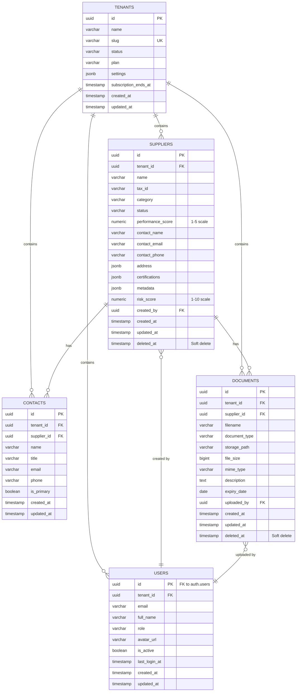

# Entity Relationship Diagram (ERD)

## Overview

This document describes the database schema for the Supplex Supplier Management Platform. The schema is designed with multi-tenant isolation as the primary architectural pattern, using PostgreSQL Row Level Security (RLS) for enforcement.

## Mermaid ERD



## Multi-Tenancy Strategy

### Tenant Isolation

All tables (except `tenants`) include a `tenant_id` foreign key that enforces data isolation:

- **Database Level**: PostgreSQL Row Level Security (RLS) policies automatically filter queries by `tenant_id` from the JWT token
- **Application Level**: Helper functions (`withTenantId`) enforce tenant filtering in Drizzle queries
- **Defense in Depth**: Both layers work together to prevent accidental cross-tenant data access

### Tenant ID Flow

```
User Authentication → JWT with app_metadata.tenant_id → 
RLS Policy Enforcement + Application Filters → 
Tenant-Isolated Data Access
```

## Table Details

### 1. Tenants Table

**Purpose**: Root entity for multi-tenant isolation

**Key Characteristics**:
- UUID primary key (prevents ID guessing)
- Unique slug for URL-friendly tenant identification
- JSONB settings for flexible tenant configuration
- Subscription tracking for billing

**Indexes**:
- Primary Key: `id`
- Unique: `slug`

---

### 2. Users Table

**Purpose**: Authenticated users with role-based access control (RBAC)

**Key Characteristics**:
- `id` matches Supabase `auth.users.id` (1:1 relationship)
- Cascade delete when tenant is deleted
- Unique constraint on `(tenant_id, email)` prevents duplicate emails per tenant

**Indexes**:
- Primary Key: `id`
- Index: `tenant_id` (for fast tenant-based lookups)
- Unique: `(tenant_id, email)`

**Roles**:
- `admin`: Full access to tenant data
- `procurement_manager`: Manage suppliers and contacts
- `quality_manager`: Manage evaluations and audits
- `viewer`: Read-only access

---

### 3. Suppliers Table

**Purpose**: Core supplier/vendor master data

**Key Characteristics**:
- Soft delete with `deleted_at` timestamp (audit trail)
- JSONB fields for flexible data: `address`, `certifications`, `metadata`
- Performance and risk scoring (nullable for prospects)
- Unique constraint on `(tenant_id, tax_id)` prevents duplicate suppliers

**Indexes**:
- Primary Key: `id`
- Composite: `(tenant_id, status)` WHERE `deleted_at IS NULL` (status filtering)
- Composite: `(tenant_id, name)` WHERE `deleted_at IS NULL` (search queries)
- Unique: `(tenant_id, tax_id)`

**Status Values**:
- `prospect`: Initial contact, not yet qualified
- `qualified`: Passed initial qualification checks
- `approved`: Fully approved for business
- `conditional`: Approved with conditions/restrictions
- `blocked`: Suspended/blocked from business

**Categories**:
- `raw_materials`: Raw material suppliers
- `components`: Component/parts suppliers
- `services`: Service providers
- `packaging`: Packaging suppliers
- `logistics`: Logistics/transportation providers

---

### 4. Contacts Table

**Purpose**: Additional contacts for suppliers beyond the primary contact

**Key Characteristics**:
- Multiple contacts per supplier (1:N relationship)
- `is_primary` flag identifies the main contact
- Cascade delete when supplier or tenant is deleted

**Indexes**:
- Primary Key: `id`
- Index: `supplier_id` (for fast supplier-based lookups)
- Index: `tenant_id` (for tenant-based lookups)

---

### 5. Documents Table

**Purpose**: Metadata for files stored in Supabase Storage

**Key Characteristics**:
- Soft delete with `deleted_at` (files may be deleted from storage later)
- `storage_path` references actual file in Supabase Storage buckets
- `expiry_date` for certificates and time-sensitive documents
- Cascade delete when supplier or tenant is deleted

**Indexes**:
- Primary Key: `id`
- Index: `tenant_id` (for tenant-based lookups)
- Index: `supplier_id` (for supplier-based lookups)

**Document Types**:
- `certificate`: ISO certifications, quality certificates
- `contract`: Contracts and agreements
- `insurance`: Insurance documents
- `audit_report`: Audit and compliance reports
- `other`: Miscellaneous documents

---

## Foreign Key Relationships

### Cascade Rules

| Parent Table | Child Table | On Delete Rule | Rationale |
|--------------|-------------|----------------|-----------|
| `tenants` → `users` | CASCADE | When tenant is deleted, all users are deleted | Users belong to tenant |
| `tenants` → `suppliers` | CASCADE | When tenant is deleted, all suppliers are deleted | Suppliers belong to tenant |
| `tenants` → `contacts` | CASCADE | When tenant is deleted, all contacts are deleted | Contacts belong to tenant |
| `tenants` → `documents` | CASCADE | When tenant is deleted, all documents are deleted | Documents belong to tenant |
| `suppliers` → `contacts` | CASCADE | When supplier is deleted, contacts are deleted | Contacts belong to supplier |
| `suppliers` → `documents` | CASCADE | When supplier is deleted, documents are deleted | Documents belong to supplier |
| `users` → `suppliers` | RESTRICT | Cannot delete user who created suppliers | Preserve audit trail |
| `users` → `documents` | RESTRICT | Cannot delete user who uploaded documents | Preserve audit trail |

---

## Row Level Security (RLS) Policies

All tables have RLS enabled with policies that enforce:

1. **SELECT**: Users can only see rows where `tenant_id` matches their JWT token
2. **INSERT**: Users can only insert rows with their own `tenant_id`
3. **UPDATE**: Users can only update rows in their tenant
4. **DELETE**: Users can only delete (soft-delete) rows in their tenant

See `packages/db/rls-policies.sql` for complete policy definitions.

---

## Data Types

### UUID vs Integer

**All primary keys use UUID** for security reasons:
- Prevents ID enumeration attacks
- Globally unique across tenants
- No sequential guessing of IDs

### JSONB Usage

JSONB fields provide flexibility without sacrificing query performance:

1. **`suppliers.address`**: Full address structure
   ```json
   {
     "street": "123 Main St",
     "city": "Frankfurt",
     "state": "Hessen",
     "postalCode": "60311",
     "country": "Germany"
   }
   ```

2. **`suppliers.certifications`**: Array of certifications
   ```json
   [
     {
       "type": "ISO 9001:2015",
       "issueDate": "2023-01-15",
       "expiryDate": "2026-01-15",
       "documentId": "uuid-here"
     }
   ]
   ```

3. **`suppliers.metadata`**: Tenant-specific custom fields
   ```json
   {
     "specialization": "High-grade steel alloys",
     "customField1": "value1",
     "customField2": "value2"
   }
   ```

4. **`tenants.settings`**: Tenant configuration
   ```json
   {
     "evaluationFrequency": "quarterly",
     "notificationEmail": "admin@tenant.com",
     "customFields": {},
     "qualificationRequirements": ["ISO 9001", "Insurance"]
   }
   ```

---

## Performance Considerations

### Indexing Strategy

1. **Tenant-based queries**: All queries filter by `tenant_id` first, so composite indexes start with `tenant_id`
2. **Soft deletes**: Indexes include `WHERE deleted_at IS NULL` to exclude deleted records
3. **Search queries**: `(tenant_id, name)` index supports supplier name searches

### Query Patterns

Most common query patterns are optimized:

```sql
-- Supplier listing (uses idx_suppliers_tenant_status)
SELECT * FROM suppliers 
WHERE tenant_id = ? AND status = 'approved' AND deleted_at IS NULL;

-- Supplier search (uses idx_suppliers_tenant_name)
SELECT * FROM suppliers 
WHERE tenant_id = ? AND name ILIKE '%search%' AND deleted_at IS NULL;

-- Supplier contacts (uses idx_contacts_supplier_id)
SELECT * FROM contacts WHERE supplier_id = ?;

-- Supplier documents (uses idx_documents_supplier_id)
SELECT * FROM documents WHERE supplier_id = ? AND deleted_at IS NULL;
```

---

## Migration Strategy

Drizzle Kit manages migrations in `packages/db/migrations/`:

1. **Generate migration**: `pnpm db:generate` creates SQL migration files
2. **Review migration**: Always review generated SQL before applying
3. **Apply migration**: `pnpm db:migrate` applies to Supabase database
4. **Rollback**: Manual process (see migration files for reverse SQL)

---

## Testing Strategy

1. **Unit Tests**: Schema definitions and helper functions (`packages/db/src/schema/__tests__/`)
2. **Integration Tests**: Actual database queries with test data (requires Supabase connection)
3. **RLS Tests**: Manual verification of RLS policies in Supabase SQL Editor

---

## Future Enhancements (Not in MVP)

1. **Audit Log Table**: Track all data changes with user attribution
2. **Supplier Evaluations Table**: Performance evaluation history
3. **Complaints Table**: Supplier complaints and CAPA tracking
4. **Supplier Relationships Table**: Many-to-many relationships between suppliers
5. **Database Views**: Pre-computed views for complex queries
6. **Full-Text Search**: PostgreSQL `tsvector` for advanced search
7. **Partitioning**: Table partitioning by tenant for very large datasets

---

## Related Documentation

- [Database Schema DDL](./database-schema.md) - SQL DDL definitions
- [Data Models](./data-models.md) - TypeScript interfaces and Zod schemas
- [Tech Stack](./tech-stack.md) - Technology choices and rationale
- [Security & Performance](./security-and-performance.md) - Security patterns

---

**Last Updated**: 2025-10-16  
**Story**: 1.2 - Database Schema & Multi-Tenancy Foundation

