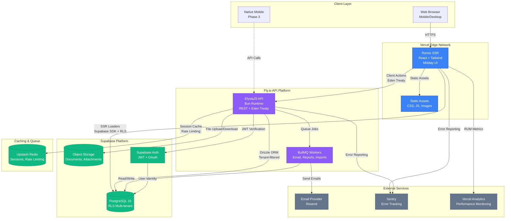

# High Level Architecture

## Technical Summary

Supplex is built as a modern fullstack monorepo leveraging a hybrid architecture that balances security, performance, and developer velocity. The frontend uses **Remix** for server-side rendering with progressive enhancement, styled with **Tailwind CSS** and **Midday UI components** (shadcn/ui primitives). The backend employs **ElysiaJS** on the **Bun runtime** for blazing-fast API performance, with **PostgreSQL** (via Supabase) as the primary database using **Row Level Security (RLS)** for multi-tenant data isolation.

A unique hybrid query strategy enables secure, RLS-protected queries for user-facing operations (via Supabase SDK in Remix loaders) while allowing performant complex queries and bulk operations through **Drizzle ORM** with application-level tenant filtering in ElysiaJS endpoints. All infrastructure is serverless/edge-first, deployed on **Vercel** (frontend) and **Fly.io** (backend), with **Upstash Redis** for caching and **BullMQ** for background job processing.

This architecture achieves the PRD goals of <2s page loads, <500ms API responses, 99%+ uptime, and mobile-first responsiveness while enabling rapid 4-month MVP development through proven patterns (Midday UI), modern tooling (Bun, Remix), and managed services (Supabase, Vercel).

## Platform and Infrastructure Choice

After evaluating multiple platform combinations, we've selected a **hybrid cloud approach** optimized for the mid-market SaaS use case:

**Recommended Platform: Vercel + Supabase + Fly.io + Upstash**

**Rationale:**

- **Vercel (Frontend):** Best-in-class Remix deployment with edge caching, instant preview environments, and <100ms cold starts. Native monorepo support with global edge network.
- **Supabase (Database + Auth):** Managed PostgreSQL with built-in RLS for multi-tenancy security, integrated authentication, and real-time subscriptions (Phase 2). European region support with GDPR compliance built-in.
- **Fly.io (Backend API):** Excellent Bun runtime support, European data center presence (Frankfurt, Amsterdam), 10ms inter-region latency. More cost-effective than Vercel Functions for long-running API operations.
- **Upstash (Redis):** Serverless Redis with per-request pricing, global replication with European region support, ideal for session storage and API rate limiting.

**Alternative Considered: AWS Full Stack (EU regions)**

- **Pros:** Enterprise-grade, unlimited scale, complete control, strong EU data residency options
- **Cons:** 3-5x higher operational complexity, requires DevOps expertise, slower iteration speed, higher minimum costs ($500+/month)
- **Decision:** Rejected for MVP; revisit for enterprise tier (Year 2)

**Alternative Considered: Vercel + Supabase Only (No Fly.io)**

- **Pros:** Simpler architecture, one less platform, Vercel has EU edge locations
- **Cons:** Vercel Functions have 10s timeout limit (problematic for bulk imports, report generation), higher costs at scale ($0.60/million requests vs Fly.io $0.02/million)
- **Decision:** Rejected; need Fly.io for long-running operations

**Platform Choice:**

| Platform Component   | Technology                     | Regions                                                       |
| -------------------- | ------------------------------ | ------------------------------------------------------------- |
| **Frontend Hosting** | Vercel Edge Network            | Global (automatic, EU-optimized)                              |
| **API Backend**      | Fly.io                         | EU-West (Frankfurt primary), EU-Central (Amsterdam secondary) |
| **Database**         | Supabase PostgreSQL 15         | EU-West (Frankfurt) with daily backups                        |
| **Object Storage**   | Supabase Storage               | EU-West (Frankfurt, GDPR-compliant)                           |
| **Authentication**   | Supabase Auth                  | EU-West (Frankfurt)                                           |
| **Cache Layer**      | Upstash Redis                  | EU region with global replication                             |
| **Job Queue**        | BullMQ (self-hosted on Fly.io) | EU-West (Frankfurt)                                           |
| **Monitoring**       | Sentry (EU) + Vercel Analytics | Cloud SaaS (EU data residency)                                |

**Deployment Regions (MVP):** Single region (EU-West/Frankfurt) to minimize latency for European customers and ensure GDPR compliance. Phase 2 adds EU-Central (Amsterdam) for redundancy and US-East for American customers.

**GDPR & Data Residency Considerations:**

- All customer data stored exclusively in EU regions (Frankfurt)
- Supabase is GDPR-compliant with EU data processing agreements
- Fly.io allows explicit EU-only deployment (no automatic US failover)
- Vercel edge caching respects geo-restrictions (EU data stays in EU)
- Monitoring tools (Sentry) configured for EU data residency

## Repository Structure

**Structure:** Monorepo with pnpm workspaces

**Monorepo Tool:** pnpm workspaces (native, no Turborepo/Nx overhead for MVP)

**Package Organization:**

```
supplex/
├── apps/
│   ├── web/              # Remix frontend application
│   └── api/              # ElysiaJS backend application
├── packages/
│   ├── ui/               # Midday UI components (shadcn/ui)
│   ├── types/            # Shared TypeScript types & Zod schemas
│   ├── db/               # Drizzle schema & migrations
│   └── config/           # Shared configs (ESLint, TypeScript, Tailwind)
├── docs/                 # Documentation (this file)
├── .github/workflows/    # CI/CD pipelines
└── package.json          # Root workspace config
```

**Rationale:**

- **Monorepo benefits:** Shared types ensure frontend/backend type safety, atomic commits across stack, simplified dependency management
- **pnpm workspaces:** 3x faster installs than npm, strict dependency isolation prevents phantom dependencies, native Node.js support (vs Yarn PnP complexity)
- **Why not Turborepo/Nx?** MVP has only 2 apps and 4 packages—overhead not justified. Add in Phase 2 if build times exceed 2 minutes.

**Package Boundaries:**

- `packages/types` — Shared between web and api, zero dependencies on either
- `packages/ui` — Used only by web, no backend dependencies
- `packages/db` — Used only by api (Drizzle schema), web accesses via Supabase SDK
- `packages/config` — Shared tooling configs (linters, TS config extends)

## High Level Architecture Diagram



## Architectural Patterns

The following patterns guide both frontend and backend development:

- **Jamstack Architecture (Hybrid SSR):** Static site generation with server-side rendering for dynamic content and serverless APIs for backend operations. _Rationale:_ Optimal performance and SEO for authenticated B2B SaaS while maintaining dynamic capabilities for user-specific data.

- **Multi-tenant with Row Level Security (RLS):** Database-enforced tenant isolation using PostgreSQL RLS policies combined with application-level checks. _Rationale:_ Defense-in-depth security ensures no tenant data leaks even if application code has bugs; required for compliance (SOC 2, GDPR).

- **Backend for Frontend (BFF) Pattern:** Remix loaders act as BFF layer, orchestrating calls to ElysiaJS API and Supabase SDK. _Rationale:_ Reduces client-side complexity, improves perceived performance through SSR, centralizes authorization logic.

- **Repository Pattern (Backend):** Abstract data access logic behind repository interfaces in ElysiaJS services. _Rationale:_ Enables testing with mock repositories, provides flexibility to add caching layers or switch databases in future without changing business logic.

- **Component-Based UI with Composition:** Reusable React components from Midday UI composed into Supplex-specific features. _Rationale:_ Maintainability and consistency across large codebase, accessibility built-in, faster development through proven patterns.

- **Optimistic UI Updates:** Client-side state updates immediately before server confirmation. _Rationale:_ Perceived performance improvement (UI feels instant), critical for mobile users on slower networks.

- **API Gateway Pattern (ElysiaJS):** Single entry point for all API calls with centralized auth, rate limiting, and logging. _Rationale:_ Simplified security model, easier monitoring, consistent error handling across all endpoints.

- **Event-Driven Background Processing:** Long-running tasks (email notifications, report generation, bulk imports) handled asynchronously via BullMQ. _Rationale:_ Prevents API timeout issues, improves user experience (no waiting for emails), enables retry logic for reliability.

- **CQRS-Lite (Command Query Separation):** Read operations use Supabase SDK (fast, RLS-protected), write operations use ElysiaJS + Drizzle (transactional, business logic enforcement). _Rationale:_ Optimizes read performance while maintaining write integrity, simplifies security model.

---
