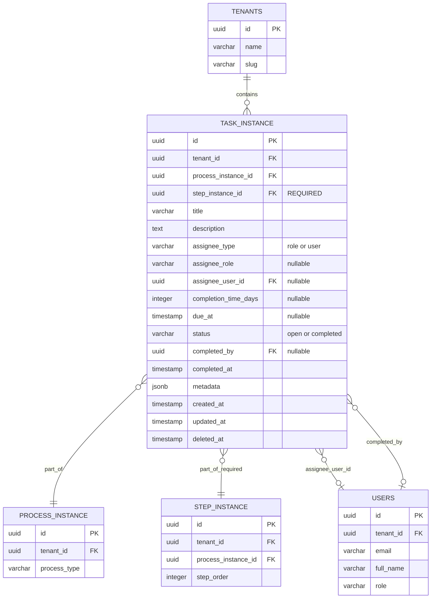
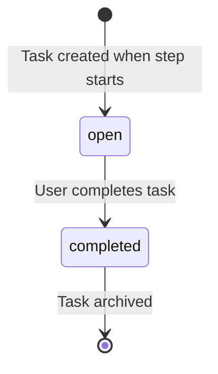

# Task Instance Schema Design

**Story:** 2.2.5.1 - Course Correction for Tasks (Remove Task Templates)  
**Created:** January 24, 2026  
**Status:** Implemented

## Overview

The task system provides runtime task creation driven by workflow execution. Tasks are created dynamically when a workflow step becomes active, acting as to-do warnings for users to complete specific actions.

**Key Change from Story 2.2.5:**  
Task templates have been **removed**. Tasks are no longer reusable library items but are created at runtime from workflow step configuration (defined in Story 2.2.6).

### Key Concepts

- **Task Instance** (`task_instance`): Runtime execution of a task created when a step becomes active
- **No Templates**: Tasks are configured at the workflow step level, not as standalone templates
- **Tenant Isolation**: All tasks are tenant-scoped and inherit tenant_id from their parent process
- **Flexible Assignment**: Tasks can be assigned to a role (all users with that role) or a specific user
- **Simple Status**: Tasks are either 'open' or 'completed' (no intermediate states)

## Table Structure

### Table: `task_instance`

Runtime execution of tasks within workflow steps.

| Column | Type | Nullable | Description |
|--------|------|----------|-------------|
| `id` | UUID | NOT NULL | Primary key, unique instance identifier |
| `tenant_id` | UUID | NOT NULL | FK to tenants (CASCADE delete) |
| `process_instance_id` | UUID | NOT NULL | FK to process_instance (CASCADE delete) |
| `step_instance_id` | UUID | NOT NULL | FK to step_instance (CASCADE delete) - **ALWAYS REQUIRED** |
| `title` | VARCHAR(300) | NOT NULL | Runtime title (from workflow step config) |
| `description` | TEXT | NULL | Runtime description (from workflow step config) |
| `assignee_type` | VARCHAR(50) | NOT NULL | 'role' or 'user' - assignment strategy |
| `assignee_role` | VARCHAR(50) | NULL | Role name if assignee_type = 'role' |
| `assignee_user_id` | UUID | NULL | FK to users if assignee_type = 'user' (RESTRICT delete) |
| `completion_time_days` | INTEGER | NULL | Days to complete (from workflow step config) |
| `due_at` | TIMESTAMP | NULL | Calculated due date (created_at + completion_time_days) |
| `status` | VARCHAR(50) | NOT NULL | 'open' or 'completed' |
| `completed_by` | UUID | NULL | FK to users (RESTRICT delete) |
| `completed_at` | TIMESTAMP | NULL | Completion timestamp |
| `metadata` | JSONB | NOT NULL | Runtime task data (default: {}) |
| `created_at` | TIMESTAMP | NOT NULL | Creation timestamp |
| `updated_at` | TIMESTAMP | NOT NULL | Last update timestamp |
| `deleted_at` | TIMESTAMP | NULL | Soft delete timestamp |

**Indexes:**
- `task_instance_pkey` - Primary key on `id`
- `idx_task_instance_tenant_assignee_status` - `(tenant_id, assignee_type, assignee_role, status)` WHERE `status = 'open' AND deleted_at IS NULL`
- `idx_task_instance_tenant_assignee_user_status` - `(tenant_id, assignee_user_id, status)` WHERE `assignee_type = 'user' AND status = 'open' AND deleted_at IS NULL`
- `idx_task_instance_process_step` - `(process_instance_id, step_instance_id)` WHERE `deleted_at IS NULL`
- `idx_task_instance_tenant_due_at` - `(tenant_id, due_at)` WHERE `status = 'open' AND deleted_at IS NULL`

**Foreign Keys:**
- `tenant_id` → `tenants(id)` ON DELETE CASCADE
- `process_instance_id` → `process_instance(id)` ON DELETE CASCADE
- `step_instance_id` → `step_instance(id)` ON DELETE CASCADE - **NOW REQUIRED**
- `assignee_user_id` → `users(id)` ON DELETE RESTRICT (when assignee_type = 'user')
- `completed_by` → `users(id)` ON DELETE RESTRICT

## Entity Relationship Diagram



## Task Assignment Strategies

### Strategy 1: Role-Based Assignment

When `assignee_type = 'role'`:

```typescript
{
  assigneeType: "role",
  assigneeRole: "procurement_manager", // Role name
  assigneeUserId: null
}
```

**Behavior:**
- Task appears in task list for **all users** in the tenant with matching role
- Any user with the role can complete the task
- Use for collaborative tasks where any team member can act

**Example Roles:**
- `admin`
- `procurement_manager`
- `quality_manager`
- `viewer`

### Strategy 2: User-Specific Assignment

When `assignee_type = 'user'`:

```typescript
{
  assigneeType: "user",
  assigneeRole: null,
  assigneeUserId: "uuid-of-specific-user"
}
```

**Behavior:**
- Task appears in task list for **only the assigned user**
- Only that user can complete the task
- Use for personal tasks requiring specific person

## Task Status Lifecycle

Tasks have a simplified two-state lifecycle:



**Status Values:**
- `open` - Task is active and awaiting completion
- `completed` - Task has been completed

**Removed Status Values (from Story 2.2.5):**
- ~~`pending`~~ - Replaced by `open`
- ~~`in_progress`~~ - Removed (tasks are either open or completed)
- ~~`cancelled`~~ - Removed (delete task if no longer needed)

## Tenant Isolation Strategy

### Query Filtering
All queries MUST filter by `tenant_id` at the application layer:

```typescript
// ✅ CORRECT: Tenant filter applied
const tasks = await db
  .select()
  .from(taskInstance)
  .where(
    and(
      eq(taskInstance.tenantId, currentTenantId),
      eq(taskInstance.status, 'open'),
      isNull(taskInstance.deletedAt)
    )
  );

// ❌ WRONG: No tenant filter
const tasks = await db
  .select()
  .from(taskInstance)
  .where(eq(taskInstance.status, 'open'));
```

### Index Performance
All indexes include `tenant_id` as the first column for optimal multi-tenant query performance:

- `(tenant_id, assignee_type, assignee_role, status)` - Role-based task lists
- `(tenant_id, assignee_user_id, status)` - User-specific task lists
- `(tenant_id, due_at)` - Overdue task detection

### Cascade Delete Rules

**CASCADE (Parent-Child Hierarchy):**
- When **tenant deleted** → All task instances deleted
- When **process deleted** → All task instances deleted
- When **step deleted** → All task instances deleted

**RESTRICT (Audit Trail):**
- **Cannot delete users** who are assigned to tasks (`assignee_user_id`)
- **Cannot delete users** who completed tasks (`completed_by`)
- Rationale: Maintains audit trail of task history
- Users must be deactivated (not deleted) if they have task history

## Task Instance Usage Patterns

### Pattern 1: Creating Task When Step Starts

Tasks are created by the workflow engine when `step_instance` transitions to 'active'.

```typescript
import { db, taskInstance } from "@supplex/db";
import { TaskInstanceStatus, TaskAssigneeType } from "@supplex/types";

// Workflow engine creates task from step configuration
const newTask = await db.insert(taskInstance).values({
  tenantId: currentTenantId,
  processInstanceId: processId,
  stepInstanceId: stepId, // REQUIRED - task always belongs to a step
  title: stepConfig.taskTitle, // From workflow_step_template
  description: stepConfig.taskDescription, // From workflow_step_template
  assigneeType: stepConfig.assigneeType, // 'role' or 'user'
  assigneeRole: stepConfig.assigneeRole, // If assigneeType = 'role'
  assigneeUserId: stepConfig.assigneeUserId, // If assigneeType = 'user'
  completionTimeDays: stepConfig.completionTimeDays, // e.g., 3 days
  dueAt: calculateDueDate(stepConfig.completionTimeDays),
  status: TaskInstanceStatus.OPEN,
  metadata: {
    createdByEngine: true,
    stepName: stepInstance.stepName,
  },
});

function calculateDueDate(days: number | null): Date | null {
  if (!days) return null;
  const dueDate = new Date();
  dueDate.setDate(dueDate.getDate() + days);
  return dueDate;
}
```

### Pattern 2: User Task List Query (Role-Based)

```typescript
// Get all open tasks for users with specific role
const roleTasks = await db
  .select({
    id: taskInstance.id,
    title: taskInstance.title,
    description: taskInstance.description,
    dueAt: taskInstance.dueAt,
    processType: processInstance.processType,
    stepName: stepInstance.stepName,
  })
  .from(taskInstance)
  .innerJoin(processInstance, eq(taskInstance.processInstanceId, processInstance.id))
  .innerJoin(stepInstance, eq(taskInstance.stepInstanceId, stepInstance.id))
  .where(
    and(
      eq(taskInstance.tenantId, currentTenantId),
      eq(taskInstance.assigneeType, TaskAssigneeType.ROLE),
      eq(taskInstance.assigneeRole, currentUserRole), // e.g., 'procurement_manager'
      eq(taskInstance.status, TaskInstanceStatus.OPEN),
      isNull(taskInstance.deletedAt)
    )
  )
  .orderBy(asc(taskInstance.dueAt));
```

### Pattern 3: User Task List Query (User-Specific)

```typescript
// Get all open tasks assigned to specific user
const userTasks = await db
  .select({
    id: taskInstance.id,
    title: taskInstance.title,
    description: taskInstance.description,
    dueAt: taskInstance.dueAt,
    processType: processInstance.processType,
    stepName: stepInstance.stepName,
  })
  .from(taskInstance)
  .innerJoin(processInstance, eq(taskInstance.processInstanceId, processInstance.id))
  .innerJoin(stepInstance, eq(taskInstance.stepInstanceId, stepInstance.id))
  .where(
    and(
      eq(taskInstance.tenantId, currentTenantId),
      eq(taskInstance.assigneeType, TaskAssigneeType.USER),
      eq(taskInstance.assigneeUserId, currentUserId),
      eq(taskInstance.status, TaskInstanceStatus.OPEN),
      isNull(taskInstance.deletedAt)
    )
  )
  .orderBy(asc(taskInstance.dueAt));
```

### Pattern 4: Overdue Task Detection

```typescript
// Find overdue tasks for notification
const overdueTasks = await db
  .select({
    id: taskInstance.id,
    title: taskInstance.title,
    dueAt: taskInstance.dueAt,
    assigneeType: taskInstance.assigneeType,
    assigneeRole: taskInstance.assigneeRole,
    assigneeUserId: taskInstance.assigneeUserId,
  })
  .from(taskInstance)
  .where(
    and(
      eq(taskInstance.tenantId, currentTenantId),
      lt(taskInstance.dueAt, new Date()), // Past due date
      eq(taskInstance.status, TaskInstanceStatus.OPEN),
      isNull(taskInstance.deletedAt)
    )
  );

// Notify users based on assigneeType
for (const task of overdueTasks) {
  if (task.assigneeType === 'role') {
    // Notify all users with assigneeRole
    const users = await getUsersByRole(task.assigneeRole);
    await sendOverdueNotifications(users, task);
  } else {
    // Notify specific user
    const user = await getUserById(task.assigneeUserId);
    await sendOverdueNotification(user, task);
  }
}
```

### Pattern 5: Completing a Task

```typescript
// Mark task as completed
await db
  .update(taskInstance)
  .set({
    status: TaskInstanceStatus.COMPLETED,
    completedBy: currentUserId,
    completedAt: new Date(),
    metadata: {
      ...existingMetadata,
      completionNotes: "Task completed successfully",
    },
    updatedAt: new Date(),
  })
  .where(
    and(
      eq(taskInstance.id, taskId),
      eq(taskInstance.tenantId, currentTenantId),
      eq(taskInstance.status, TaskInstanceStatus.OPEN) // Prevent double-completion
    )
  );
```

## Metadata Field Usage Patterns

### Task Instance Metadata Examples

```typescript
// Runtime task metadata created by workflow engine
metadata: {
  createdByEngine: true,
  stepName: "Review Supplier Documents",
  stepOrder: 3,
  workflowTemplateId: "template-uuid",
}

// Task completion metadata
metadata: {
  ...previousMetadata,
  completionNotes: "All documents verified and approved",
  attachments: [
    { id: "doc1", name: "ISO_9001.pdf", verifiedAt: "2026-01-24T11:00:00Z" }
  ],
}

// Task with checklist
metadata: {
  checklist: [
    { id: "item1", label: "Verify business license", completed: true },
    { id: "item2", label: "Check ISO certificate", completed: true },
  ],
  completionPercentage: 100,
}
```

## Performance Considerations

### Index Usage

**Query: Role-Based Task List**
```sql
-- Uses: idx_task_instance_tenant_assignee_status
SELECT * FROM task_instance
WHERE tenant_id = ? AND assignee_type = 'role' AND assignee_role = ? AND status = 'open'
AND deleted_at IS NULL;
```

**Query: User-Specific Task List**
```sql
-- Uses: idx_task_instance_tenant_assignee_user_status
SELECT * FROM task_instance
WHERE tenant_id = ? AND assignee_user_id = ? AND status = 'open'
AND deleted_at IS NULL;
```

**Query: Overdue Tasks**
```sql
-- Uses: idx_task_instance_tenant_due_at
SELECT * FROM task_instance
WHERE tenant_id = ? AND due_at < NOW() AND status = 'open'
AND deleted_at IS NULL;
```

**Query: Step Tasks**
```sql
-- Uses: idx_task_instance_process_step
SELECT * FROM task_instance
WHERE process_instance_id = ? AND step_instance_id = ?
AND deleted_at IS NULL;
```

### Partial Indexes

All indexes use `WHERE` clauses to:
- Reduce index size (exclude completed and soft-deleted records)
- Improve query performance (smaller index to scan)
- Focus on active tasks that users actually query

### JSONB Performance

- `metadata` field uses JSONB for flexibility
- PostgreSQL supports JSONB indexing if needed (GIN indexes)
- Currently not indexed - add GIN index if metadata querying becomes frequent

## Migration Information

**Migration File:** `0011_course_correct_remove_task_template.sql`  
**Applied:** January 24, 2026  
**Changes:**
- Dropped `task_template` table entirely
- Removed `task_template_id` column from `task_instance`
- Removed `assigned_to` column from `task_instance`
- Added `assignee_type`, `assignee_role`, `assignee_user_id` columns
- Added `completion_time_days` column
- Renamed `due_date` to `due_at`
- Made `step_instance_id` NOT NULL
- Updated indexes for new assignee system
- Simplified status values to 'open' and 'completed'

**Previous Migration:** `0010_add_task_tables.sql` (Story 2.2.5) - Now superseded

## Workflow Integration

Tasks are configured at the **workflow step level** (not as standalone templates).

**Configuration Location:** `workflow_step_template` table (Story 2.2.6)

**Step Configuration Fields:**
- `task_title` - Copied to `task_instance.title`
- `task_description` - Copied to `task_instance.description`
- `completion_time_days` - Copied to `task_instance.completion_time_days`
- `assignee_type` - Copied to `task_instance.assignee_type`
- `assignee_role` - Copied to `task_instance.assignee_role`
- `assignee_user_id` - Copied to `task_instance.assignee_user_id`

**Engine Behavior:**
1. When `step_instance` transitions to 'active'
2. Workflow engine reads configuration from `workflow_step_template`
3. Engine creates `task_instance` with values from step config
4. Engine calculates `due_at` from `completion_time_days`
5. Task appears in user's task list immediately

## Future Enhancements

Planned for future stories:

1. **Task Dependencies** - Define task execution order within workflow (Story TBD)
2. **Task Notifications** - Automatic email/in-app notifications for new and overdue tasks (Story 2.2.8)
3. **Task History** - Audit log of all task status changes (Story TBD)
4. **Task Comments** - Allow users to add comments to tasks (Story TBD)
5. **Task Attachments** - Link documents to tasks (Story TBD)
6. **Row Level Security (RLS)** - Database-level tenant isolation policies (Story TBD)

## Related Documentation

- [Workflow Engine Schema](./workflow-engine-schema.md) - process_instance and step_instance tables
- [Entity Relationship Diagram](./erd.md) - Complete database schema diagram
- [Coding Standards](./coding-standards.md) - Database schema conventions
- [Story 2.2.5](../stories/2.2.5.story.md) - Original task template implementation (superseded)
- [Story 2.2.5.1](../stories/2.2.5.1.story.md) - Course correction (this implementation)
- [Story 2.2.6](../stories/2.2.6.story.md) - Workflow template builder (defines step-level task config)

---

**Last Updated:** January 24, 2026  
**Author:** James (Dev Agent)

