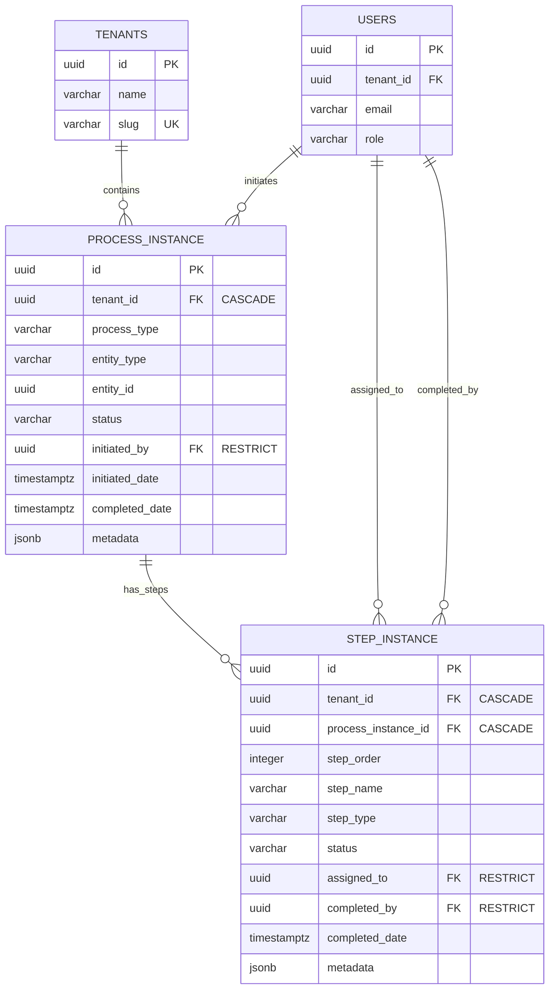

# Workflow Engine Schema Documentation

> **Story:** 2.2.1 - Database Refactor for Dynamic Workflows  
> **Date:** January 20, 2026  
> **Status:** Active

## Overview

This document describes the new domain-agnostic workflow execution engine tables that replace the qualification-specific workflow tables. The new schema supports any type of multi-step process (supplier qualification, sourcing, product lifecycle management, etc.) through a flexible, tenant-isolated design.

## Architecture Principles

### Domain-Agnostic Design

The workflow engine is intentionally designed to be process-type agnostic:

- **process_instance** tracks any workflow execution (not just qualification)
- **step_instance** tracks any step type (forms, approvals, tasks, documents)
- Process-specific configuration is stored in JSONB `metadata` fields
- Entity associations use flexible `entity_type` and `entity_id` fields

### Tenant Isolation Strategy

Both tables enforce strict tenant isolation:

```sql
-- All queries must include tenant_id filter
SELECT * FROM process_instance 
WHERE tenant_id = $1 AND status = 'active';

SELECT * FROM step_instance 
WHERE tenant_id = $1 AND assigned_to = $2 AND status IN ('pending', 'active');
```

**Isolation Mechanisms:**
1. **Application Level:** All queries filter by `tenant_id` (enforced in API layer)
2. **Database Level:** `tenant_id` foreign key with CASCADE delete
3. **Index Optimization:** All composite indexes start with `tenant_id`
4. **Future:** Row Level Security (RLS) policies (Phase 2)

## Table Definitions

### process_instance

Tracks the execution of a multi-step workflow.

#### Columns

| Column | Type | Constraints | Description |
|--------|------|-------------|-------------|
| `id` | UUID | PRIMARY KEY, DEFAULT gen_random_uuid() | Unique process instance identifier |
| `tenant_id` | UUID | NOT NULL, FK to tenants(id) CASCADE | Tenant isolation |
| `process_type` | VARCHAR(100) | NOT NULL | Type of process (e.g., 'supplier_qualification') |
| `entity_type` | VARCHAR(100) | NOT NULL | Type of entity being processed (e.g., 'supplier') |
| `entity_id` | UUID | NOT NULL | ID of the entity being processed |
| `status` | VARCHAR(50) | NOT NULL, DEFAULT 'active' | Process status: active, completed, cancelled, blocked |
| `initiated_by` | UUID | NOT NULL, FK to users(id) RESTRICT | User who started the process |
| `initiated_date` | TIMESTAMPTZ | NOT NULL, DEFAULT NOW() | When process was started |
| `completed_date` | TIMESTAMPTZ | NULL | When process was completed/cancelled |
| `metadata` | JSONB | NOT NULL, DEFAULT '{}' | Process-specific configuration and state |
| `created_at` | TIMESTAMPTZ | NOT NULL, DEFAULT NOW() | Record creation timestamp |
| `updated_at` | TIMESTAMPTZ | NOT NULL, DEFAULT NOW() | Record update timestamp |
| `deleted_at` | TIMESTAMPTZ | NULL | Soft delete timestamp |

#### Indexes

```sql
-- Filtering processes by type and status
CREATE INDEX idx_process_instance_tenant_type_status 
    ON process_instance(tenant_id, process_type, status) 
    WHERE deleted_at IS NULL;

-- Entity-specific process lookups
CREATE INDEX idx_process_instance_tenant_entity 
    ON process_instance(tenant_id, entity_type, entity_id) 
    WHERE deleted_at IS NULL;
```

#### Example Usage

```typescript
// Create a supplier qualification process
const processInstance = await db.insert(processInstance).values({
  tenantId: user.tenantId,
  processType: ProcessType.SUPPLIER_QUALIFICATION,
  entityType: 'supplier',
  entityId: supplierId,
  status: ProcessStatus.ACTIVE,
  initiatedBy: user.id,
  metadata: {
    checklistId: checklistTemplate.id,
    priority: 'high',
  },
});
```

### step_instance

Tracks individual steps within a process execution.

#### Columns

| Column | Type | Constraints | Description |
|--------|------|-------------|-------------|
| `id` | UUID | PRIMARY KEY, DEFAULT gen_random_uuid() | Unique step instance identifier |
| `tenant_id` | UUID | NOT NULL, FK to tenants(id) CASCADE | Tenant isolation (inherited from process) |
| `process_instance_id` | UUID | NOT NULL, FK to process_instance(id) CASCADE | Parent process |
| `step_order` | INTEGER | NOT NULL | Sequential order of step in process |
| `step_name` | VARCHAR(200) | NOT NULL | Display name of step |
| `step_type` | VARCHAR(50) | NOT NULL | Type: form, approval, task, document_upload |
| `status` | VARCHAR(50) | NOT NULL, DEFAULT 'pending' | Step status: pending, active, completed, blocked, skipped |
| `assigned_to` | UUID | NULL, FK to users(id) RESTRICT | User assigned to complete step |
| `completed_by` | UUID | NULL, FK to users(id) RESTRICT | User who completed step |
| `completed_date` | TIMESTAMPTZ | NULL | When step was completed |
| `metadata` | JSONB | NOT NULL, DEFAULT '{}' | Step-specific configuration and data |
| `created_at` | TIMESTAMPTZ | NOT NULL, DEFAULT NOW() | Record creation timestamp |
| `updated_at` | TIMESTAMPTZ | NOT NULL, DEFAULT NOW() | Record update timestamp |
| `deleted_at` | TIMESTAMPTZ | NULL | Soft delete timestamp |

#### Indexes

```sql
-- Sequential step retrieval within a process
CREATE INDEX idx_step_instance_process_order 
    ON step_instance(process_instance_id, step_order) 
    WHERE deleted_at IS NULL;

-- User task lists (pending/active steps assigned to user)
CREATE INDEX idx_step_instance_tenant_assigned_status 
    ON step_instance(tenant_id, assigned_to, status) 
    WHERE status IN ('pending', 'active') AND deleted_at IS NULL;
```

#### Example Usage

```typescript
// Create approval steps
const steps = await db.insert(stepInstance).values([
  {
    tenantId: user.tenantId,
    processInstanceId: processId,
    stepOrder: 1,
    stepName: 'Initial Review',
    stepType: StepType.APPROVAL,
    status: StepStatus.ACTIVE,
    assignedTo: procurementManagerId,
    metadata: {
      requiredRole: 'procurement_manager',
      instructions: 'Review supplier documentation',
    },
  },
  {
    tenantId: user.tenantId,
    processInstanceId: processId,
    stepOrder: 2,
    stepName: 'Technical Assessment',
    stepType: StepType.FORM,
    status: StepStatus.PENDING,
    assignedTo: qualityManagerId,
    metadata: {
      formSchema: technicalAssessmentForm,
    },
  },
]);
```

### comment_thread

Tracks comments and threaded discussions within workflow steps, supporting decline reasons and user responses.

**Added in:** Story 2.2.8 - Workflow Execution Engine

#### Columns

| Column | Type | Constraints | Description |
|--------|------|-------------|-------------|
| `id` | UUID | PRIMARY KEY, DEFAULT gen_random_uuid() | Unique comment identifier |
| `tenant_id` | UUID | NOT NULL, FK to tenants(id) CASCADE | Tenant isolation |
| `process_instance_id` | UUID | NOT NULL, FK to process_instance(id) CASCADE | Parent process |
| `step_instance_id` | UUID | NOT NULL, FK to step_instance(id) CASCADE | Step where comment was made |
| `entity_type` | VARCHAR(50) | NOT NULL | Type of entity: 'form' or 'document' |
| `entity_id` | UUID | NULL | Optional reference to specific entity (future use) |
| `parent_comment_id` | UUID | NULL, FK to comment_thread(id) CASCADE | Parent comment for threading |
| `comment_text` | TEXT | NOT NULL | Comment content |
| `commented_by` | UUID | NOT NULL, FK to users(id) RESTRICT | User who created comment |
| `created_at` | TIMESTAMPTZ | NOT NULL, DEFAULT NOW() | Comment creation timestamp |
| `updated_at` | TIMESTAMPTZ | NOT NULL, DEFAULT NOW() | Comment update timestamp |
| `deleted_at` | TIMESTAMPTZ | NULL | Soft delete timestamp |

#### Indexes

```sql
-- Retrieve all comments for a step with tenant filter
CREATE INDEX idx_comment_thread_tenant_process_step 
    ON comment_thread(tenant_id, process_instance_id, step_instance_id) 
    WHERE deleted_at IS NULL;

-- Support threaded comment retrieval
CREATE INDEX idx_comment_thread_parent 
    ON comment_thread(parent_comment_id) 
    WHERE deleted_at IS NULL;
```

#### Example Usage

```typescript
// Create a decline comment
const declineComment = await db.insert(commentThread).values({
  tenantId: user.tenantId,
  processInstanceId: processId,
  stepInstanceId: stepId,
  entityType: 'form',
  commentText: 'Please revise section 3 with updated certification dates.',
  commentedBy: user.id,
});

// Create a reply
const replyComment = await db.insert(commentThread).values({
  tenantId: user.tenantId,
  processInstanceId: processId,
  stepInstanceId: stepId,
  entityType: 'form',
  parentCommentId: declineComment.id,
  commentText: 'Updated the form with correct dates. Please review.',
  commentedBy: originalUserId,
});

// Retrieve threaded comments for a step
const comments = await db
  .select()
  .from(commentThread)
  .where(
    and(
      eq(commentThread.stepInstanceId, stepId),
      eq(commentThread.tenantId, user.tenantId)
    )
  )
  .orderBy(commentThread.createdAt);
```

## Foreign Key Cascade Rules

### CASCADE Delete

When parent is deleted, all children are automatically deleted:

- `tenant_id` → CASCADE: Deleting tenant removes all processes and steps
- `process_instance_id` → CASCADE: Deleting process removes all steps

### RESTRICT Delete

Prevents deletion to preserve audit trail:

- `initiated_by` → RESTRICT: Cannot delete user who initiated a process
- `assigned_to` → RESTRICT: Cannot delete user who was assigned a step
- `completed_by` → RESTRICT: Cannot delete user who completed a step

## Legacy Tables (DO NOT MODIFY)

The following tables remain unchanged and continue to support existing qualification workflows:

### qualification_process
- **Purpose:** Tracks supplier qualification processes (legacy)
- **File:** `packages/db/src/schema/qualification-process.ts`
- **Status:** Active but frozen - no new features added
- **Future:** Will be migrated to use `process_instance` in future stories

### qualification_stages
- **Purpose:** Individual approval stages within qualification (legacy)
- **File:** `packages/db/src/schema/qualification-stages.ts`
- **Status:** Active but frozen - no new features added
- **Future:** Will be migrated to use `step_instance` in future stories

### workflow_documents
- **Purpose:** Document checklist items for workflows (legacy)
- **File:** `packages/db/src/schema/workflow-documents.ts`
- **Status:** Active but frozen
- **Future:** Will be redesigned as workflow engine integration

### workflow_events
- **Purpose:** Audit trail for workflow actions (legacy)
- **File:** `packages/db/src/schema/workflow-events.ts`
- **Status:** Active but frozen
- **Future:** Will be replaced by generic process event logging

### qualification_templates
- **Purpose:** Template definitions for qualification checklists (legacy)
- **File:** `packages/db/src/schema/qualification-templates.ts`
- **Status:** Active but frozen
- **Future:** Will be replaced by flexible workflow templates

## Migration Path

### Phase 1: Co-existence (Current - Story 2.2.1)

✅ **Completed:**
- New tables created (`process_instance`, `step_instance`)
- Legacy tables remain unchanged
- No data migration required
- Both systems operate independently

### Phase 2: New Feature Development (Stories 2.2.2 - 2.2.10)

🔄 **In Progress:**
- All new workflow features use new engine only
- Legacy qualification workflows continue to use old tables
- New qualification workflows can use either system (toggle)

### Phase 3: Data Migration (Future Epic)

📋 **Planned:**
- Migrate existing qualification_process → process_instance
- Migrate existing qualification_stages → step_instance
- Maintain audit trail and historical data
- Update all API references

### Phase 4: Decommission (Future Epic)

🗑️ **Planned:**
- Verify all features migrated
- Remove legacy table definitions
- Remove legacy API endpoints
- Clean up unused code

## Entity Relationship Diagram



## Performance Considerations

### Index Strategy

All indexes are designed for tenant-isolated queries:

1. **Composite indexes start with `tenant_id`** - Enables index-only scans for tenant-specific queries
2. **Partial indexes with WHERE clauses** - Reduces index size by excluding soft-deleted records
3. **Conditional partial indexes** - `step_instance` task list index only includes pending/active steps

### Query Optimization

```sql
-- Good: Uses idx_process_instance_tenant_type_status
SELECT * FROM process_instance 
WHERE tenant_id = $1 AND process_type = 'supplier_qualification' AND status = 'active'
AND deleted_at IS NULL;

-- Good: Uses idx_step_instance_tenant_assigned_status
SELECT * FROM step_instance 
WHERE tenant_id = $1 AND assigned_to = $2 AND status IN ('pending', 'active')
AND deleted_at IS NULL;

-- Bad: Missing tenant_id filter (full table scan)
SELECT * FROM process_instance WHERE entity_id = $1;
```

### JSONB Metadata

The `metadata` fields use JSONB for flexibility:

- **GIN indexes** can be added later for specific metadata queries
- **Querying:** Use `->` and `->>` operators for JSON navigation
- **Updating:** Use `jsonb_set()` for partial updates

```sql
-- Query metadata
SELECT * FROM process_instance 
WHERE metadata->>'priority' = 'high';

-- Update metadata
UPDATE process_instance 
SET metadata = jsonb_set(metadata, '{status_details}', '"In review"')
WHERE id = $1;
```

## Security & Compliance

### Audit Trail Preservation

- Soft deletes (`deleted_at`) preserve historical records
- RESTRICT on user foreign keys prevents deletion of workflow participants
- All timestamp fields (created_at, updated_at, completed_date) are immutable after creation

### Data Privacy

- JSONB metadata fields may contain sensitive information
- Application layer must sanitize metadata before logging
- Future: Add RLS policies for multi-tenant database-level security

## Testing Strategy

See `packages/db/src/schema/__tests__/workflow-engine-tenant-isolation.test.ts` for:

- ✅ Tenant isolation enforcement
- ✅ Cascade delete behavior
- ✅ Foreign key constraint validation
- ✅ Index performance verification

## Related Documentation

- [Database Schema Overview](./database-schema.md)
- [ERD Documentation](./erd.md)
- [Coding Standards](./coding-standards.md)
- [Story 2.2.1](../../docs/stories/2.2.1.story.md)

---

*Last Updated: January 20, 2026*

