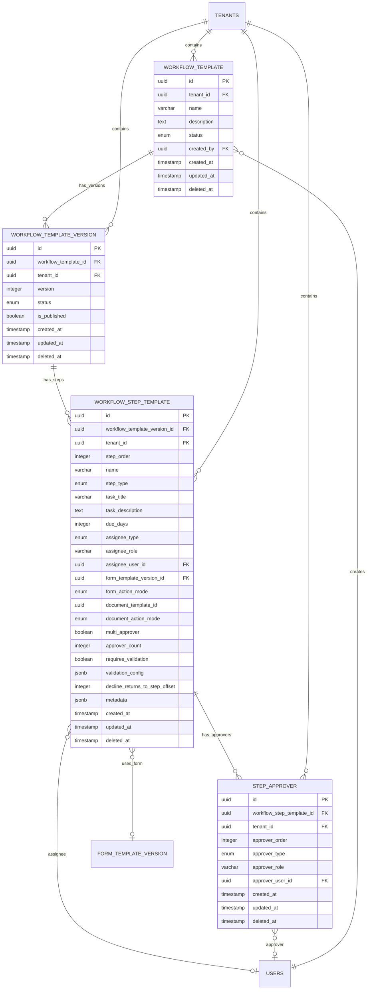

# Workflow Template Schema Design

**Story:** 2.2.6 - Workflow Template Data Model (Tenant-Isolated, Action Modes)  
**Date:** January 24, 2026

> **⚠️ Stale References (Story 2.2.23):** This document references `multi_approver`, `approver_count`, `step_approver`, and `form_template_version_id`. Multi-approver was removed in Story 2.2.18 (replaced by auto-validation in Story 2.2.15). Template versioning was removed in Story 2.2.14. The actual schema in `packages/db/src/schema/` is the source of truth.

## Overview

The workflow template system provides a flexible, tenant-isolated framework for defining reusable workflow structures. Each workflow template can have multiple versions, with each version containing an ordered sequence of steps that specify task configuration, form/document integration, and approval requirements.

## Table of Contents

- [Entity Relationship Diagram](#entity-relationship-diagram)
- [Tenant Isolation Strategy](#tenant-isolation-strategy)
- [Table Schemas](#table-schemas)
- [Versioning and Immutability](#versioning-and-immutability)
- [Step Configuration](#step-configuration)
- [Multi-Approver Configuration](#multi-approver-configuration)
- [Auto-Validation Configuration](#auto-validation-configuration)
- [Form and Document Integration](#form-and-document-integration)
- [Decline Behavior](#decline-behavior)
- [Common Query Examples](#common-query-examples)

## Entity Relationship Diagram



## Tenant Isolation Strategy

All workflow template tables implement strict tenant isolation:

### Tenant ID Column
- Every table includes a `tenant_id` column
- All queries **MUST** filter by `tenant_id`
- Enforced at application layer (middleware, loaders, API handlers)

### Foreign Key Cascade Rules

| Foreign Key | Cascade Behavior | Rationale |
|------------|------------------|-----------|
| `tenant_id` | **CASCADE** | When tenant deleted, all workflow templates and related records deleted |
| `workflow_template_id` | **CASCADE** | When template deleted, all versions deleted |
| `workflow_template_version_id` | **CASCADE** | When version deleted, all steps and approvers deleted |
| `workflow_step_template_id` | **CASCADE** | When step deleted, all approvers deleted |
| `created_by` | **RESTRICT** | Cannot delete users referenced in workflow templates (audit trail) |
| `assignee_user_id` | **RESTRICT** | Cannot delete users assigned to steps (audit trail) |
| `approver_user_id` | **RESTRICT** | Cannot delete users defined as approvers (audit trail) |
| `form_template_version_id` | **RESTRICT** | Cannot delete form versions still referenced by workflow steps (data integrity) |

### Performance Indexes

All multi-tenant queries benefit from composite indexes starting with `tenant_id`:

```sql
-- Example: Fetching steps for a workflow version
-- Uses: idx_workflow_step_template_tenant_version_order
SELECT * FROM workflow_step_template
WHERE tenant_id = $1 
  AND workflow_template_version_id = $2
  AND deleted_at IS NULL
ORDER BY step_order ASC;
```

## Table Schemas

### workflow_template

Defines the top-level workflow template entity. Organizations categorize workflows using the name and description fields.

**Key Fields:**
- `name`: Human-readable workflow name (e.g., "Supplier Qualification - ISO Certified Vendors")
- `description`: Detailed workflow purpose and categorization
- `status`: Lifecycle state ('draft', 'published', 'archived')
- `created_by`: User who created the template (audit trail)

**Indexes:**
- `(tenant_id, status)` - Filter templates by status

### workflow_template_version

Immutable versions of workflow templates.

**Key Fields:**
- `version`: Sequential integer (1, 2, 3, ...)
- `is_published`: Quick check for published status
- `status`: Same as template ('draft', 'published', 'archived')

**Constraints:**
- `UNIQUE (workflow_template_id, version)` - Prevent duplicate versions
- `CHECK` - Ensures `is_published = true` implies `status = 'published'`

**Indexes:**
- `(tenant_id, workflow_template_id, version)` - Version lookups
- `(tenant_id, status)` - Filter by status

### workflow_step_template

Defines individual steps within a workflow version.

**Key Field Groups:**

1. **Step Identity:**
   - `step_order`: Sequential order (1, 2, 3, ...)
   - `name`: Display name
   - `step_type`: 'form', 'approval', 'document', 'task'

2. **Task Configuration:** (Used to create `task_instance` at runtime)
   - `task_title`: Title for runtime task
   - `task_description`: Description for runtime task
   - `due_days`: Days from step start until due
   - `assignee_type`: 'role' or 'user'
   - `assignee_role`: Role name (if type = 'role')
   - `assignee_user_id`: User ID (if type = 'user')

3. **Form Integration:**
   - `form_template_version_id`: FK to form template version
   - `form_action_mode`: 'fill_out' or 'validate'

4. **Document Integration:**
   - `document_template_id`: Reference to document template (not yet implemented)
   - `document_action_mode`: 'upload' or 'validate'

5. **Multi-Approver:**
   - `multi_approver`: Boolean flag
   - `approver_count`: Number of approvals required
   - Approvers defined in `step_approver` table

6. **Decline Behavior:**
   - `decline_returns_to_step_offset`: Relative offset (default: 1)

**Indexes:**
- `(tenant_id, workflow_template_version_id, step_order)` - Ordered step retrieval
- `(form_template_version_id)` - Form usage tracking

### step_approver

Defines approvers for multi-approver steps.

**Key Fields:**
- `approver_order`: Display order (1, 2, 3, ...)
- `approver_type`: 'role' or 'user'
- `approver_role`: Role name (if type = 'role')
- `approver_user_id`: User ID (if type = 'user')

**Indexes:**
- `(tenant_id, workflow_step_template_id, approver_order)` - Ordered approver retrieval

## Versioning and Immutability

### Version Lifecycle

```
Draft → Published → Archived
  ↓         ↓          ↓
Mutable  Immutable  Immutable
```

**Draft Versions:**
- Can be edited and deleted
- Not available for process execution
- Used for template design

**Published Versions:**
- **Immutable** (enforced at application level)
- Actively used for new process instances
- Only one version per template can be published at a time

**Archived Versions:**
- **Immutable**
- No longer available for new process instances
- Preserved for historical reference

### Version Number Strategy

- Version numbers are sequential integers: 1, 2, 3, ...
- Unique constraint prevents duplicate versions
- Version increments on publish (not on every draft save)

**Example:**
```typescript
// Creating a new version
const newVersion = {
  workflow_template_id: templateId,
  tenant_id: tenantId,
  version: maxVersion + 1, // Auto-increment from max existing version
  status: 'draft',
  is_published: false,
};
```

## Step Configuration

### Task Configuration

When a `step_instance` transitions to 'active', the workflow engine creates a `task_instance` using the step template configuration:

| Step Template Field | Maps To | Purpose |
|---------------------|---------|---------|
| `task_title` | `task_instance.title` | Display name for task |
| `task_description` | `task_instance.description` | Instructions for user |
| `due_days` | `task_instance.due_at` | Calculated: step start + due_days |
| `assignee_type` | `task_instance.assignee_type` | 'role' or 'user' |
| `assignee_role` | `task_instance.assignee_role` | Role name (if type = 'role') |
| `assignee_user_id` | `task_instance.assignee_user_id` | User ID (if type = 'user') |

**Example Step Configuration:**
```typescript
const step = {
  name: "Complete Supplier Profile",
  step_type: "form",
  task_title: "Fill out supplier information",
  task_description: "Please provide basic company details, certifications, and contact information.",
  due_days: 7,
  assignee_type: "role",
  assignee_role: "supplier_contact",
  form_template_version_id: "...",
  form_action_mode: "fill_out",
};
```

## Multi-Approver Configuration

### Overview

Steps can require multiple approvals before proceeding. This is configured with:
- `multi_approver = true` flag
- `approver_count` field (e.g., 2 out of 3)
- `step_approver` records defining who can approve

### Approver Types

**1. Role-Based Approvers:**
```typescript
{
  approver_type: "role",
  approver_role: "procurement_manager",
  approver_user_id: null,
}
```
- Any user with the specified role can approve
- One user action counts as one approval
- Multiple users with same role can approve independently

**2. User-Specific Approvers:**
```typescript
{
  approver_type: "user",
  approver_role: null,
  approver_user_id: "user-uuid",
}
```
- Only the specific user can approve
- Ensures specific person must approve (e.g., CEO)

### Runtime Behavior

When `multi_approver = true`:
1. Workflow engine creates one `task_instance` per approver
2. Each task assigned based on approver type (role or user)
3. Step completes when `approver_count` tasks marked completed
4. Remaining tasks auto-completed or cancelled

### Example Configuration

```typescript
// Step: "Multi-Department Approval"
const step = {
  name: "Multi-Department Approval",
  multi_approver: true,
  approver_count: 2, // Need 2 out of 3 approvals
};

// Approvers
const approvers = [
  {
    approver_order: 1,
    approver_type: "role",
    approver_role: "procurement_manager",
  },
  {
    approver_order: 2,
    approver_type: "role",
    approver_role: "quality_manager",
  },
  {
    approver_order: 3,
    approver_type: "user",
    approver_user_id: "ceo-user-id",
  },
];
```

**Result:** Step completes when any 2 of these 3 approve.

## Auto-Validation Configuration

**Story:** 2.2.15 - Auto-Validation Task Creation (Eliminate Manual Validation Steps)

### Overview

Steps can automatically create validation tasks when completed, eliminating the need for manual validation steps. This is configured with:
- `requires_validation = true` flag
- `validation_config` JSONB field containing approver roles

### Purpose

**Problem Solved:** Prior to Story 2.2.15, users had to manually create separate validation steps (using `form_action_mode='validate'` or `document_action_mode='validate'`). This was:
- Cumbersome (extra steps to configure)
- Error-prone (easy to forget validation steps)
- Not intuitive (validation felt like it should be a property, not a separate step)

**Solution:** Auto-validation makes validation opt-in via checkbox, automatically creating validation tasks at runtime.

### Configuration Structure

```typescript
interface ValidationConfig {
  approverRoles: string[];          // Required: Roles that can approve validation
  requireAllApprovals?: boolean;    // Optional: Future enhancement (default: false)
}
```

**Example JSONB:**
```json
{
  "approverRoles": ["quality_manager", "procurement_manager"],
  "requireAllApprovals": false
}
```

### Available Roles

- `admin`
- `procurement_manager`
- `quality_manager`
- `supplier_user`

### Runtime Behavior

When a step with `requires_validation = true` completes:

1. **Step Completion**: User submits form or uploads documents
2. **Status Change**: Step status changes to `awaiting_validation`
3. **Task Creation**: System creates validation task for EACH role in `validation_config.approverRoles`
4. **Task Properties**:
   - `assignee_type = 'role'`
   - `assignee_role = [role from config]`
   - `title = 'Validate: [Step Name]'`
   - `metadata.isValidationTask = true`
5. **Next Step Blocked**: Next step does NOT activate yet
6. **Validation Approval**: When ALL validation tasks are approved:
   - Step status changes to `validated`
   - Next step activates automatically
7. **Validation Decline**: If any validator declines:
   - Follow standard decline flow (return to previous step)

### Example Configuration

**Before (Manual Approach - OLD):**
```typescript
// Step 1: Fill out form
{
  name: "Submit Supplier Profile",
  step_type: "form",
  form_action_mode: "fill_out",
}

// Step 2: Manual validation step (had to create this manually)
{
  name: "Validate Supplier Profile",  // ← MANUAL STEP
  step_type: "form",
  form_action_mode: "validate",       // ← MANUAL CONFIGURATION
  assignee_role: "quality_manager",
}
```

**After (Auto-Validation - NEW):**
```typescript
// Single step with auto-validation
{
  name: "Submit Supplier Profile",
  step_type: "form",
  form_action_mode: "fill_out",
  requires_validation: true,                                    // ← CHECKBOX
  validation_config: {
    approverRoles: ["quality_manager", "procurement_manager"],  // ← AUTO-CREATES TASKS
  },
}
// No manual validation step needed!
// System creates validation tasks automatically at runtime
```

### Workflow Comparison

**Manual Validation (Legacy):**
```
Step 1: Submit Form (fill_out) → 
Step 2: Validate Form (validate) ← MANUAL → 
Step 3: Upload Documents (upload) → 
Step 4: Validate Documents (validate) ← MANUAL → 
Step 5: Final Approval
```

**Auto-Validation (Story 2.2.15):**
```
Step 1: Submit Form (fill_out + requiresValidation=true)
  → Runtime: Auto-creates validation task for quality_manager
  
Step 2: Upload Documents (upload + requiresValidation=true)
  → Runtime: Auto-creates validation task for procurement_manager
  
Step 3: Final Approval
```

### Advantages

✅ **Simpler Templates**: Fewer steps to configure  
✅ **Intuitive UI**: Validation is a checkbox property where it belongs  
✅ **Error Prevention**: Can't forget to add validation  
✅ **Flexible**: Select multiple approver roles  
✅ **Backward Compatible**: Manual validation steps still work  

### Validation Rules

- If `requires_validation = true`, `approverRoles` MUST be non-empty array
- Each role in `approverRoles` must be valid tenant role
- Empty validation config (`{}`) is allowed when `requires_validation = false`

### Backward Compatibility

- **Existing workflows** with manual validation steps (`form_action_mode='validate'`) continue to work unchanged
- **Both approaches** can coexist in the same workflow template if needed
- **Migration is optional** - users can gradually adopt auto-validation for new workflows

### Database Fields

```sql
ALTER TABLE workflow_step_template
ADD COLUMN requires_validation BOOLEAN NOT NULL DEFAULT false,
ADD COLUMN validation_config JSONB NOT NULL DEFAULT '{}'::jsonb;

CREATE INDEX idx_workflow_step_requires_validation
ON workflow_step_template(requires_validation)
WHERE requires_validation = true AND deleted_at IS NULL;
```

## Form and Document Integration

### Form Action Modes

**1. fill_out** - Initial Data Entry
- Form is **editable**
- User can save draft
- Submit requires all required fields
- After submit, workflow proceeds to next step

**Use Cases:**
- Initial supplier profile creation
- Questionnaire completion
- Document metadata entry

**Example:**
```typescript
{
  step_type: "form",
  form_template_version_id: "supplier-profile-v3",
  form_action_mode: "fill_out",
  task_title: "Complete supplier information",
  task_description: "Fill out all required fields in the supplier profile form.",
}
```

**2. validate** - Review and Approval
- Form is **read-only**
- UI shows "Approve" and "Decline" buttons
- On decline: Comment required, workflow returns to previous step
- On approve: Workflow proceeds to next step

**Use Cases:**
- Manager review of submissions
- Quality approval
- Compliance validation

**Example:**
```typescript
{
  step_type: "approval",
  form_template_version_id: "supplier-profile-v3",
  form_action_mode: "validate",
  task_title: "Review supplier submission",
  task_description: "Review the supplier profile for completeness and accuracy.",
  multi_approver: true,
  approver_count: 1,
}
```

### Document Action Modes

**1. upload** - Document Upload
- UI shows document requirements (from `document_template_id`)
- User can upload multiple files
- Submit requires all required documents
- After submit, workflow proceeds to next step

**Use Cases:**
- Supplier uploads certifications
- Financial statements submission
- Compliance documentation

**2. validate** - Document Review
- Documents displayed in read-only mode
- UI shows "Approve" and "Decline" buttons
- On decline: Comment required, workflow returns to previous step
- On approve: Workflow proceeds to next step

**Use Cases:**
- Quality manager reviews ISO certifications
- Finance reviews financial statements
- Legal reviews contracts

## Decline Behavior

The `decline_returns_to_step_offset` field controls where the workflow returns when a step is declined.

### Offset Values

| Offset | Returns To | Example (Current Step = 4) |
|--------|-----------|---------------------------|
| 1 | Previous step | Returns to Step 3 |
| 2 | Two steps back | Returns to Step 2 |
| 3 | Three steps back | Returns to Step 1 |

### Behavior on Decline

1. User clicks "Decline" button
2. Decline comment required
3. Current step transitions to 'declined' status
4. Target step (current - offset) transitions to 'active'
5. User at target step can modify data and resubmit
6. Workflow proceeds forward again after resubmission

### Example Workflow

```
Step 1: Fill Out Form (assignee: supplier)
  ↓ (submit)
Step 2: Review Form (assignee: procurement, decline_offset: 1)
  ↓ (approve)
Step 3: Quality Review (assignee: quality, decline_offset: 1)
  ↓ (decline) → Returns to Step 2
Step 2: Review Form (again)
  ↓ (approve)
Step 3: Quality Review (again)
  ↓ (approve)
Step 4: Complete
```

## Common Query Examples

### Creating Workflow Template with Steps

```typescript
import { db } from "@supplex/db";
import { 
  workflowTemplate, 
  workflowTemplateVersion, 
  workflowStepTemplate,
  stepApprover 
} from "@supplex/db";

// 1. Create template
const [template] = await db.insert(workflowTemplate).values({
  tenant_id: tenantId,
  name: "Supplier Qualification - ISO Certified Vendors",
  description: "Enhanced qualification process for ISO-certified suppliers with multi-approver support",
  status: "draft",
  created_by: userId,
}).returning();

// 2. Create version
const [version] = await db.insert(workflowTemplateVersion).values({
  workflow_template_id: template.id,
  tenant_id: tenantId,
  version: 1,
  status: "draft",
  is_published: false,
}).returning();

// 3. Create steps
const step1 = await db.insert(workflowStepTemplate).values({
  workflow_template_version_id: version.id,
  tenant_id: tenantId,
  step_order: 1,
  name: "Fill Out Supplier Profile",
  step_type: "form",
  task_title: "Complete supplier information",
  task_description: "Provide basic company details and certifications.",
  due_days: 7,
  assignee_type: "role",
  assignee_role: "supplier_contact",
  form_template_version_id: formVersionId,
  form_action_mode: "fill_out",
  multi_approver: false,
  decline_returns_to_step_offset: 1,
}).returning();

const step2 = await db.insert(workflowStepTemplate).values({
  workflow_template_version_id: version.id,
  tenant_id: tenantId,
  step_order: 2,
  name: "Review Supplier Profile",
  step_type: "approval",
  task_title: "Review supplier submission",
  task_description: "Review the supplier profile for completeness.",
  due_days: 3,
  form_template_version_id: formVersionId,
  form_action_mode: "validate",
  multi_approver: true,
  approver_count: 2,
  decline_returns_to_step_offset: 1,
}).returning();

// 4. Create approvers for multi-approver step
await db.insert(stepApprover).values([
  {
    workflow_step_template_id: step2[0].id,
    tenant_id: tenantId,
    approver_order: 1,
    approver_type: "role",
    approver_role: "procurement_manager",
  },
  {
    workflow_step_template_id: step2[0].id,
    tenant_id: tenantId,
    approver_order: 2,
    approver_type: "role",
    approver_role: "quality_manager",
  },
]);
```

### Retrieving Published Workflow Versions

```typescript
import { eq, and, isNull } from "drizzle-orm";

const publishedVersions = await db.query.workflowTemplateVersion.findMany({
  where: and(
    eq(workflowTemplateVersion.tenant_id, tenantId),
    eq(workflowTemplateVersion.status, "published"),
    eq(workflowTemplateVersion.is_published, true),
    isNull(workflowTemplateVersion.deleted_at)
  ),
  with: {
    workflowTemplate: true,
  },
  orderBy: (versions, { desc }) => [desc(versions.version)],
});
```

### Fetching Ordered Steps for Workflow Version

```typescript
const stepsWithApprovers = await db.query.workflowStepTemplate.findMany({
  where: and(
    eq(workflowStepTemplate.tenant_id, tenantId),
    eq(workflowStepTemplate.workflow_template_version_id, versionId),
    isNull(workflowStepTemplate.deleted_at)
  ),
  with: {
    approvers: {
      where: isNull(stepApprover.deleted_at),
      orderBy: (approvers, { asc }) => [asc(approvers.approver_order)],
    },
  },
  orderBy: (steps, { asc }) => [asc(steps.step_order)],
});
```

### Retrieving Approvers for Multi-Approver Step

```typescript
const approvers = await db.query.stepApprover.findMany({
  where: and(
    eq(stepApprover.tenant_id, tenantId),
    eq(stepApprover.workflow_step_template_id, stepId),
    isNull(stepApprover.deleted_at)
  ),
  with: {
    approverUser: true, // Include user details if user-specific
  },
  orderBy: (approvers, { asc }) => [asc(approvers.approver_order)],
});
```

## Metadata Field Usage Patterns

The `workflow_step_template.metadata` JSONB field supports extensible configuration:

**Common Patterns:**

```typescript
// Conditional visibility
metadata: {
  visible_when: {
    field_id: "company_size",
    operator: "equals",
    value: "large"
  }
}

// Custom validation rules
metadata: {
  validation: {
    custom_rules: [
      "revenue_must_exceed_1m",
      "certification_not_expired"
    ]
  }
}

// UI customization
metadata: {
  ui: {
    color: "#4CAF50",
    icon: "check_circle",
    help_text: "This step typically takes 3-5 business days"
  }
}

// SLA configuration
metadata: {
  sla: {
    warning_hours: 48,
    critical_hours: 72,
    escalation_user_id: "manager-uuid"
  }
}
```

## Summary

The workflow template schema provides:

✅ **Tenant Isolation** - Strict multi-tenant data separation  
✅ **Versioning** - Immutable published versions with draft/published/archived lifecycle  
✅ **Flexible Steps** - Task, form, document, and approval steps  
✅ **Multi-Approver Support** - Role-based or user-specific approvals with configurable thresholds  
✅ **Action Modes** - Fill out vs validate for forms, upload vs validate for documents  
✅ **Decline Handling** - Configurable return-to-step behavior  
✅ **Type Safety** - PostgreSQL ENUMs for status and mode fields  
✅ **Performance** - Composite indexes for multi-tenant queries  
✅ **Extensibility** - JSONB metadata for future enhancements  
✅ **Audit Trail** - RESTRICT delete on user references, CASCADE for tenant hierarchy

This foundation enables the workflow execution engine (Story 2.2.8) and workflow template builder UI (Story 2.2.7).

