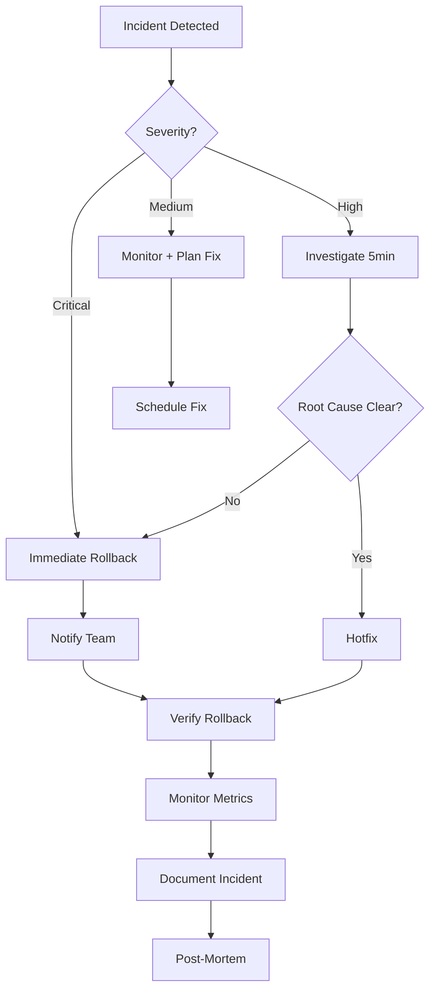

# Rollback and Incident Response Procedures

This document provides step-by-step procedures for rolling back deployments and responding to production incidents.

## Quick Reference

| Component | Rollback Time | Command |
|-----------|---------------|---------|
| **Frontend (Vercel)** | ~30 seconds | Via dashboard or `vercel rollback` |
| **Backend (Fly.io)** | ~60 seconds | `flyctl releases rollback <version>` |
| **Database** | Varies | Restore from backup or create reverse migration |

## When to Rollback

### Immediate Rollback Required

- ✅ Application crashes or won't start
- ✅ Critical functionality broken (login, payments, data loss)
- ✅ Security vulnerability exposed
- ✅ Database corruption or data loss occurring
- ✅ Performance degradation > 10x normal (P99 latency)
- ✅ Error rate > 5% of requests

### Monitor Before Rolling Back

- ⚠️ Minor UI bugs (non-blocking)
- ⚠️ Performance degradation < 2x normal
- ⚠️ Error rate < 1% of requests
- ⚠️ Non-critical feature not working

### Do NOT Rollback

- ❌ Single user reporting issue (might be client-side)
- ❌ Expected behavior change (new feature working as designed)
- ❌ Monitoring alert false positive

## Rollback Procedures

### 1. Frontend Rollback (Vercel)

#### Via Vercel Dashboard (Recommended)

1. **Navigate to Vercel Dashboard**
   ```
   https://vercel.com/dashboard → Select Project
   ```

2. **Find Previous Deployment**
   - Click **Deployments** tab
   - Identify last known good deployment (check timestamp and Git commit)
   - Verify it was marked as "Production"

3. **Rollback**
   - Click **⋯** menu on deployment
   - Click **Promote to Production**
   - Confirm rollback

4. **Verify**
   ```bash
   curl https://supplex.vercel.app/health
   # Should return 200 OK
   
   # Check application in browser
   open https://supplex.vercel.app
   ```

**Rollback Time:** ~30 seconds

#### Via Vercel CLI

```bash
# List recent deployments
vercel ls

# Example output:
# Age  Deployment                        Status    Duration
# 2m   supplex-abc123.vercel.app         Ready     1m
# 15m  supplex-def456.vercel.app         Ready     1m  ← Last good
# 1h   supplex-ghi789.vercel.app         Ready     1m

# Rollback to previous deployment
vercel alias supplex-def456.vercel.app supplex.vercel.app

# Or use rollback command (if available)
vercel rollback
```

### 2. Backend Rollback (Fly.io)

#### Quick Rollback

```bash
# 1. List recent releases
flyctl releases list -a supplex-api

# Example output:
# VERSION  STATUS      TYPE    CREATED AT           USER
# v42      successful  deploy  2025-10-24 10:15     you@email.com
# v41      successful  deploy  2025-10-24 09:30     you@email.com  ← Last good
# v40      successful  deploy  2025-10-23 16:00     you@email.com

# 2. Rollback to previous version
flyctl releases rollback v41 -a supplex-api

# 3. Monitor deployment
flyctl status -a supplex-api
flyctl logs -a supplex-api

# 4. Verify health check
curl https://supplex-api.fly.dev/api/health
```

**Rollback Time:** ~60 seconds

#### Rollback via GitHub

If you need to revert to a specific Git commit:

```bash
# 1. Find commit hash of last good deployment
git log --oneline -10

# 2. Revert to that commit
git revert --no-commit <commit-hash>..HEAD
git commit -m "revert: Rollback to <commit-hash>"

# 3. Push to trigger deployment
git push origin main

# CI/CD will deploy the reverted version
```

### 3. Database Rollback

⚠️ **Warning:** Database rollbacks are complex and can cause data loss. Only perform if absolutely necessary.

#### Option 1: Reverse Migration (Preferred)

**When to use:** Schema change caused issue, no data corruption

```bash
# 1. View migration history
pnpm --filter @supplex/db db:rollback

# Output shows recent migrations

# 2. Create reverse migration
# Edit schema files to undo changes
# Then generate new migration:
pnpm --filter @supplex/db db:generate

# 3. Review generated SQL
cat packages/db/migrations/0XXX_rollback_*.sql

# 4. Apply reverse migration
pnpm --filter @supplex/db db:migrate

# Or via Fly.io:
flyctl ssh console -a supplex-api
cd /app
bun run db:migrate
```

#### Option 2: Database Restore from Backup

**When to use:** Data corruption, lost data, migration completely failed

```bash
# 1. Go to Supabase Dashboard
# Project → Database → Backups

# 2. Select backup from before incident
# Verify timestamp is before issue occurred

# 3. Click "Restore"
# ⚠️ WARNING: This will overwrite current database

# 4. Confirm restoration

# 5. Wait for restore to complete (~5-10 minutes)

# 6. Verify database
psql $DATABASE_URL -c "SELECT COUNT(*) FROM suppliers;"

# 7. Restart API to reconnect
flyctl restart -a supplex-api
```

**Data Loss:** All changes since backup will be lost.

#### Option 3: Manual SQL Rollback

**When to use:** Small schema change, know exact SQL to revert

```bash
# 1. Connect to database
psql $DATABASE_URL

# 2. Run reverse SQL
# Example: Remove column added in migration
ALTER TABLE suppliers DROP COLUMN website;

# 3. Verify schema
\d suppliers

# 4. Exit
\q
```

## Full System Rollback

If both frontend and backend need rollback:

```bash
# 1. Rollback backend first (to avoid frontend calling broken API)
flyctl releases rollback v41 -a supplex-api

# 2. Verify backend health
curl https://supplex-api.fly.dev/api/health

# 3. Rollback frontend
# Via Vercel dashboard: Promote previous deployment to production

# 4. Verify frontend health
curl https://supplex.vercel.app/health

# 5. Test critical user flow
# - Login
# - View supplier list
# - Create supplier
```

**Total Rollback Time:** ~2 minutes

## Emergency Hotfix Procedure

For critical bugs that need immediate fix (not full rollback):

### 1. Create Hotfix Branch

```bash
# Create hotfix branch from main
git checkout main
git pull origin main
git checkout -b hotfix/critical-login-bug

# Make minimal fix
# Edit only necessary files

# Commit fix
git add .
git commit -m "hotfix: Fix critical login bug"

# Push hotfix
git push origin hotfix/critical-login-bug
```

### 2. Fast-Track CI

```bash
# Create PR to main
gh pr create \
  --title "HOTFIX: Fix critical login bug" \
  --body "Emergency fix for production issue. Bypassing normal review process." \
  --base main

# Wait for CI to pass (~5 minutes)
# Monitor: https://github.com/supplex/supplex/actions
```

### 3. Deploy Hotfix

```bash
# Merge PR immediately after CI passes
gh pr merge --squash --delete-branch

# Monitor deployment
# Frontend: https://vercel.com/dashboard
# Backend: flyctl logs -a supplex-api

# Verify fix
curl https://supplex-api.fly.dev/api/health
```

### 4. Post-Hotfix

```bash
# Notify team
# Slack: @channel Hotfix deployed for critical login bug. Monitoring...

# Monitor Sentry for errors
# https://sentry.io/organizations/supplex/issues/

# Document incident
# Create docs/incidents/2025-10-24-login-bug.md

# Schedule post-mortem
# Calendar: "Post-mortem: Login Bug Incident"
```

## Incident Response Workflow



### Step 1: Detection & Triage (0-2 minutes)

**How incidents are detected:**
- 🔔 Sentry error alerts
- 📊 Health check failing
- 👤 User reports
- 📉 Monitoring dashboards

**Triage:**
```bash
# Check health endpoints
curl https://supplex-api.fly.dev/api/health
curl https://supplex.vercel.app/health

# Check error rate in Sentry
# https://sentry.io/organizations/supplex/issues/

# Check deployment status
flyctl status -a supplex-api
# Vercel dashboard: https://vercel.com/dashboard

# Check logs
flyctl logs -a supplex-api --limit 100
```

**Severity Assessment:**

| Severity | Impact | Response Time | Action |
|----------|--------|---------------|--------|
| **P0 - Critical** | Service down, data loss, security breach | Immediate | Rollback + Page on-call |
| **P1 - High** | Major feature broken, high error rate | < 15 minutes | Investigate + Hotfix or Rollback |
| **P2 - Medium** | Minor feature broken, low error rate | < 1 hour | Plan fix |
| **P3 - Low** | UI bug, no functional impact | < 1 day | Schedule fix |

### Step 2: Communication (2-5 minutes)

**Notify stakeholders:**

```bash
# Slack: #incidents channel
@channel INCIDENT: Production API returning 500 errors
Severity: P0
Impact: Users cannot log in
ETA: Investigating, rollback in progress
Incident Commander: @yourname

# Status page (if available)
# Update: "Investigating login issues"

# Email: stakeholders@supplex.com
Subject: [INCIDENT] Production Issue - Login Down
Body: We are experiencing login issues. Rolling back deployment. ETA: 10 minutes.
```

### Step 3: Resolution (5-15 minutes)

**Execute rollback or hotfix** (see procedures above)

### Step 4: Verification (15-20 minutes)

```bash
# Verify health checks
curl https://supplex-api.fly.dev/api/health
curl https://supplex.vercel.app/health

# Test critical user flows
# 1. Login
# 2. View supplier list
# 3. Create supplier
# 4. Upload document

# Check error rate
# Sentry: Should drop to < 1%

# Monitor logs
flyctl logs -a supplex-api

# Check metrics
# Response time: Should return to normal
# Error rate: Should be < 1%
```

### Step 5: All Clear (20-30 minutes)

```bash
# Slack: #incidents
@channel RESOLVED: Production API back to normal
Root cause: Bad deployment in v42
Resolution: Rolled back to v41
Next steps: Post-mortem scheduled for tomorrow 2pm

# Status page
# Update: "All systems operational"

# Email: stakeholders@supplex.com
Subject: [RESOLVED] Production Issue - Login Restored
Body: Issue resolved. System back to normal. Post-mortem tomorrow.
```

### Step 6: Post-Incident (1-2 days)

1. **Document Incident:**
   ```markdown
   # Incident Report: Login Failure 2025-10-24
   
   ## Summary
   - **Date:** 2025-10-24 10:15 UTC
   - **Duration:** 15 minutes
   - **Severity:** P0 - Critical
   - **Impact:** 100% of users unable to log in
   
   ## Timeline
   - 10:15 - Deployment v42 completed
   - 10:16 - Sentry alerts for login errors
   - 10:17 - Incident detected, rollback initiated
   - 10:20 - Rollback to v41 completed
   - 10:25 - Verified login working
   - 10:30 - All clear issued
   
   ## Root Cause
   JWT secret not set in v42 deployment
   
   ## Resolution
   Rolled back to v41
   
   ## Prevention
   - Add JWT_SECRET validation to health check
   - Add integration test for login flow in CI
   - Update deployment checklist
   ```

2. **Schedule Post-Mortem:**
   - Invite: Team + stakeholders
   - Agenda: What happened, why, how to prevent
   - Duration: 1 hour
   - Output: Action items

3. **Implement Improvements:**
   - Fix root cause
   - Add monitoring
   - Update runbooks
   - Improve CI/CD

## Rollback Checklist

Use this checklist during rollback:

```markdown
## Rollback Checklist

### Pre-Rollback
- [ ] Incident severity confirmed (P0 or P1)
- [ ] Stakeholders notified
- [ ] Last known good version identified
- [ ] Backup of current state taken (if applicable)

### During Rollback
- [ ] Backend rolled back (Fly.io)
- [ ] Frontend rolled back (Vercel)
- [ ] Database rolled back (if needed)
- [ ] Health checks verified
- [ ] Critical user flows tested

### Post-Rollback
- [ ] Monitoring confirms system stable
- [ ] Error rate < 1%
- [ ] All clear issued to stakeholders
- [ ] Incident documented
- [ ] Post-mortem scheduled
```

## Common Scenarios

### Scenario 1: Bad Migration

**Symptoms:** Database errors, API returns 500

**Rollback:**
```bash
# Rollback API (to prevent further migration attempts)
flyctl releases rollback v41 -a supplex-api

# Create reverse migration
pnpm --filter @supplex/db db:generate

# Apply reverse migration
pnpm --filter @supplex/db db:migrate
```

### Scenario 2: Frontend Broken, Backend Fine

**Symptoms:** UI crashes, API works

**Rollback:**
```bash
# Only rollback frontend
# Via Vercel dashboard: Promote previous deployment

# Verify
curl https://supplex.vercel.app/health
```

### Scenario 3: High Error Rate After Deployment

**Symptoms:** Sentry alerts, 5% error rate

**Rollback:**
```bash
# Immediate rollback
flyctl releases rollback v41 -a supplex-api

# Investigate logs after rollback
flyctl logs -a supplex-api | grep ERROR
```

## Contact Information

### On-Call Rotation

| Day | Primary | Secondary |
|-----|---------|-----------|
| Mon-Fri | DevOps Lead | Backend Lead |
| Sat-Sun | On-call engineer | DevOps Lead |

### Escalation Path

1. On-call engineer (Immediate)
2. Engineering Manager (15 minutes)
3. CTO (30 minutes)
4. CEO (1 hour - for security/compliance issues)

### Emergency Contacts

- **On-Call:** [PagerDuty link]
- **DevOps Slack:** #devops
- **Incidents Slack:** #incidents
- **Status Page:** [StatusPage link]

## Tools & Access

### Required Access

- Fly.io: `flyctl auth login`
- Vercel: `vercel login`
- Supabase: Dashboard access
- GitHub: Admin access
- Sentry: Admin access

### Monitoring Dashboards

- **Sentry:** https://sentry.io/organizations/supplex
- **Fly.io Metrics:** `flyctl dashboard metrics -a supplex-api`
- **Vercel Analytics:** https://vercel.com/dashboard/analytics

## Next Steps

- [GitHub Branch Protection Setup](./github-branch-protection-setup.md)
- [Fly.io Deployment Setup](./flyio-deployment-setup.md)
- [Vercel Deployment Setup](./vercel-deployment-setup.md)
- [Database Migration Automation](./database-migration-automation.md)

