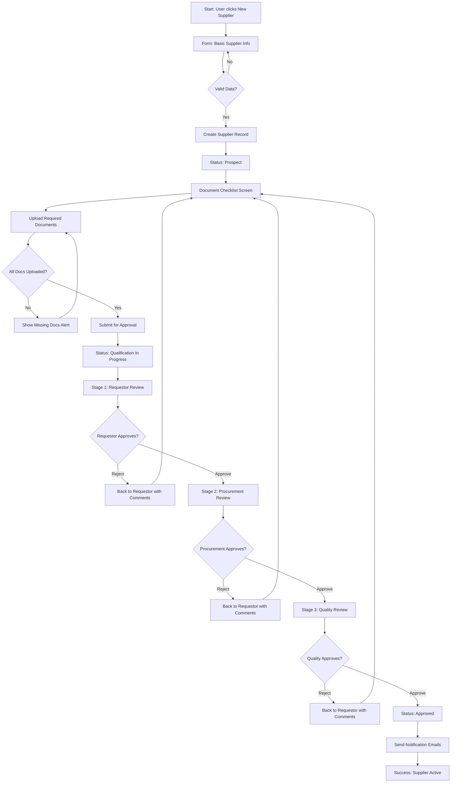
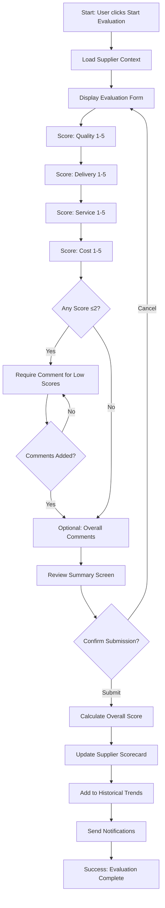
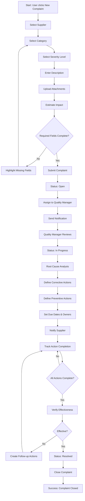
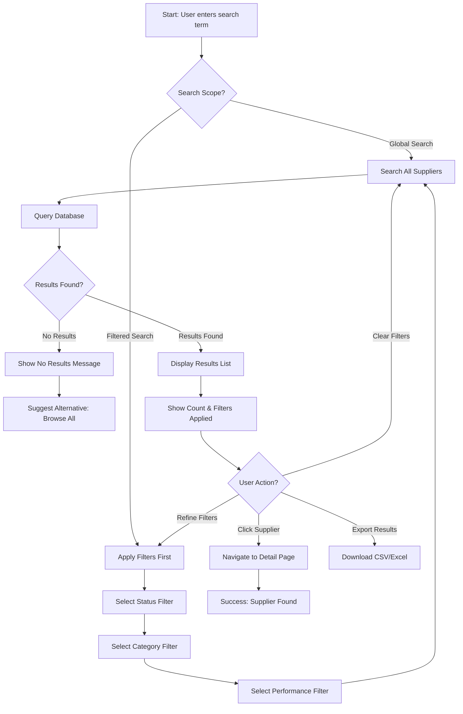

# Supplex UI/UX Specification

This document defines the user experience goals, information architecture, user flows, and visual design specifications for Supplex's user interface. It serves as the foundation for visual design and frontend development, ensuring a cohesive and user-centered experience.

## 1. Introduction

### 1.1 Overall UX Goals & Principles

#### Target User Personas

**"Spreadsheet Sarah" - Procurement Manager**

- Technical professionals who need advanced features and efficiency
- 35-50 years old, 10-20 years procurement experience
- Manages 40 suppliers, spends 8 hours/week on Excel trackers
- Stressed about ISO 9001 audits
- Quote: _"I need something simple that just works. I don't have time to learn a complex ERP, and we can't afford SAP."_

**"Quality Quinn" - Quality Manager**

- Compliance-focused users who prioritize documentation and audit readiness
- 40-55 years old, 15-25 years quality/engineering experience
- Conducts 2-3 supplier audits per quarter
- Quote: _"I need to prove to auditors that we're managing our suppliers properly. Right now I'm drowning in paperwork."_

**"Tech-Forward Tom" - CTO/CIO**

- System administrators and technical decision-makers
- 38-50 years old, 15+ years IT/software leadership
- Needs well-documented APIs and enterprise-grade security
- Quote: _"I need a solution with well-documented REST API, webhooks, and enterprise-grade security."_

#### Usability Goals

1. **Ease of learning**: New users can complete core tasks within 5 minutes without training
2. **Efficiency of use**: Power users can complete frequent tasks with minimal clicks - reduce admin time from 8-12 hours/week to <2 hours
3. **Error prevention**: Clear validation and confirmation for destructive actions (supplier status changes, deletions, approvals)
4. **Memorability**: Infrequent users can return quarterly for evaluations without relearning
5. **Accessibility**: WCAG 2.1 AA compliance for all users, including keyboard navigation and screen reader support

#### Design Principles

1. **Clarity over cleverness** - Prioritize clear data presentation over aesthetic innovation. Compliance documentation must be immediately understandable.
2. **Progressive disclosure** - Show only what's needed, when it's needed. Prevent overwhelming users with too much data on a single screen.
3. **Consistent patterns** - Leverage familiar shadcn/ui components throughout (buttons, forms, tables, dialogs) for predictable interactions.
4. **Immediate feedback** - Every action has a clear, immediate response through loading states, success notifications, and error messages.
5. **Accessible by default** - Design for all users from the start, following WCAG 2.1 AA standards with proper contrast, focus states, and semantic HTML.

#### Change Log

| Date         | Version | Description                 | Author            |
| ------------ | ------- | --------------------------- | ----------------- |
| Oct 13, 2025 | 1.0     | Initial UI/UX specification | UX Expert (Sally) |

## 2. Information Architecture (IA)

### 2.1 Site Map / Screen Inventory

```mermaid
graph TD
    A[Dashboard] --> B[Suppliers]
    A --> C[Qualification]
    A --> D[Evaluation]
    A --> E[Complaints]
    A --> F[Analytics]
    A --> G[Settings]

    B --> B1[Supplier List]
    B --> B2[Supplier Detail]
    B --> B3[Add New Supplier]
    B --> B4[Documents Repository]

    C --> C1[Qualification Queue]
    C --> C2[Qualification Detail]
    C --> C3[New Qualification]
    C --> C4[Approval Workflow]

    D --> D1[Evaluation Schedule]
    D --> D2[Create Evaluation]
    D --> D3[Evaluation Form]
    D --> D4[Supplier Scorecard]
    D --> D5[Historical Trends]

    E --> E1[Complaints List]
    E --> E2[Complaint Detail]
    E --> E3[New Complaint]
    E --> E4[CAPA Tracking]

    F --> F1[Executive Dashboard]
    F --> F2[Procurement Dashboard]
    F --> F3[Quality Dashboard]
    F --> F4[Custom Reports]
    F --> F5[Data Export]

    G --> G1[User Management]
    G --> G2[Tenant Settings]
    G --> G3[Role Permissions]
    G --> G4[API Keys]
    G --> G5[Notifications]
```

### 2.2 Navigation Structure

**Primary Navigation:** Vertical sidebar navigation (Midday-style) with icon + label for each main section. Always visible on desktop (collapsible), transforms to hamburger menu on mobile (<1024px). Icons provide visual anchors for quick recognition:

- Dashboard (Home icon) - Central hub with KPIs and quick actions
- Suppliers (Building icon) - Master supplier directory and profiles
- Qualification (CheckCircle icon) - Onboarding and approval workflows
- Evaluation (BarChart icon) - Performance scoring and scorecards
- Complaints (AlertTriangle icon) - Issue tracking and CAPA management
- Analytics (PieChart icon) - Reports and data insights
- Settings (Cog icon) - System configuration and user management

**Secondary Navigation:** Contextual horizontal tabs within each section for filtering and organization:

- **Suppliers**: All | Active | Prospect | Conditional | Blocked
- **Qualification**: Queue | In Progress | Approved | Rejected
- **Evaluation**: Scheduled | Overdue | Completed
- **Complaints**: Open | In Progress | Resolved | Closed

**Breadcrumb Strategy:** Always visible below top header for deep navigation context. Format: "Section > Sub-section > Detail" (e.g., "Suppliers > ABC Corp > Documents > ISO 9001 Certificate"). All segments are clickable for quick navigation up the hierarchy. Current page is highlighted in neutral-600. On mobile (<768px), breadcrumbs collapse to a "< Back" button with full path accessible via dropdown menu.

## 3. User Flows

### 3.1 Supplier Qualification Flow

**User Goal:** Successfully onboard a new supplier from initial request through final approval, ensuring all compliance documentation is collected and verified.

**Entry Points:**

- Dashboard "Add New Supplier" quick action button
- Suppliers list page "New Supplier" button
- Qualification queue "New Qualification" button

**Success Criteria:**

- Supplier moves from "Prospect" → "Qualified" → "Approved" status
- All required documents uploaded and verified
- 3-stage approval completed (Requestor → Procurement → Quality)
- Email notifications sent at each stage
- Complete audit trail captured (4-8 week manual process reduced to 2-4 weeks)

#### 3.1.1 Flow Diagram

#### 3.1.2 Edge Cases & Error Handling

- **Missing documents during submission**: Display warning dialog listing missing items, allow save as draft or force completion
- **Document expiration during approval**: Alert appears if certificate expires within 30 days, requires re-upload before final approval
- **Duplicate supplier detection**: On form submission, check for existing suppliers with similar name/tax ID, show merge dialog
- **Approver unavailable**: After 48 hours with no action, send escalation email to their manager and notification to requestor
- **Rejected at final stage**: All previous approvals remain valid, only failed stage needs re-approval after corrections
- **Partial document upload failure**: Show per-file upload status, allow retry for failed files without re-uploading successful ones

#### 3.1.3 Notes

**Performance:** Form autosaves every 30 seconds to prevent data loss. Document uploads support drag-and-drop and bulk selection (up to 10 files, 25MB each).

**Mobile Considerations:** On mobile, document upload triggers native camera for capturing certifications on-site during supplier visits.

**Accessibility:** Approval workflow includes keyboard shortcuts (Alt+A approve, Alt+R reject), screen reader announces stage transitions.

---

### 3.2 Performance Evaluation Flow

**User Goal:** Complete a periodic supplier evaluation (quarterly) by scoring performance across 4 dimensions, resulting in an updated supplier scorecard.

**Entry Points:**

- Dashboard "Evaluations Due" widget (shows count of overdue evaluations)
- Evaluation schedule page "Start Evaluation" button
- Supplier detail page "Evaluate" action button
- Email notification "Evaluation Due" CTA

**Success Criteria:**

- All 4 dimensions scored (Quality, Delivery, Service, Cost) on 1-5 scale
- Comments provided for scores ≤2 (below expectations)
- Historical trend chart updated
- Supplier scorecard regenerated
- Notification sent to supplier contact (optional, Phase 2)
- Evaluation marked "Completed" in schedule

#### 3.2.1 Flow Diagram

#### 3.2.2 Edge Cases & Error Handling

- **Incomplete evaluation**: Allow save as draft, show "Resume Evaluation" option in dashboard until completed
- **Multiple evaluators**: If org requires consensus, show multi-user scoring interface with averaging logic
- **Historical data missing**: For first evaluation, show "No historical data" message instead of trend chart
- **Score justification required**: Scores =5 (exceptional) or =1 (unacceptable) also trigger comment requirement for documentation
- **Evaluation overdue**: After 7 days past due date, send escalation to user's manager and mark evaluation as "Overdue" in red
- **Supplier no longer active**: If supplier status changed to "Blocked" during evaluation, show warning but allow completion for audit trail

#### 3.2.3 Notes

**Data Pre-filling (Phase 2):** ERP integration will auto-populate scores from actual delivery/quality data, user only reviews and adjusts.

**Mobile Optimization:** Evaluation form uses large touch targets (56px) for star ratings, optimized for field evaluations during supplier audits.

**Accessibility:** Form supports keyboard navigation with Tab/Shift+Tab, Arrow keys for rating selection, Enter to submit.

---

### 3.3 Complaint Registration & CAPA Flow

**User Goal:** Register a supplier quality complaint, track root cause analysis, and manage corrective/preventive actions (CAPA) through resolution.

**Entry Points:**

- Dashboard "Report Complaint" quick action
- Complaints list "New Complaint" button
- Supplier detail page "File Complaint" action
- Email integration (forward complaint emails to system - Phase 2)

**Success Criteria:**

- Complaint registered with severity, category, description, attachments
- Assigned to quality manager for review
- Root cause identified and documented
- Corrective and preventive actions defined with due dates
- Supplier notified (email)
- Status tracked through Open → In Progress → Resolved → Closed
- CAPA effectiveness verified before closure

#### 3.3.1 Flow Diagram

#### 3.3.2 Edge Cases & Error Handling

- **Duplicate complaint**: System checks for similar open complaints for same supplier in last 30 days, shows "Related Complaints" warning
- **Severity escalation**: If complaint marked "Critical", auto-escalate to Quality Director and send SMS notification (if enabled)
- **Supplier disputes root cause**: Add "Supplier Response" section for collaborative resolution, track dispute status
- **CAPA due date exceeded**: Auto-send reminders at 80%, 100%, and 120% of timeline, escalate to manager if >14 days overdue
- **Recurrent complaint**: If 3+ similar complaints in 90 days, trigger "Repeat Offender" flag and suggest supplier audit
- **Incomplete attachments**: Evidence photos/documents required for severity levels 1-2 (Critical/Major), block submission if missing

#### 3.3.3 Notes

**Integration:** Phase 2 will support email forwarding to auto-create complaints from customer complaint emails, using NLP to extract key details.

**Collaboration (Phase 3):** Supplier portal will allow suppliers to respond directly to complaints, upload evidence, and update CAPA status.

**Accessibility:** Complaint form supports voice-to-text for description field on mobile, useful during shop floor inspections.

---

### 3.4 Supplier Search & Discovery Flow

**User Goal:** Quickly find a specific supplier or filter suppliers by status, category, or performance to take action.

**Entry Points:**

- Global search bar (always visible in header)
- Suppliers list page with advanced filters
- Dashboard quick search widget

**Success Criteria:**

- Search returns results in <500ms (95th percentile)
- Results ranked by relevance (name match > category > status)
- Filters persist across sessions
- One-click access to supplier detail page
- Recent searches saved for quick repeat access

#### 3.4.1 Flow Diagram

#### 3.4.2 Edge Cases & Error Handling

- **No results found**: Show suggestions like "Try removing filters" or "Browse all suppliers", highlight potential typos
- **Too many results (>100)**: Display "Showing first 100 results, refine filters to see more", encourage narrowing search
- **Search timeout**: If query exceeds 3 seconds, show loading state then cached results, log slow query for optimization
- **Ambiguous search term**: If search matches multiple fields (name, category, location), show "Results by" sections to organize
- **Inactive suppliers in results**: Visually de-emphasize with gray styling, show "Inactive" badge, allow exclusion via filter
- **Permission filtering**: Users only see suppliers they have permission to view based on role (Quality sees all, Viewer sees subset)

#### 3.4.3 Notes

**Search Intelligence (Phase 2):** Fuzzy matching for typos, synonym support (e.g., "vendor" = "supplier"), search within documents.

**Performance Optimization:** Elasticsearch integration for sub-100ms search, PostgreSQL full-text search for MVP.

**Accessibility:** Search results navigable with keyboard (Tab through results, Enter to open), screen reader announces result count.

## 4. Wireframes & Mockups

### 4.1 Design Files

**Primary Design Files:** Figma workspace for Supplex UI/UX designs (to be created)

- **URL:** `https://figma.com/supplex-mvp-designs` (placeholder - create workspace in Week 1)
- **Design System:** Based on Midday UI package ([GitHub reference](https://github.com/midday-ai/midday/tree/main/packages/ui))
- **Component Library:** shadcn/ui with Midday customizations
- **Collaboration:** Shared with dev team for handoff, Zeplin/Figma Dev Mode for specs

### 4.2 Key Screen Layouts

#### 4.2.1 Dashboard (Home)

**Purpose:** Central command center providing at-a-glance overview of supplier health, pending actions, and key metrics. First screen users see after login.

**Key Elements:**

- **Top KPI Cards** (4-across on desktop, 2-across mobile):
  - Total Active Suppliers (with trend indicator ↑↓)
  - Pending Qualifications (count with urgency badge)
  - Overdue Evaluations (count in warning color)
  - Open Complaints (count with severity breakdown)
- **Quick Actions Bar:** Floating action buttons (Midday-style) for:
  - Add New Supplier
  - Start Evaluation
  - Report Complaint
  - View Analytics
- **Supplier Performance Distribution** (donut chart):
  - Color-coded segments: Excellent (green), Good (blue), Fair (yellow), Poor (red)
  - Center displays total supplier count
  - Clickable segments filter to supplier list
- **Recent Activity Feed** (right sidebar on desktop, below charts on mobile):
  - Timeline view of recent approvals, evaluations, complaints
  - Avatar + action + timestamp format
  - "View All" link to full activity log
- **Upcoming Tasks Widget:**
  - List of evaluations due this week
  - Pending approvals requiring user's action
  - Certificate expirations (next 30 days)

**Interaction Notes:** All KPI cards clickable → navigate to filtered views. Charts support hover tooltips with detailed breakdowns. Quick actions use shadcn/ui Button component with icon + label. Dashboard refreshes every 60 seconds (live indicator in corner).

**Design File Reference:** `Figma > Screens > 01-Dashboard`

---

#### 4.2.2 Supplier List

**Purpose:** Searchable, filterable directory of all suppliers with bulk actions and quick access to supplier details.

**Key Elements:**

- **Search & Filter Bar** (sticky header):
  - Global search input (with command-K shortcut indicator)
  - Filter dropdowns: Status, Category, Performance, Location
  - Active filter chips (dismissible)
  - "Clear All Filters" link
- **Data Table** (shadcn/ui Table component):
  - Columns: Checkbox | Supplier Name | Category | Status | Performance Score | Last Evaluation | Actions
  - Sortable column headers (click to sort ASC/DESC)
  - Row hover effect with quick action icons (Edit, View, Evaluate, Report)
  - Status badges with color coding (Approved=green, Conditional=yellow, Blocked=red)
  - Performance score with star rating visualization (1-5 stars)
- **Bulk Actions Toolbar** (appears when rows selected):
  - Export selected to CSV/Excel
  - Bulk status change (with confirmation dialog)
  - Schedule evaluations (opens multi-select date picker)
- **Pagination Controls** (bottom):
  - Rows per page selector (10, 25, 50, 100)
  - Page numbers with prev/next arrows
  - Total count display: "Showing 1-25 of 247 suppliers"

**Interaction Notes:** Table supports infinite scroll (optional, toggle in settings). Click row → navigate to supplier detail page. Ctrl/Cmd+Click → open in new tab. Mobile: Table transforms to card list view with swipe actions.

**Design File Reference:** `Figma > Screens > 02-Supplier-List`

---

#### 4.2.3 Qualification Workflow

**Purpose:** Multi-step form for onboarding new suppliers with document collection and approval tracking.

**Key Elements:**

- **Progress Stepper** (top, Midday-style horizontal stepper):
  - Steps: Basic Info → Documents → Review → Approval
  - Current step highlighted, completed steps with checkmark, future steps grayed
  - Click to navigate between steps (if no validation errors)
- **Step 1: Basic Info Form:**
  - Two-column layout (desktop) / single column (mobile)
  - Fields: Supplier Name*, Tax ID*, Category*, Contact Name*, Email*, Phone*, Address
  - Real-time validation with inline error messages
  - "Save as Draft" (secondary) + "Next" (primary) buttons
- **Step 2: Document Upload:**
  - Document checklist (configurable per tenant)
  - Drag-and-drop upload zone (Midday file upload component)
  - File list with upload progress bars
  - Preview thumbnails for PDFs/images
  - Expiration date picker for certificates
- **Step 3: Review Summary:**
  - Read-only display of all entered data
  - Document list with "View" links
  - Risk score calculation display
  - "Edit" buttons to return to specific steps
  - "Submit for Approval" primary action
- **Step 4: Approval Tracking:**
  - Vertical timeline showing 3 approval stages
  - Each stage shows: Approver name, status, timestamp, comments
  - Real-time status updates via WebSocket (Phase 2)

**Interaction Notes:** Form autosaves to localStorage every 30 seconds. Unsaved changes warning on page exit. Document upload supports bulk selection. Approval notifications via email + in-app bell icon. Mobile: Stepper collapses to dropdown selector.

**Design File Reference:** `Figma > Screens > 03-Qualification-Workflow`

---

#### 4.2.4 Supplier Detail Page

**Purpose:** Comprehensive view of individual supplier with tabs for different data categories and contextual actions.

**Key Elements:**

- **Header Section:**
  - Supplier name (H1) + status badge
  - Performance score (large, with trend indicator)
  - Quick action buttons: Evaluate | Report Complaint | Edit | Archive
  - Last evaluated date (subtle, gray text)
- **Tabbed Navigation** (shadcn/ui Tabs):
  - Overview | Documents | Evaluations | Complaints | Activity Log
- **Overview Tab:** Company details, performance scorecard (radar chart), recent evaluations timeline, key contacts
- **Documents Tab:** Categorized document grid with expiration alerts
- **Evaluations Tab:** Historical evaluations table with performance trend chart
- **Complaints Tab:** Complaints list with severity indicators and filters
- **Activity Log Tab:** Chronological audit trail filterable by action type

**Interaction Notes:** Header is sticky on scroll (compresses to compact mode). Tabs use URL hash for deep linking. Documents support preview in lightbox modal. Mobile: Tabs transform to accordion sections.

**Design File Reference:** `Figma > Screens > 04-Supplier-Detail`

---

#### 4.2.5 Evaluation Form

**Purpose:** Guided form for scoring supplier performance across 4 dimensions with historical context.

**Key Elements:**

- **Supplier Context Panel** (left sidebar):
  - Supplier name + logo
  - Current overall score (large display)
  - Last 3 evaluation scores (mini timeline)
  - Evaluation period display
- **Evaluation Form** (main content):
  - 4 dimension cards (Quality, Delivery, Service, Cost)
  - Each: 1-5 star rating + comment field + helper text
  - Previous score shown for reference
  - Required comment indicator for scores ≤2
  - Optional overall comments (rich text editor)
- **Summary Panel** (right sidebar):
  - Calculated overall score
  - Score change from last evaluation
  - Performance tier with icon
  - Action buttons

**Interaction Notes:** Star ratings animate on hover. Clicking star sets rating, supports keyboard (1-5 keys). Comment fields expand on focus. Overall score updates in real-time. Draft auto-saved. Submission triggers confirmation dialog.

**Design File Reference:** `Figma > Screens > 05-Evaluation-Form`

---

#### 4.2.6 Complaint Detail / CAPA Tracking

**Purpose:** Detailed view of a supplier complaint with CAPA workflow management and collaborative resolution.

**Key Elements:**

- **Complaint Header:** ID, severity badge, status progress bar, assignment details
- **Complaint Details Card:** Supplier, category, description, impact, attachments
- **Root Cause Analysis Section:** Editable RCA with templates (Phase 2)
- **CAPA Actions Panel:** Tabbed (Corrective | Preventive) with action tracking
- **Effectiveness Verification:** Checkbox + notes + verifier details
- **Activity Timeline** (right sidebar): Chronological activity log
- **Action Buttons:** Save, Close Complaint, Escalate

**Interaction Notes:** Status auto-updates based on CAPA progress. Overdue CAPAs highlighted in red. Email notifications on changes. Comments support @mentions. Mobile: Sections collapse to accordions. "Related Complaints" for trend analysis.

**Design File Reference:** `Figma > Screens > 06-Complaint-CAPA`

## 5. Component Library / Design System

### 5.1 Design System Approach

**Design System Approach:** Supplex will adopt the **Midday UI design system** ([GitHub](https://github.com/midday-ai/midday/tree/main/packages/ui)) as our foundational component library. Midday UI is built on **shadcn/ui** (headless, accessible components) with **Tailwind CSS** for styling. This approach provides:

- **Proven B2B SaaS patterns** - Midday is a production financial management app with similar data-heavy workflows
- **Accessibility built-in** - shadcn/ui components follow ARIA best practices and WCAG 2.1 AA standards
- **Customization flexibility** - Components are copied into our codebase (not npm packages), allowing full customization
- **Developer velocity** - Pre-built components reduce development time by 60-70% compared to custom builds
- **Tailwind integration** - Seamless integration with Tailwind CSS for rapid styling iterations

**Implementation Strategy:**

1. **Week 1:** Clone Midday UI package structure into `/packages/ui`
2. **Week 2:** Customize theme tokens (colors, typography, spacing) to match Supplex branding
3. **Week 3-4:** Extend base components with Supplex-specific variants (e.g., Supplier Card, Evaluation Rating)
4. **Ongoing:** Document component usage in Storybook for team reference

**References:**

- Midday UI Source: https://github.com/midday-ai/midday/tree/main/packages/ui
- shadcn/ui Documentation: https://ui.shadcn.com/
- Tailwind CSS: https://tailwindcss.com/

### 5.2 Core Components

#### 5.2.1 Button

**Purpose:** Primary interactive element for user actions throughout the application.

**Variants:** Primary (main CTAs), Secondary (alternative actions), Destructive (dangerous actions), Ghost (subtle actions), Link (text-only navigation)

**States:** Default, Hover, Active, Disabled, Loading (with spinner)

**Usage Guidelines:** Use Primary for single primary action per screen. Secondary for supporting actions. Destructive actions always require confirmation dialog. Include loading state for async operations (>500ms). Minimum touch target: 44px height on mobile. Icon + text preferred over icon-only.

---

#### 5.2.2 Data Table

**Purpose:** Display large datasets with sorting, filtering, and pagination for suppliers, evaluations, complaints.

**Variants:** Standard (default with zebra striping), Compact (reduced row height), Interactive (clickable rows), Selectable (checkbox column for bulk actions)

**States:** Row states (Default, Hover, Selected, Disabled), Column states (Sortable, Resizable), Loading state (skeleton rows), Empty state (illustration + CTA)

**Usage Guidelines:** Always include search/filter for tables >20 rows. Default sort by most recently updated. Show row count and pagination controls. Mobile: Transform to card list. Support keyboard navigation. Sticky header when scrolling.

---

#### 5.2.3 Form Inputs

**Purpose:** Collect user data in forms (supplier details, evaluations, complaints).

**Variants:** Text Input, Textarea, Select Dropdown, Multi-select, Date Picker, File Upload (drag-and-drop), Radio Group, Checkbox, Rating Input (1-5 stars)

**States:** Default, Focus, Error, Disabled, Success

**Usage Guidelines:** Always include label (visible or aria-label). Show validation errors inline below field (red text + icon). Required fields marked with \*. File uploads show progress bar and preview. Date pickers show format hint. Rating inputs support keyboard (1-5 number keys).

---

#### 5.2.4 Card

**Purpose:** Container component for grouping related content (KPIs, supplier details, document sections).

**Variants:** Default (white background, subtle border), Elevated (drop shadow), Interactive (clickable), Outlined (border-only)

**States:** Default, Hover (if interactive), Disabled

**Usage Guidelines:** Use for visually separating content sections. Include header with title + optional action button. Avoid nesting >2 levels deep. Mobile: Full-width with 16px padding. Desktop: Min 280px width, max 600px for readability.

---

#### 5.2.5 Modal / Dialog

**Purpose:** Focused interactions requiring user attention (confirmations, forms, detail views).

**Variants:** Standard (500px for forms), Large (800px for detail views), Alert (400px for confirmations), Sheet (slide-in from right)

**States:** Open, Closed, Loading

**Usage Guidelines:** Always include close button (X icon). Destructive actions require explicit confirmation. ESC closes non-critical modals. Focus trap: Tab stays within modal. Mobile: Full-screen on <768px. Include primary + secondary actions in footer.

---

#### 5.2.6 Badge / Status Indicator

**Purpose:** Display status, categories, counts, and labels throughout the UI.

**Variants:** Status (color-coded supplier status), Severity (complaint levels), Count (numerical indicators), Tag (categorical labels)

**States:** Default, Removable (with X icon)

**Usage Guidelines:** Use consistent color mapping (red=error/critical, yellow=warning, green=success, blue=info). Keep text concise (1-2 words). Include icon for important statuses. Count badges show max 99 (99+ for >99). Don't overuse - max 3 badges per card/row.

---

#### 5.2.7 Toast / Notification

**Purpose:** Temporary feedback for user actions (success, error, info messages).

**Variants:** Success (green with checkmark), Error (red with X), Warning (yellow with alert), Info (blue with info icon)

**States:** Entering (slide in), Visible, Exiting (fade out)

**Usage Guidelines:** Auto-dismiss after 5 seconds (10s for important messages). Include action button if applicable ("Undo", "Retry"). Stack multiple toasts vertically (max 3 visible). Position: Top-right on desktop, top-center on mobile. Include close button for manual dismissal.

---

#### 5.2.8 Charts & Data Visualization

**Purpose:** Visual representation of data for dashboards and analytics.

**Variants:** Donut Chart (performance distribution), Line Chart (trends), Bar Chart (comparative metrics), Radar Chart (multi-dimensional scores), Trend Sparkline (inline micro-charts)

**States:** Loading (skeleton), Interactive (hover tooltips), Empty (no data message)

**Usage Guidelines:** Use Recharts library (React-based, accessible). Always include axis labels and legend. Tooltips show exact values on hover. Support keyboard navigation. Color-blind safe palette. Responsive: Simplify chart on mobile. Export chart data to CSV option.

---

#### 5.2.9 Stepper / Progress Indicator

**Purpose:** Guide users through multi-step workflows (qualification, evaluation).

**Variants:** Horizontal (desktop, 4 steps visible), Vertical (timeline for approvals), Progress Bar (linear percentage)

**States:** Step states - Upcoming (grayed), Active (highlighted), Completed (checkmark), Error (red)

**Usage Guidelines:** Show step numbers or icons. Active step visually distinct. Completed steps clickable to return. Show overall progress percentage. Mobile: Compress to dropdown showing current step + progress.

---

#### 5.2.10 Navigation (Sidebar)

**Purpose:** Primary navigation for accessing main application sections.

**Variants:** Expanded (full width with icon + label), Collapsed (icon-only), Mobile (hamburger menu with overlay)

**States:** Item states - Default, Active (current section), Hover

**Usage Guidelines:** Active nav item highlighted (blue background or left border). Support keyboard navigation. Collapsible via toggle button (save preference). Show notification badges on nav items. Bottom nav items: Settings, User profile. Mobile: Slide-in overlay, swipe to close.

## 6. Branding & Style Guide

### 6.1 Visual Identity

**Brand Guidelines:** Supplex brand identity conveys **professionalism, reliability, and clarity** - essential qualities for supplier management in regulated industries.

**Design Philosophy:**

- **Professional yet approachable** - Not overly corporate, but trustworthy for quality managers
- **Data-forward** - Clean layouts that prioritize information density without clutter
- **Modern B2B SaaS** - Contemporary design language similar to Linear, Notion, Midday
- **Manufacturing-appropriate** - Subtle industrial touches (precise alignments, structured grids)

**Visual References:**

- Primary inspiration: [Midday UI](https://github.com/midday-ai/midday/tree/main/packages/ui) (financial SaaS aesthetic)
- Secondary: Linear (project management), Attio (CRM), Plane (issue tracking)

### 6.2 Color Palette

| Color Type        | Hex Code  | Tailwind Token | Usage                                                        |
| ----------------- | --------- | -------------- | ------------------------------------------------------------ |
| **Primary**       | `#2563EB` | `blue-600`     | Primary CTAs, active nav items, links, focus states          |
| **Primary Hover** | `#1D4ED8` | `blue-700`     | Hover state for primary buttons and interactive elements     |
| **Secondary**     | `#64748B` | `slate-500`    | Secondary buttons, muted text, icons                         |
| **Accent**        | `#8B5CF6` | `violet-500`   | Highlights, special features, premium indicators             |
| **Success**       | `#10B981` | `emerald-500`  | Positive feedback, approved status, success messages         |
| **Warning**       | `#F59E0B` | `amber-500`    | Cautions, conditional status, expiring certificates          |
| **Error**         | `#EF4444` | `red-500`      | Errors, critical issues, blocked status, destructive actions |
| **Info**          | `#3B82F6` | `blue-500`     | Informational messages, minor complaints, general notices    |
| **Neutral 50**    | `#F8FAFC` | `slate-50`     | Page background, card backgrounds (light mode)               |
| **Neutral 100**   | `#F1F5F9` | `slate-100`    | Hover backgrounds, alternate row backgrounds                 |
| **Neutral 200**   | `#E2E8F0` | `slate-200`    | Borders, dividers, inactive states                           |
| **Neutral 600**   | `#475569` | `slate-600`    | Body text, secondary content                                 |
| **Neutral 900**   | `#0F172A` | `slate-900`    | Headings, primary text, high-emphasis content                |

**Color System Notes:**

- **WCAG 2.1 AA Compliance:** All text colors meet 4.5:1 contrast ratio minimum against backgrounds
- **Status Color Mapping:** Approved/Active = Success (green), Conditional/Warning = Warning (amber), Blocked/Critical = Error (red), In Progress/Pending = Info (blue), Prospect/Draft = Secondary (slate)
- **Chart Colors:** Use color-blind safe palette (blue, orange, green, purple, teal) - avoid red/green only distinctions
- **Dark Mode (Phase 2):** Invert neutrals, reduce primary saturation by 10%, increase contrast ratios

### 6.3 Typography

#### 6.3.1 Font Families

- **Primary:** `Inter` - Clean, highly legible sans-serif optimized for UI (Google Fonts)
- **Secondary:** `Inter` - Same as primary for consistency (Midday uses single font family)
- **Monospace:** `JetBrains Mono` - Code snippets, API keys, technical data (e.g., supplier IDs)

#### 6.3.2 Type Scale

| Element        | Size            | Weight         | Line Height    | Tailwind Class           | Usage                                         |
| -------------- | --------------- | -------------- | -------------- | ------------------------ | --------------------------------------------- |
| **H1**         | 36px / 2.25rem  | SemiBold (600) | 40px / 2.5rem  | `text-4xl font-semibold` | Page titles, main headings                    |
| **H2**         | 30px / 1.875rem | SemiBold (600) | 36px / 2.25rem | `text-3xl font-semibold` | Section headings, modal titles                |
| **H3**         | 24px / 1.5rem   | SemiBold (600) | 32px / 2rem    | `text-2xl font-semibold` | Subsection headings, card titles              |
| **H4**         | 20px / 1.25rem  | SemiBold (600) | 28px / 1.75rem | `text-xl font-semibold`  | Component headings, sidebar nav               |
| **Body Large** | 18px / 1.125rem | Regular (400)  | 28px / 1.75rem | `text-lg`                | Intro paragraphs, important descriptions      |
| **Body**       | 16px / 1rem     | Regular (400)  | 24px / 1.5rem  | `text-base`              | Default body text, form labels, table content |
| **Body Small** | 14px / 0.875rem | Regular (400)  | 20px / 1.25rem | `text-sm`                | Helper text, secondary info, timestamps       |
| **Caption**    | 12px / 0.75rem  | Regular (400)  | 16px / 1rem    | `text-xs`                | Fine print, badges, metadata                  |

### 6.4 Iconography

**Icon Library:** [Lucide React](https://lucide.dev/) - Consistent, customizable icon set (same as Midday UI)

**Icon Specifications:**

- **Default Size:** 20px (1.25rem) for inline icons, 24px (1.5rem) for standalone
- **Stroke Width:** 2px for consistency
- **Color:** Inherit from parent text color for flexibility

**Common Icons:**

- **Navigation:** Home, Building2, CheckCircle2, BarChart3, AlertTriangle, Settings
- **Actions:** Plus, Edit3, Trash2, Download, Upload, Search, Filter, MoreHorizontal
- **Status:** Check, X, AlertCircle, Info, Clock, Star

**Usage Guidelines:** Use outlined icons (not filled). Pair icon with text label whenever possible. Icon-only buttons require `aria-label` and tooltip on hover. Status icons use semantic colors.

### 6.5 Spacing & Layout

**Grid System:** 12-column responsive grid with flexible gutters

**Container Widths:**

- **Mobile:** 100% width (with 16px padding)
- **Tablet:** 100% width (with 24px padding)
- **Desktop:** Max 1280px centered (with 32px padding)
- **Wide:** Max 1536px centered (for dashboards with charts)

**Spacing Scale:** Tailwind's default 4px base unit system

| Name    | Size | Tailwind   | Usage                                            |
| ------- | ---- | ---------- | ------------------------------------------------ |
| **xs**  | 4px  | `space-1`  | Tight spacing (badge padding, icon gaps)         |
| **sm**  | 8px  | `space-2`  | Small gaps (form field spacing, button icon gap) |
| **md**  | 16px | `space-4`  | Default spacing (card padding, section gaps)     |
| **lg**  | 24px | `space-6`  | Large gaps (between major sections)              |
| **xl**  | 32px | `space-8`  | Extra large (page margins, modal padding)        |
| **2xl** | 48px | `space-12` | Section separators, page header spacing          |

**Border Radius:** sm (4px) for badges, md (6px) for buttons/inputs, lg (8px) for cards, xl (12px) for feature cards, full (9999px) for avatars

**Shadows:** sm (subtle borders), md (elevated cards), lg (modals), xl (overlays)

## 7. Accessibility Requirements

### 7.1 Compliance Target

**Standard:** **WCAG 2.1 Level AA** compliance across all user-facing features

**Rationale:** WCAG 2.1 AA is the industry standard for B2B SaaS and often a contractual requirement. Level AAA is too restrictive for data-heavy business applications. ISO 9001 and other quality certifications increasingly include digital accessibility requirements.

**Audit Schedule:** Pre-launch automated testing with axe DevTools and Lighthouse (target score 90+), MVP launch manual testing with screen readers (NVDA, JAWS, VoiceOver), Post-launch third-party accessibility audit (Month 6), Ongoing quarterly accessibility reviews.

### 7.2 Key Requirements

#### Visual

**Color contrast ratios:** Normal text (16px+) minimum 4.5:1, Large text (24px+) minimum 3:1, UI components minimum 3:1 for borders/icons. Status indicators never rely on color alone - always pair with icons or text labels.

**Focus indicators:** All interactive elements have clear focus outline (2px blue ring with 2px offset). Logical tab order following visual layout. "Skip to main content" link visible on Tab. Modals trap focus until dismissed. No keyboard traps.

**Text sizing:** Minimum 12px for captions, 16px default for body. All font sizes in rem (not px). Interface remains functional at 200% zoom level. Text spacing adjustable without breaking layout.

#### Interaction

**Keyboard navigation:** All functionality accessible via keyboard alone. Standard shortcuts: Tab/Shift+Tab (navigate), Enter/Space (activate), Esc (close), Arrow keys (menus/lists). Custom shortcuts documented (Cmd+K search, Alt+A approve). Clear visible focus at all times.

**Screen reader support:** Semantic HTML5 elements (nav, main, article, aside). ARIA labels on all interactive elements. Correct ARIA roles for custom components. Dynamic content updates announced via aria-live. Form labels associated with inputs. Error announcements immediate. Status messages announced.

**Touch targets:** Minimum 44x44px touch targets for all interactive elements. Minimum 8px spacing between adjacent targets. Larger targets on mobile (56px for primary actions). No gesture-only interactions.

#### Content

**Alternative text:** All images have descriptive alt text (decorative images use alt=""). Icon-only buttons include aria-label. Charts include text summaries and data tables for screen reader users.

**Heading structure:** Logical hierarchy (H1 → H2 → H3, never skip). Single H1 per page. Descriptive headings. Proper ARIA landmarks (banner, navigation, main, contentinfo).

**Form labels:** Visible text labels (not just placeholders). Required fields marked with \* + aria-required="true". Specific, actionable error messages linked via aria-describedby. Related fields grouped with fieldset/legend. Appropriate autocomplete attributes.

### 7.3 Testing Strategy

**Automated Testing:** axe DevTools on every page, Lighthouse accessibility score 90+ required, Pa11y CI in pipeline, eslint-plugin-jsx-a11y for React issues.

**Manual Testing:** Full keyboard navigation testing, Screen reader testing (NVDA on Windows, VoiceOver on Mac/iOS), Color contrast manual review, 200% zoom testing, Focus management verification.

**User Testing (Phase 2):** Recruit 2-3 users with disabilities for usability testing. Provide accessibility feedback email in footer. Log accessibility issues as high-priority bugs.

**Testing Checklist:** All interactive elements keyboard accessible, Focus indicators visible with logical order, Screen reader announces correctly, Color contrast meets AA (4.5:1), Forms have visible labels and errors, No keyboard traps, Touch targets 44x44px minimum, Headings properly structured, ARIA labels on icon buttons, Live regions announce updates, Works at 200% zoom, axe DevTools zero violations.

## 8. Responsiveness Strategy

### 8.1 Breakpoints

| Breakpoint  | Min Width | Max Width | Target Devices                     | Tailwind Prefix | Primary Use Case                                           |
| ----------- | --------- | --------- | ---------------------------------- | --------------- | ---------------------------------------------------------- |
| **Mobile**  | 0px       | 767px     | iPhone, Android phones             | `(default)`     | Viewing data, approvals, quick searches on-the-go          |
| **Tablet**  | 768px     | 1023px    | iPad, Android tablets              | `md:`           | Field evaluations, document reviews during audits          |
| **Desktop** | 1024px    | 1439px    | Standard laptops, desktop monitors | `lg:`           | Primary work environment - data entry, analysis, workflows |
| **Wide**    | 1440px    | ∞         | Large monitors, ultra-wide         | `xl:`           | Dashboards with multiple panels, power user productivity   |

**Breakpoint Philosophy:** Mobile-first CSS (start with mobile, progressively enhance). Content-first breakpoints (break when content dictates). Fluid between breakpoints (use %, rem). Touch-first on <1024px (larger targets, swipe gestures).

### 8.2 Adaptation Patterns

#### Layout Changes

**Mobile (0-767px):** Single column layout, full-width cards, hidden sidebar (hamburger menu), bottom navigation (Phase 2), simplified dashboard (2-column KPIs, stacked charts), collapsed tables (transform to card lists).

**Tablet (768-1023px):** 2-column grids, collapsible sidebar, responsive tables (horizontal scroll if needed), split views (list 40%, detail 60%).

**Desktop (1024-1439px):** 3-column grids, persistent sidebar (collapsible by preference), full data tables (all columns visible), modal dialogs (centered, not full-screen).

**Wide (1440px+):** 4-column grids, side panels (activity feeds, related items), multi-panel views, larger max-width containers (1536px).

#### Navigation Changes

**Mobile Navigation:** Hamburger menu triggers slide-out drawer, full-screen overlay, 56px tall touch-optimized items, breadcrumbs collapse to "< Back" button, global search collapses to icon.

**Tablet Navigation:** Collapsible sidebar (icon toggle), persistent on landscape, abbreviated breadcrumbs (current + one level up).

**Desktop/Wide Navigation:** Always visible sidebar (icons + labels), hover previews on collapsed state, full breadcrumbs (complete path).

#### Content Priority

**Mobile Content Hierarchy:** Critical actions first (Save, Submit at top), key data above fold, progressive disclosure (accordions for secondary details), reduced density (more whitespace), hide tertiary content (activity logs, metadata).

**Desktop Content Hierarchy:** All content visible simultaneously, sidebar + main + right context panel, full data tables, activity feeds and metadata visible.

#### Interaction Changes

**Mobile Interactions:** Swipe gestures (reveal actions), pull-to-refresh on lists, long-press for context menu, bottom sheets (not modals), native inputs (date pickers, file uploads).

**Tablet Interactions:** Hover states (trackpad support), touch + mouse support, drag-and-drop works, split keyboard awareness.

**Desktop Interactions:** Hover tooltips (rich context), right-click menus, full keyboard shortcuts, multi-file drag-and-drop.

## 9. Animation & Micro-interactions

### 9.1 Motion Principles

**Animation Philosophy:** Purposeful not decorative (every animation serves functional purpose), Fast and snappy (100-300ms for business users), Respect user preferences (honor `prefers-reduced-motion`), Performance-first (CSS transforms and opacity only for 60fps), Consistent timing (reuse easing functions).

**When to Animate:** User-triggered actions (clicks, submissions, toggles), State changes (loading, status updates, feedback), Spatial relationships (modals, panels, list movements), Drawing attention (notifications, alerts, data updates). Never auto-play animations without interaction (except loading spinners), no endless loops.

### 9.2 Key Animations

- **Button Press Feedback:** Scale down on press (0.98), spring back on release (Duration: 100ms press, 150ms release, Easing: ease-out)
- **Modal / Dialog Entry:** Fade in backdrop + scale up modal (Duration: 200ms, Easing: cubic-bezier(0.16, 1, 0.3, 1))
- **Toast Notification:** Slide in from top-right + fade in (Duration: 300ms entry, 200ms exit, Easing: ease-out/ease-in)
- **Loading Spinner:** Continuous rotation (Duration: 1000ms, Easing: linear)
- **Skeleton Loading:** Shimmer effect (Duration: 1500ms loop, Easing: ease-in-out)
- **Table Row Hover:** Background color transition (Duration: 150ms, Easing: ease-in-out)
- **Accordion Expand/Collapse:** Height transition + rotate caret (Duration: 250ms, Easing: cubic-bezier(0.4, 0, 0.2, 1))
- **Status Badge Change:** Pulse effect + color transition (Duration: 400ms pulse, 200ms color, Easing: ease-in-out)
- **Form Field Validation:** Shake on error + border color red (Duration: 300ms shake, 150ms color, Easing: ease-in-out)
- **Progress Bar Fill:** Width transition + shimmer overlay (Duration: 500ms per update, Easing: ease-out)
- **Page Transition:** Fade out current + fade in new (Duration: 150ms out, 200ms in, Easing: ease-in-out)
- **Drag and Drop:** Lift effect on drag start + drop zone highlight (Duration: 200ms lift, 150ms drop, Easing: ease-out)
- **Star Rating:** Fill animation + scale pulse (Duration: 300ms fill, 400ms pulse, Easing: ease-out/ease-in-out)
- **Data Refresh:** Rotate refresh icon + subtle fade (Duration: 600ms, Easing: ease-in-out)
- **Filter Chip:** Scale in on add, scale out + fade on remove (Duration: 200ms add, 150ms remove, Easing: ease-out/ease-in)

### 9.3 Animation Implementation

**CSS Transitions (Preferred):** Use for simple state changes (hover, focus, color changes). Only animate `transform` and `opacity` (GPU-accelerated).

**Framer Motion (Complex Animations):** Use for orchestrated multi-element animations, stagger children in lists, gesture-based animations (drag, swipe), page transitions.

**Performance Guidelines:** Only animate transform and opacity. Avoid animating width, height, top, left (causes reflow). Use `will-change` sparingly. Lazy load Framer Motion (code-split). Respect `prefers-reduced-motion` media query.

## 10. Performance Considerations

### 10.1 Performance Goals

- **Page Load:** < 2 seconds (95th percentile) on 3G connection, < 1 second on broadband
- **Time to Interactive (TTI):** < 3 seconds for initial page load
- **Largest Contentful Paint (LCP):** < 2.5 seconds (Core Web Vital)
- **Cumulative Layout Shift (CLS):** < 0.1 (Core Web Vital)
- **First Input Delay (FID):** < 100ms (Core Web Vital)
- **Interaction Response:** < 100ms for button clicks, form inputs, navigation
- **Animation FPS:** 60fps (16.67ms per frame) for all animations

### 10.2 Design Strategies

**Code Splitting & Lazy Loading:** Route-based splitting (each main section in separate bundles), component lazy loading (charts, rich text editor), dynamic imports (React.lazy + Suspense), preloading (next likely route on hover). Impact: 60-70% smaller initial bundle, 40% faster TTI.

**Image & Asset Optimization:** WebP with fallback, responsive images (srcset), lazy loading (loading="lazy"), SVG icon sprites, font subsetting (Latin only), CDN delivery. Impact: 50% reduction in image payload.

**Data Fetching Optimization:** SSR with Remix loaders, request deduplication, optimistic UI updates, stale-while-revalidate, pagination (25-50 items), infinite scroll (optional). Impact: 70% reduction in data transferred.

**Caching Strategy:** Static assets (1 year cache), API responses (Redis 5-60s), client-side (LocalStorage), Service Worker (Phase 2), proper HTTP headers. Impact: Repeat visits < 500ms.

**Rendering Optimization:** React.memo for expensive components, useMemo/useCallback, virtual scrolling (react-window for >100 items), debouncing (search 300ms), throttling (scroll handlers). Impact: Smooth 60fps scrolling.

**Bundle Size Management:** Tree shaking, bundle analysis (vite-bundle-analyzer), lightweight alternatives, lazy load charts (Recharts ~50KB). Performance Budget: Initial bundle < 250KB gzipped, route chunks < 50KB, total CSS < 100KB. Impact: 40% faster initial load.

**Monitoring & Debugging:** Vercel Analytics (RUM), Sentry (errors + performance), Lighthouse CI (automated audits), React DevTools Profiler, Chrome DevTools. Alerts: Slack if Lighthouse < 90, LCP > 3s, API p95 > 1s.

## 11. Next Steps

### 11.1 Immediate Actions

1. Review this specification with stakeholders (PM, Tech Lead, Design Lead) - Week 1
2. Create Figma workspace and clone Midday UI design system - Week 1
3. Begin visual design for key screens (Dashboard, Supplier List, Qualification) - Weeks 1-2
4. Prototype core user flows in Figma (clickable prototypes) - Week 2
5. Conduct design review with development team - End Week 2
6. Update architecture document with frontend technical specifications - Week 2
7. Create component Storybook (document shadcn/ui components) - Week 3

### 11.2 Design Handoff Checklist

- [x] All user flows documented
- [x] Component inventory complete
- [x] Accessibility requirements defined
- [x] Responsive strategy clear
- [x] Brand guidelines incorporated
- [x] Performance goals established
- [ ] Figma designs created (in progress)
- [ ] Component Storybook published
- [ ] Design tokens exported to code
- [ ] Icon set finalized and exported
- [ ] All screen states designed (empty, loading, error)
- [ ] Mobile mockups created
- [ ] Design QA completed
- [ ] Developer handoff meeting scheduled

### 11.3 Open Questions for Resolution

1. Should bottom navigation (mobile) be in MVP or Phase 2?
2. Virtual scrolling for all tables or only tables with >100 rows?
3. Design login/signup screens (not covered in this spec)
4. Create illustrations or use simple icon + text for empty states?
5. Global error boundary design vs. inline error messages?
6. Does MVP need user onboarding tour or just inline help?
7. Bell icon with notification list, or just toasts?

### 11.4 Success Criteria

**MVP Launch (Month 4):** All 6 key screens designed and implemented, Lighthouse score ≥ 90 desktop / ≥ 85 mobile, Zero critical accessibility violations, Responsive design functional, 5 pilot users complete workflows without assistance.

**Post-MVP (Month 6):** NPS > 40 for UI/UX, User task completion > 90%, < 2% of support tickets UI/UX related, Performance goals met (LCP < 2.5s, FID < 100ms).

---

## Conclusion

This UI/UX Specification provides comprehensive guidance for designing and implementing the Supplex user interface using the Midday UI design system ([GitHub](https://github.com/midday-ai/midday/tree/main/packages/ui)) built on shadcn/ui and Tailwind CSS. The specification prioritizes accessibility (WCAG 2.1 AA), performance (Core Web Vitals), and responsive design to deliver a professional supplier management platform for mid-sized manufacturers.

**Key Deliverables:** User flows for qualification, evaluation, complaints, and search; Component library with 10 core components; Color palette and typography system; Accessibility requirements and testing strategy; Responsive breakpoints and adaptation patterns; Animation guidelines; Performance goals and optimization strategies.

**Next Steps:** Create Figma designs, build component Storybook, conduct design reviews, hand off to development team for implementation.

---

**Document Complete** | **Version 1.0** | **Date: October 13, 2025** | **Author: Sally (UX Expert)**
