# 2. Information Architecture (IA)

## 2.1 Site Map / Screen Inventory

```mermaid
graph TD
    A[Dashboard] --> B[Suppliers]
    A --> C[Qualification]
    A --> D[Evaluation]
    A --> E[Complaints]
    A --> F[Analytics]
    A --> G[Settings]

    B --> B1[Supplier List]
    B --> B2[Supplier Detail]
    B --> B3[Add New Supplier]
    B --> B4[Documents Repository]

    C --> C1[Qualification Queue]
    C --> C2[Qualification Detail]
    C --> C3[New Qualification]
    C --> C4[Approval Workflow]

    D --> D1[Evaluation Schedule]
    D --> D2[Create Evaluation]
    D --> D3[Evaluation Form]
    D --> D4[Supplier Scorecard]
    D --> D5[Historical Trends]

    E --> E1[Complaints List]
    E --> E2[Complaint Detail]
    E --> E3[New Complaint]
    E --> E4[CAPA Tracking]

    F --> F1[Executive Dashboard]
    F --> F2[Procurement Dashboard]
    F --> F3[Quality Dashboard]
    F --> F4[Custom Reports]
    F --> F5[Data Export]

    G --> G1[User Management]
    G --> G2[Tenant Settings]
    G --> G3[Role Permissions]
    G --> G4[API Keys]
    G --> G5[Notifications]
```

## 2.2 Navigation Structure

**Primary Navigation:** Vertical sidebar navigation (Midday-style) with icon + label for each main section. Always visible on desktop (collapsible), transforms to hamburger menu on mobile (<1024px). Icons provide visual anchors for quick recognition:

- Dashboard (Home icon) - Central hub with KPIs and quick actions
- Suppliers (Building icon) - Master supplier directory and profiles
- Qualification (CheckCircle icon) - Onboarding and approval workflows
- Evaluation (BarChart icon) - Performance scoring and scorecards
- Complaints (AlertTriangle icon) - Issue tracking and CAPA management
- Analytics (PieChart icon) - Reports and data insights
- Settings (Cog icon) - System configuration and user management

**Secondary Navigation:** Contextual horizontal tabs within each section for filtering and organization:

- **Suppliers**: All | Active | Prospect | Conditional | Blocked
- **Qualification**: Queue | In Progress | Approved | Rejected
- **Evaluation**: Scheduled | Overdue | Completed
- **Complaints**: Open | In Progress | Resolved | Closed

**Breadcrumb Strategy:** Always visible below top header for deep navigation context. Format: "Section > Sub-section > Detail" (e.g., "Suppliers > ABC Corp > Documents > ISO 9001 Certificate"). All segments are clickable for quick navigation up the hierarchy. Current page is highlighted in neutral-600. On mobile (<768px), breadcrumbs collapse to a "< Back" button with full path accessible via dropdown menu.
