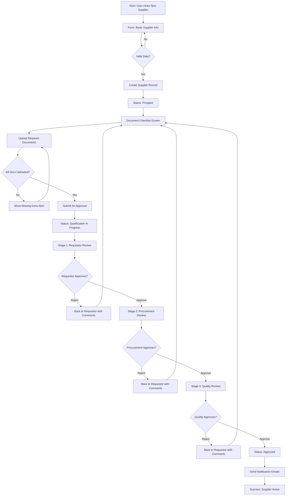
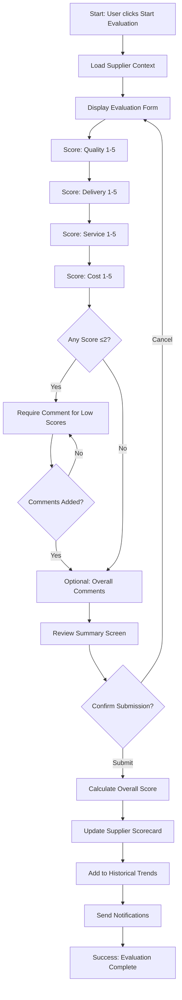
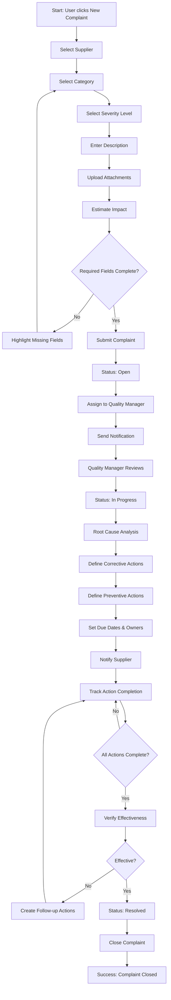
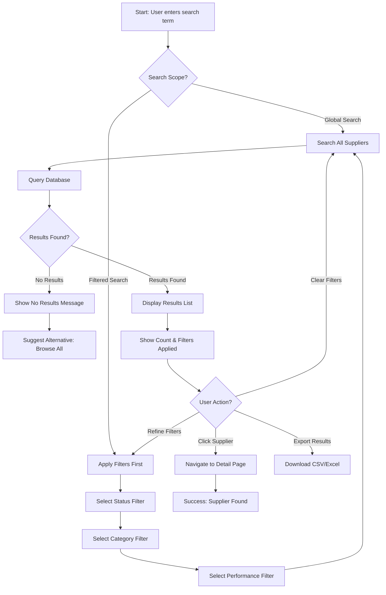

# 3. User Flows

## 3.1 Supplier Qualification Flow

**User Goal:** Successfully onboard a new supplier from initial request through final approval, ensuring all compliance documentation is collected and verified.

**Entry Points:**

- Dashboard "Add New Supplier" quick action button
- Suppliers list page "New Supplier" button
- Qualification queue "New Qualification" button

**Success Criteria:**

- Supplier moves from "Prospect" → "Qualified" → "Approved" status
- All required documents uploaded and verified
- 3-stage approval completed (Requestor → Procurement → Quality)
- Email notifications sent at each stage
- Complete audit trail captured (4-8 week manual process reduced to 2-4 weeks)

### 3.1.1 Flow Diagram

### 3.1.2 Edge Cases & Error Handling

- **Missing documents during submission**: Display warning dialog listing missing items, allow save as draft or force completion
- **Document expiration during approval**: Alert appears if certificate expires within 30 days, requires re-upload before final approval
- **Duplicate supplier detection**: On form submission, check for existing suppliers with similar name/tax ID, show merge dialog
- **Approver unavailable**: After 48 hours with no action, send escalation email to their manager and notification to requestor
- **Rejected at final stage**: All previous approvals remain valid, only failed stage needs re-approval after corrections
- **Partial document upload failure**: Show per-file upload status, allow retry for failed files without re-uploading successful ones

### 3.1.3 Notes

**Performance:** Form autosaves every 30 seconds to prevent data loss. Document uploads support drag-and-drop and bulk selection (up to 10 files, 25MB each).

**Mobile Considerations:** On mobile, document upload triggers native camera for capturing certifications on-site during supplier visits.

**Accessibility:** Approval workflow includes keyboard shortcuts (Alt+A approve, Alt+R reject), screen reader announces stage transitions.

---

## 3.2 Performance Evaluation Flow

**User Goal:** Complete a periodic supplier evaluation (quarterly) by scoring performance across 4 dimensions, resulting in an updated supplier scorecard.

**Entry Points:**

- Dashboard "Evaluations Due" widget (shows count of overdue evaluations)
- Evaluation schedule page "Start Evaluation" button
- Supplier detail page "Evaluate" action button
- Email notification "Evaluation Due" CTA

**Success Criteria:**

- All 4 dimensions scored (Quality, Delivery, Service, Cost) on 1-5 scale
- Comments provided for scores ≤2 (below expectations)
- Historical trend chart updated
- Supplier scorecard regenerated
- Notification sent to supplier contact (optional, Phase 2)
- Evaluation marked "Completed" in schedule

### 3.2.1 Flow Diagram

### 3.2.2 Edge Cases & Error Handling

- **Incomplete evaluation**: Allow save as draft, show "Resume Evaluation" option in dashboard until completed
- **Multiple evaluators**: If org requires consensus, show multi-user scoring interface with averaging logic
- **Historical data missing**: For first evaluation, show "No historical data" message instead of trend chart
- **Score justification required**: Scores =5 (exceptional) or =1 (unacceptable) also trigger comment requirement for documentation
- **Evaluation overdue**: After 7 days past due date, send escalation to user's manager and mark evaluation as "Overdue" in red
- **Supplier no longer active**: If supplier status changed to "Blocked" during evaluation, show warning but allow completion for audit trail

### 3.2.3 Notes

**Data Pre-filling (Phase 2):** ERP integration will auto-populate scores from actual delivery/quality data, user only reviews and adjusts.

**Mobile Optimization:** Evaluation form uses large touch targets (56px) for star ratings, optimized for field evaluations during supplier audits.

**Accessibility:** Form supports keyboard navigation with Tab/Shift+Tab, Arrow keys for rating selection, Enter to submit.

---

## 3.3 Complaint Registration & CAPA Flow

**User Goal:** Register a supplier quality complaint, track root cause analysis, and manage corrective/preventive actions (CAPA) through resolution.

**Entry Points:**

- Dashboard "Report Complaint" quick action
- Complaints list "New Complaint" button
- Supplier detail page "File Complaint" action
- Email integration (forward complaint emails to system - Phase 2)

**Success Criteria:**

- Complaint registered with severity, category, description, attachments
- Assigned to quality manager for review
- Root cause identified and documented
- Corrective and preventive actions defined with due dates
- Supplier notified (email)
- Status tracked through Open → In Progress → Resolved → Closed
- CAPA effectiveness verified before closure

### 3.3.1 Flow Diagram

### 3.3.2 Edge Cases & Error Handling

- **Duplicate complaint**: System checks for similar open complaints for same supplier in last 30 days, shows "Related Complaints" warning
- **Severity escalation**: If complaint marked "Critical", auto-escalate to Quality Director and send SMS notification (if enabled)
- **Supplier disputes root cause**: Add "Supplier Response" section for collaborative resolution, track dispute status
- **CAPA due date exceeded**: Auto-send reminders at 80%, 100%, and 120% of timeline, escalate to manager if >14 days overdue
- **Recurrent complaint**: If 3+ similar complaints in 90 days, trigger "Repeat Offender" flag and suggest supplier audit
- **Incomplete attachments**: Evidence photos/documents required for severity levels 1-2 (Critical/Major), block submission if missing

### 3.3.3 Notes

**Integration:** Phase 2 will support email forwarding to auto-create complaints from customer complaint emails, using NLP to extract key details.

**Collaboration (Phase 3):** Supplier portal will allow suppliers to respond directly to complaints, upload evidence, and update CAPA status.

**Accessibility:** Complaint form supports voice-to-text for description field on mobile, useful during shop floor inspections.

---

## 3.4 Supplier Search & Discovery Flow

**User Goal:** Quickly find a specific supplier or filter suppliers by status, category, or performance to take action.

**Entry Points:**

- Global search bar (always visible in header)
- Suppliers list page with advanced filters
- Dashboard quick search widget

**Success Criteria:**

- Search returns results in <500ms (95th percentile)
- Results ranked by relevance (name match > category > status)
- Filters persist across sessions
- One-click access to supplier detail page
- Recent searches saved for quick repeat access

### 3.4.1 Flow Diagram

### 3.4.2 Edge Cases & Error Handling

- **No results found**: Show suggestions like "Try removing filters" or "Browse all suppliers", highlight potential typos
- **Too many results (>100)**: Display "Showing first 100 results, refine filters to see more", encourage narrowing search
- **Search timeout**: If query exceeds 3 seconds, show loading state then cached results, log slow query for optimization
- **Ambiguous search term**: If search matches multiple fields (name, category, location), show "Results by" sections to organize
- **Inactive suppliers in results**: Visually de-emphasize with gray styling, show "Inactive" badge, allow exclusion via filter
- **Permission filtering**: Users only see suppliers they have permission to view based on role (Quality sees all, Viewer sees subset)

### 3.4.3 Notes

**Search Intelligence (Phase 2):** Fuzzy matching for typos, synonym support (e.g., "vendor" = "supplier"), search within documents.

**Performance Optimization:** Elasticsearch integration for sub-100ms search, PostgreSQL full-text search for MVP.

**Accessibility:** Search results navigable with keyboard (Tab through results, Enter to open), screen reader announces result count.
